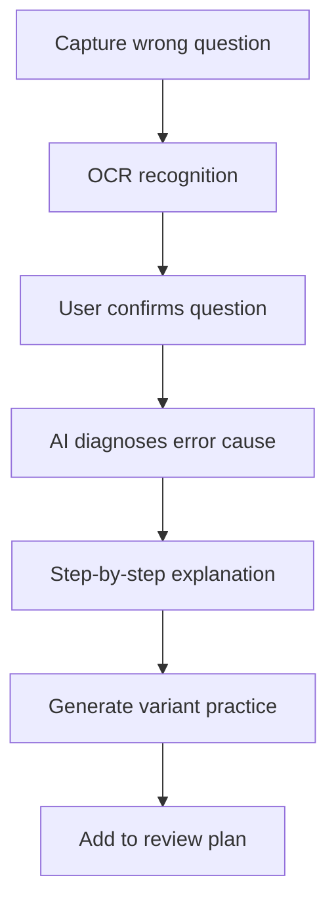

# AI Wrong Question Coach PRD

---

## 1. Document Overview

| Item | Content |
|------|---------|
| Document Name | AI Wrong Question Coach Product Requirements Document |
| Version | v1.0 |
| Created Date | 2026-04-28 |
| Status | Draft |
| Target Audience | Product, Design, Mobile, Backend, AI Engineering, Curriculum Research, QA |

## 2. Project Background

A wrong-question notebook is an effective learning tool, but manually organizing mistakes is time-consuming. Many students only take photos of wrong questions and never review them properly. Most existing photo-based homework tools focus on “giving the answer,” which can cause students to skip the thinking process.

This product focuses on **error diagnosis and repeated practice**. After identifying a wrong question, it analyzes the related knowledge points, error type, and weak reasoning links, then automatically generates variant exercises and a review plan to help students truly master the concept.

## 3. Product Overview

### 3.1 Product Positioning

An AI-powered wrong-question review tool for middle and high school students. It turns photographed mistakes into knowledge diagnosis, variant practice, and spaced review plans.

### 3.2 Target Users

| User Role | Characteristics | Core Needs |
|----------|-----------------|------------|
| Middle and high school students | Have many mistakes from homework and exams | Quickly organize and review wrong questions |
| Parents | Want to understand learning weaknesses | View learning reports |
| Teachers | Need class-level error statistics | Identify common knowledge gaps |
| Self-learners | Lack teacher explanations | Get step-by-step guidance |

### 3.3 Core Value

1. **Shift from answers to error causes**: Explain why the student got it wrong, instead of only providing the correct answer.
2. **Automatically generate repeated practice**: Create similar and variant questions around weak knowledge points.
3. **Build a memory rhythm**: Schedule reviews based on spaced repetition.
4. **Visualize weak knowledge points**: Help students clearly see what they need to improve.

## 4. Functional Requirements

### 4.1 P0: Core Features (MVP)

| Feature ID | Feature Name | Description | Acceptance Criteria |
|------------|--------------|-------------|---------------------|
| F001 | Photo-based question capture | Capture wrong questions from test papers or homework | Supports cropping and rotation |
| F002 | OCR recognition | Recognize question text, options, and handwritten answers | Users can edit recognition results |
| F003 | Error diagnosis | Analyze knowledge points, error type, and reasoning gaps | Outputs a readable diagnosis |
| F004 | Step-by-step explanation | Provide progressive hints instead of directly giving the full answer | Users can expand the next step |
| F005 | Variant practice | Generate 3-5 practice questions for the same knowledge point | Includes answers and explanations |
| F006 | Review plan | Automatically schedule review dates | Sends reminders when review is due |

### 4.2 P1: Important Features

| Feature ID | Feature Name | Description |
|------------|--------------|-------------|
| F101 | Knowledge graph | Show the student's mastery of knowledge points |
| F102 | Pre-exam sprint | Generate a review paper based on wrong questions |
| F103 | Parent report | Generate weekly weakness summaries and recommendations |
| F104 | Class mode | Allow teachers to view class-level error distribution |
| F105 | Oral explanation | Let students explain their reasoning verbally, and let AI identify gaps |

### 4.3 P2: Enhancement Features

| Feature ID | Feature Name | Description |
|------------|--------------|-------------|
| F201 | Personalized question bank | Build a long-term learning ability model for each user |
| F202 | Handwritten solution grading | Grade the reasoning process step by step |
| F203 | Multi-subject support | Extend support to math, physics, chemistry, and English |
| F204 | School system integration | Integrate with homework and exam systems |

## 5. Technical Solution

| Layer | Technology Choice |
|------|-------------------|
| Mobile App | Flutter / React Native |
| Backend | FastAPI / NestJS |
| Database | PostgreSQL, Redis |
| AI Capabilities | OCR, question parsing, knowledge point classification, question generation |
| Curriculum Research | Knowledge taxonomy, question bank, difficulty labeling |

## 6. Data Model

### 6.1 WrongQuestion

| Field Name | Type | Required | Description |
|------------|------|:--------:|-------------|
| id | string | Yes | Wrong question ID |
| subject | string | Yes | Subject |
| questionText | text | Yes | Question body |
| userAnswer | text | No | Student's answer |
| correctAnswer | text | No | Correct answer |
| knowledgeTags | array | No | Knowledge points |
| errorType | enum | No | concept/careless/method/calculation |
| nextReviewAt | datetime | No | Next review time |

## 7. Core Workflow

## 8. Acceptance Metrics

| Metric | Target |
|--------|--------|
| Editable OCR recognition success rate | ≥ 85% |
| Error diagnosis approval rate | ≥ 75% |
| Variant practice completion rate | ≥ 50% |
| 7-day review retention rate | ≥ 30% |

