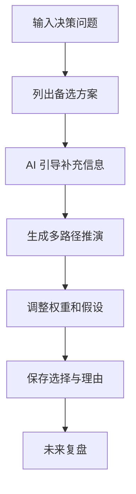

# AI 人生选择模拟器 PRD

---

## 1. 文档概述

| 项目 | 内容 |
|------|------|
| 文档名称 | AI人生选择模拟器产品需求文档 |
| 文档版本 | v1.0 |
| 创建日期 | 2026-04-28 |
| 文档状态 | 草稿 |
| 目标受众 | 产品、设计、前端、后端、AI 工程、测试 |

## 2. 项目背景

人在做职业、城市、关系、学习和消费选择时，经常只看到眼前收益，很难系统比较长期影响。普通待办或笔记工具无法帮助用户把选择拆成变量、风险和后果。本产品通过结构化提问、情景推演和多路径模拟，让用户看到不同选择在时间、金钱、关系、成长和机会成本上的可能变化。

## 3. 产品概述

### 3.1 产品定位

一个面向个人重大决策的 AI 推演工具，用多路径模拟帮助用户更清楚地做选择。

### 3.2 目标用户

| 用户角色 | 特征描述 | 核心需求 |
|----------|----------|----------|
| 职场人 | 面临跳槽、转行、升学 | 比较不同路径收益和风险 |
| 创业者 | 决定是否启动项目 | 识别资源缺口和失败条件 |
| 学生 | 选择专业、城市、实习 | 看清长期机会成本 |
| 家庭用户 | 做买房、搬家等决策 | 平衡财务和生活质量 |

### 3.3 核心价值

1. **把模糊纠结结构化**：将选择拆成可比较变量。
2. **看到长期后果**：生成 3 个月、1 年、3 年情景。
3. **暴露关键假设**：指出结果依赖哪些前提。
4. **减少冲动决策**：提供复盘和延迟确认机制。

## 4. 功能需求

### 4.1 P0：核心功能（MVP）

| 功能编号 | 功能名称 | 功能描述 | 验收标准 |
|----------|----------|----------|----------|
| F001 | 决策创建 | 输入问题、备选方案、截止时间 | 至少支持 2 个方案 |
| F002 | 引导提问 | AI 追问目标、约束、资源和担忧 | 问题不超过 8 个 |
| F003 | 路径推演 | 为每个方案生成短中长期结果 | 输出包含收益、风险、代价 |
| F004 | 评分矩阵 | 从财务、成长、自由度、关系等维度评分 | 用户可调整权重 |
| F005 | 关键假设 | 列出最影响结论的假设 | 假设可标记可信度 |
| F006 | 决策记录 | 保存最终选择和理由 | 支持后续复盘 |

### 4.2 P1：重要功能

| 功能编号 | 功能名称 | 功能描述 |
|----------|----------|----------|
| F101 | 反方辩论 | AI 分别扮演支持者和反对者 |
| F102 | 最坏情况计划 | 自动生成风险预案和止损点 |
| F103 | 价值观校准 | 基于用户价值排序调整推荐 |
| F104 | 复盘提醒 | 在决策后 30/90/180 天提醒复盘 |
| F105 | 可信朋友评审 | 邀请朋友对方案匿名打分 |

### 4.3 P2：增强功能

| 功能编号 | 功能名称 | 功能描述 |
|----------|----------|----------|
| F201 | 财务模拟 | 引入收入、支出、储蓄率模型 |
| F202 | 职业路径库 | 基于职业样本提供参考路径 |
| F203 | 情绪偏差检测 | 识别恐惧、从众、损失厌恶等偏差 |
| F204 | 决策教练 | 长期学习用户的决策风格 |

## 5. 技术方案

| 层级 | 技术选择 |
|------|----------|
| 前端 | Next.js / React |
| 后端 | FastAPI / NestJS |
| 数据库 | PostgreSQL |
| AI 能力 | LLM 推理、结构化抽取、评分解释 |
| 安全 | 用户隐私数据加密、导出删除 |

## 6. 数据模型

### 6.1 DecisionCase

| 字段名 | 类型 | 必填 | 说明 |
|--------|------|:----:|------|
| id | string | ✓ | 决策 ID |
| title | string | ✓ | 决策问题 |
| options | array | ✓ | 候选方案 |
| criteria | array | ✓ | 评价维度 |
| assumptions | array | ✗ | 关键假设 |
| selectedOptionId | string | ✗ | 最终选择 |
| reviewDate | date | ✗ | 复盘日期 |

## 7. 核心流程

## 8. 验收指标

| 指标 | 目标 |
|------|------|
| 决策创建完成率 | ≥ 65% |
| 用户调整权重比例 | ≥ 40% |
| 复盘提醒打开率 | ≥ 25% |
| 输出事实性风险投诉率 | ≤ 3% |

