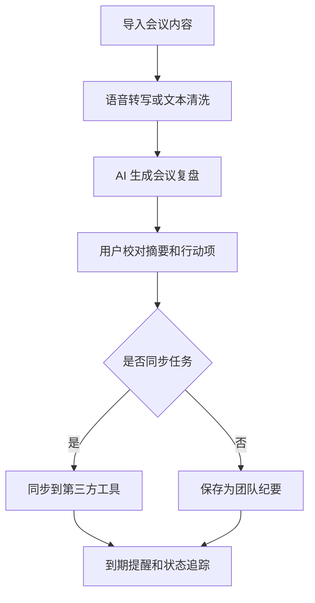

# AI 会议复盘与行动项追踪工具 PRD

---

## 1. 文档概述

### 1.1 文档信息

| 项目 | 内容 |
|------|------|
| 文档名称 | AI会议复盘与行动项追踪工具产品需求文档 |
| 文档版本 | v1.0 |
| 创建日期 | 2026-04-28 |
| 文档状态 | 草稿 |
| 目标受众 | 产品、设计、前端、后端、测试 |

### 1.2 项目背景

远程会议和跨部门协作已经成为常态，但会议结束后经常出现“谁负责什么、什么时候交付、结论在哪里”不清楚的问题。传统会议纪要依赖人工整理，耗时且容易遗漏。本项目希望通过录音转写、AI 摘要、行动项识别和自动提醒，把会议从“讨论结束”推进到“结果落地”。

**项目特点：**
- 支持会议录音、文本纪要和在线会议记录导入。
- 自动提取结论、风险、争议点和待办事项。
- 将行动项同步到日历、飞书、Slack、Notion 或任务系统。
- 支持团队复盘，追踪行动项完成率。

---

## 2. 产品概述

### 2.1 产品定位

一款面向团队协作场景的 AI 会议复盘工具，帮助团队自动沉淀会议结论并持续追踪行动项。

### 2.2 目标用户

| 用户角色 | 特征描述 | 核心需求 |
|----------|----------|----------|
| 项目经理 | 频繁主持跨部门会议 | 快速形成纪要，追踪任务闭环 |
| 团队负责人 | 关注决策质量和执行进展 | 了解会议产出和风险 |
| 参会成员 | 需要明确个人待办 | 获取自己的行动项和截止时间 |
| 助理/运营 | 负责会议整理和同步 | 减少人工整理工作量 |

### 2.3 核心价值

1. **减少会议损耗**：自动生成结构化复盘，降低人工记录成本。
2. **提升执行闭环**：行动项自动分配、提醒和追踪。
3. **保留决策依据**：保存关键讨论、反对意见和最终结论。
4. **改进会议质量**：统计会议时长、参与度和任务完成率。

---

## 3. 功能需求

### 3.1 P0：核心功能（MVP）

#### 3.1.1 会议导入

| 功能编号 | 功能名称 | 功能描述 | 验收标准 |
|----------|----------|----------|----------|
| F001 | 音频上传 | 支持上传 mp3、m4a、wav 等会议录音 | 上传后进入转写队列 |
| F002 | 文本导入 | 支持粘贴会议文本或导入 Markdown 文档 | 成功生成可分析文本 |
| F003 | 基础信息 | 录入会议标题、时间、参会人、项目标签 | 信息可编辑并保存 |
| F004 | 转写处理 | 将音频转为文本并区分说话人 | 转写完成后可查看全文 |

#### 3.1.2 AI 复盘生成

| 功能编号 | 功能名称 | 功能描述 | 验收标准 |
|----------|----------|----------|----------|
| F011 | 会议摘要 | 生成 200-500 字会议摘要 | 摘要包含主题、结论和下一步 |
| F012 | 关键结论 | 提取明确达成一致的结论 | 结论可逐条编辑 |
| F013 | 争议点 | 提取未达成一致或需继续讨论的问题 | 每个争议点包含上下文 |
| F014 | 风险识别 | 识别延期、依赖、资源不足等风险 | 风险可标记等级 |

#### 3.1.3 行动项管理

| 功能编号 | 功能名称 | 功能描述 | 验收标准 |
|----------|----------|----------|----------|
| F021 | 待办提取 | 自动识别任务、负责人和截止时间 | 提取结果可人工确认 |
| F022 | 任务编辑 | 修改负责人、截止日期、优先级、描述 | 保存后更新任务列表 |
| F023 | 状态跟踪 | 支持未开始、进行中、已完成、已延期 | 状态变更有操作记录 |
| F024 | 个人视图 | 每个成员查看自己的会议行动项 | 按截止时间排序 |

#### 3.1.4 分享与导出

| 功能编号 | 功能名称 | 功能描述 | 验收标准 |
|----------|----------|----------|----------|
| F031 | 纪要分享 | 生成可分享链接或团队内可见页面 | 权限范围可配置 |
| F032 | Markdown 导出 | 导出结构化会议纪要 | 导出内容包含摘要和行动项 |
| F033 | 任务同步 | 支持同步到飞书/Slack/Notion/Trello 中至少一种 | 同步失败有错误提示 |

### 3.2 P1：重要功能

| 功能编号 | 功能名称 | 功能描述 |
|----------|----------|----------|
| F101 | 会议模板 | 支持周会、复盘会、需求评审、事故复盘等模板 |
| F102 | 智能提醒 | 行动项到期前自动提醒负责人 |
| F103 | 会议质量分析 | 分析会议时长、发言分布、未闭环事项 |
| F104 | 多语言转写 | 支持中英文会议转写和摘要 |
| F105 | 项目归档 | 按项目沉淀历史会议和决策链 |

### 3.3 P2：增强功能

| 功能编号 | 功能名称 | 功能描述 |
|----------|----------|----------|
| F201 | 实时会议助手 | 在线会议中实时转写和提取重点 |
| F202 | 决策追溯 | 根据问题追溯历史会议中的相关决策 |
| F203 | 自动会议评分 | 根据目标、结论、行动项完整度给出评分 |
| F204 | 知识库问答 | 对历史会议内容进行语义搜索和问答 |

---

## 4. 技术方案

### 4.1 技术栈

| 层级 | 技术选择 |
|------|----------|
| 前端 | React / Vue、富文本编辑器、任务看板组件 |
| 后端 | FastAPI / Node.js、任务队列、WebSocket |
| AI 能力 | 语音转写模型、LLM 摘要与结构化抽取 |
| 数据库 | PostgreSQL、Redis、对象存储 |
| 集成 | 飞书、Slack、Notion、Google Calendar API |

### 4.2 系统架构

```text
用户上传/导入
    ↓
会议内容处理服务
    ↓
转写服务 / 文本清洗
    ↓
AI 结构化分析
    ↓
纪要编辑器 + 行动项看板
    ↓
提醒服务 / 第三方同步 / 导出服务
```

---

## 5. 数据模型

### 5.1 Meeting

| 字段名 | 类型 | 必填 | 说明 |
|--------|------|:----:|------|
| id | string | ✓ | 会议 ID |
| title | string | ✓ | 会议标题 |
| startedAt | datetime | ✓ | 会议开始时间 |
| participants | array | ✓ | 参会人 |
| transcriptUrl | string | ✗ | 转写文本地址 |
| summary | text | ✗ | AI 摘要 |
| projectId | string | ✗ | 所属项目 |

### 5.2 ActionItem

| 字段名 | 类型 | 必填 | 说明 |
|--------|------|:----:|------|
| id | string | ✓ | 行动项 ID |
| meetingId | string | ✓ | 来源会议 |
| title | string | ✓ | 任务标题 |
| ownerId | string | ✗ | 负责人 |
| dueDate | date | ✗ | 截止日期 |
| status | enum | ✓ | pending/doing/done/delayed |
| sourceText | text | ✗ | 来源原文 |

---

## 6. 核心流程



---

## 7. 非功能需求

| 类别 | 要求 |
|------|------|
| 性能 | 1 小时录音转写和摘要生成时间不超过 10 分钟 |
| 安全 | 会议内容加密存储，支持按项目权限隔离 |
| 可用性 | AI 结果必须可编辑，不可强制覆盖人工修改 |
| 可靠性 | 第三方同步失败时保留重试队列 |
| 隐私 | 支持会议录音自动删除策略 |

---

## 8. 开发计划

| 阶段 | 周期 | 交付内容 |
|------|------|----------|
| 第一阶段 | 2 周 | 会议导入、转写、基础纪要生成 |
| 第二阶段 | 2 周 | 行动项识别、编辑、状态追踪 |
| 第三阶段 | 2 周 | 分享导出、第三方同步、提醒 |
| 第四阶段 | 1 周 | 权限、安全、测试和上线准备 |

