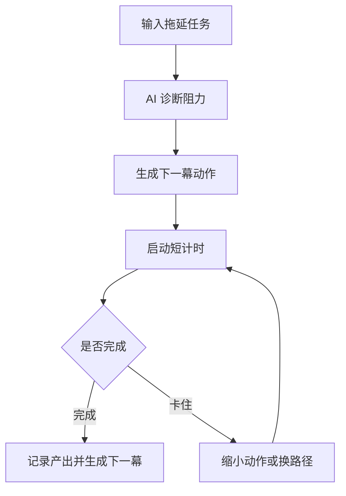

# AI 反拖延任务导演 PRD

---

## 1. 文档概述

| 项目 | 内容 |
|------|------|
| 文档名称 | AI反拖延任务导演产品需求文档 |
| 文档版本 | v1.0 |
| 创建日期 | 2026-04-28 |
| 文档状态 | 草稿 |
| 目标受众 | 产品、设计、前端、后端、AI 工程、测试 |

## 2. 项目背景

很多任务管理工具假设用户知道下一步该做什么，但拖延往往不是因为没有列表，而是任务太大、情绪阻力高、开始动作不清晰。本产品把 AI 设计成“任务导演”，帮助用户把目标拆成 5-15 分钟的可执行镜头，配合计时、阻力识别、复盘和轻量陪跑，让用户从“我要完成项目”进入“现在只做下一幕”。

## 3. 产品概述

### 3.1 产品定位

一款面向拖延场景的 AI 执行陪跑工具，把大任务拆成低阻力、短时长、可连续推进的行动片段。

### 3.2 目标用户

| 用户角色 | 特征描述 | 核心需求 |
|----------|----------|----------|
| 学生 | 作业、考试复习拖延 | 快速开始并保持节奏 |
| 自由职业者 | 缺少外部监督 | 拆任务和持续推进 |
| 创作者 | 任务开放、难以收尾 | 明确下一步产出 |
| ADHD 倾向用户 | 注意力易跳转 | 降低启动阻力 |

### 3.3 核心价值

1. **从启动入手**：把任务拆到小到可以立刻开始。
2. **识别拖延原因**：区分不会做、不想做、怕做和太累。
3. **陪跑而非说教**：每一轮只给下一步动作。
4. **形成执行证据**：记录每次推进的实际产出。

## 4. 功能需求

### 4.1 P0：核心功能（MVP）

| 功能编号 | 功能名称 | 功能描述 | 验收标准 |
|----------|----------|----------|----------|
| F001 | 任务输入 | 用户输入想完成但拖延的任务 | 支持自然语言描述 |
| F002 | 阻力诊断 | AI 询问原因并判断主要阻力 | 输出不超过 4 类阻力 |
| F003 | 下一幕拆解 | 生成 5-15 分钟可执行步骤 | 步骤有明确完成标准 |
| F004 | 专注计时 | 启动短时间计时并记录状态 | 计时完成后进入复盘 |
| F005 | 卡住求助 | 用户卡住时 AI 给替代动作 | 替代动作更小更具体 |
| F006 | 执行日志 | 记录每轮任务、用时、产出 | 可按项目回看 |

### 4.2 P1：重要功能

| 功能编号 | 功能名称 | 功能描述 |
|----------|----------|----------|
| F101 | 项目模式 | 将多个执行片段汇总为项目进度 |
| F102 | 能量匹配 | 根据用户精力推荐任务类型 |
| F103 | 截止期倒排 | 基于 deadline 自动排执行节奏 |
| F104 | 温和催办 | 到点提醒并给出最低启动动作 |
| F105 | 复盘洞察 | 统计最常见拖延触发点 |

### 4.3 P2：增强功能

| 功能编号 | 功能名称 | 功能描述 |
|----------|----------|----------|
| F201 | 屏幕陪跑 | 识别用户当前应用并提醒回到任务 |
| F202 | 同伴房间 | 两人或多人静默陪跑 |
| F203 | 自定义导演人格 | 选择冷静、严格、温柔等陪跑风格 |
| F204 | 自动产出归档 | 将文档、截图、链接归档到任务日志 |

## 5. 技术方案

| 层级 | 技术选择 |
|------|----------|
| 客户端 | Web / macOS / iOS |
| 后端 | FastAPI / NestJS |
| 数据库 | PostgreSQL、Redis |
| AI 能力 | 任务拆解、阻力分类、对话陪跑 |
| 通知 | 本地通知、邮件、日历集成 |

## 6. 数据模型

### 6.1 FocusSession

| 字段名 | 类型 | 必填 | 说明 |
|--------|------|:----:|------|
| id | string | ✓ | 专注轮次 ID |
| taskId | string | ✓ | 任务 ID |
| stepText | text | ✓ | 本轮行动 |
| plannedMinutes | number | ✓ | 计划时长 |
| actualMinutes | number | ✗ | 实际时长 |
| blockerType | enum | ✗ | 阻力类型 |
| outputNote | text | ✗ | 完成产出 |

## 7. 核心流程

## 8. 验收指标

| 指标 | 目标 |
|------|------|
| 首轮启动率 | ≥ 70% |
| 单轮完成率 | ≥ 60% |
| 次日回访率 | ≥ 30% |
| AI 步骤被用户改写率 | ≤ 35% |

