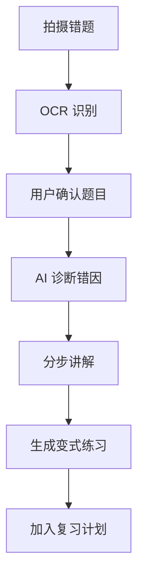

# AI 学习错题教练 PRD

---

## 1. 文档概述

| 项目 | 内容 |
|------|------|
| 文档名称 | AI学习错题教练产品需求文档 |
| 文档版本 | v1.0 |
| 创建日期 | 2026-04-28 |
| 文档状态 | 草稿 |
| 目标受众 | 产品、设计、移动端、后端、AI 工程、教研、测试 |

## 2. 项目背景

错题本是有效学习工具，但手动整理成本高，很多学生只拍照不复盘。市面上拍题工具偏向“给答案”，容易让学生跳过思考。本产品以“错因诊断和复练”为核心，识别错题后分析知识点、错误类型和薄弱链路，自动生成变式题和复习计划，帮助学生真正掌握。

## 3. 产品概述

### 3.1 产品定位

一款面向中高年级学生的 AI 错题复盘工具，把错题从照片变成知识诊断、变式练习和复习计划。

### 3.2 目标用户

| 用户角色 | 特征描述 | 核心需求 |
|----------|----------|----------|
| 中学生 | 作业和考试错题多 | 快速整理和复练 |
| 家长 | 想了解薄弱点 | 查看学习报告 |
| 教师 | 需要班级错因统计 | 发现共性问题 |
| 自学用户 | 没有老师讲解 | 获得分步提示 |

### 3.3 核心价值

1. **从答案转向错因**：解释为什么错，而不只是给正确答案。
2. **自动生成复练**：围绕薄弱点生成同类题和变式题。
3. **建立记忆节奏**：按遗忘曲线安排复习。
4. **可视化薄弱知识点**：让学生知道该补哪里。

## 4. 功能需求

### 4.1 P0：核心功能（MVP）

| 功能编号 | 功能名称 | 功能描述 | 验收标准 |
|----------|----------|----------|----------|
| F001 | 拍照录题 | 拍摄试卷或作业错题 | 支持裁剪和旋转 |
| F002 | OCR 识别 | 识别题干、选项、手写答案 | 用户可编辑识别结果 |
| F003 | 错因诊断 | 分析知识点、错误类型和解题漏洞 | 输出可读诊断 |
| F004 | 分步讲解 | 按提示递进讲解，不直接塞答案 | 支持展开下一步 |
| F005 | 变式练习 | 生成 3-5 道同知识点练习 | 包含答案和解析 |
| F006 | 复习计划 | 自动安排复习日期 | 到期提醒 |

### 4.2 P1：重要功能

| 功能编号 | 功能名称 | 功能描述 |
|----------|----------|----------|
| F101 | 知识图谱 | 展示知识点掌握情况 |
| F102 | 考前冲刺 | 根据错题生成考前复习卷 |
| F103 | 家长报告 | 每周生成薄弱点和建议 |
| F104 | 班级模式 | 教师查看班级错因分布 |
| F105 | 口述讲题 | 学生讲解思路，AI 判断漏洞 |

### 4.3 P2：增强功能

| 功能编号 | 功能名称 | 功能描述 |
|----------|----------|----------|
| F201 | 个性化题库 | 长期学习用户能力模型 |
| F202 | 手写批改 | 对推导过程进行步骤级批改 |
| F203 | 多学科支持 | 数学、物理、化学、英语扩展 |
| F204 | 学校系统集成 | 对接作业和考试系统 |

## 5. 技术方案

| 层级 | 技术选择 |
|------|----------|
| 移动端 | Flutter / React Native |
| 后端 | FastAPI / NestJS |
| 数据库 | PostgreSQL、Redis |
| AI 能力 | OCR、题目解析、知识点分类、题目生成 |
| 教研 | 知识点体系、题型库、难度标注 |

## 6. 数据模型

### 6.1 WrongQuestion

| 字段名 | 类型 | 必填 | 说明 |
|--------|------|:----:|------|
| id | string | ✓ | 错题 ID |
| subject | string | ✓ | 学科 |
| questionText | text | ✓ | 题干 |
| userAnswer | text | ✗ | 用户答案 |
| correctAnswer | text | ✗ | 正确答案 |
| knowledgeTags | array | ✗ | 知识点 |
| errorType | enum | ✗ | concept/careless/method/calculation |
| nextReviewAt | datetime | ✗ | 下次复习时间 |

## 7. 核心流程

## 8. 验收指标

| 指标 | 目标 |
|------|------|
| OCR 可编辑识别成功率 | ≥ 85% |
| 错因诊断认可率 | ≥ 75% |
| 变式题完成率 | ≥ 50% |
| 7 日复习留存率 | ≥ 30% |

