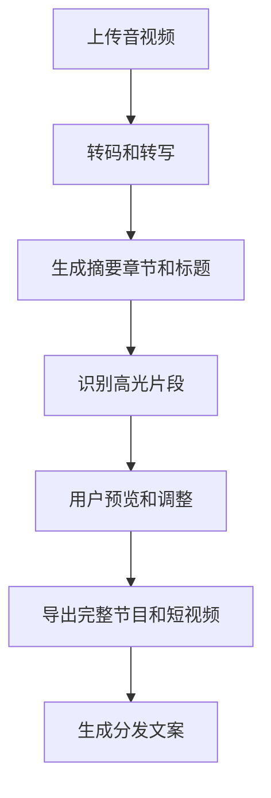

# AI 播客剪辑与分发工具 PRD

---

## 1. 文档概述

### 1.1 文档信息

| 项目 | 内容 |
|------|------|
| 文档名称 | AI播客剪辑与分发工具产品需求文档 |
| 文档版本 | v1.0 |
| 创建日期 | 2026-04-28 |
| 文档状态 | 草稿 |
| 目标受众 | 产品、设计、前端、后端、AI 工程、测试 |

### 1.2 项目背景

播客、访谈和长视频内容越来越多，但从录制到上线通常需要转写、剪辑、标题生成、Shownotes、短视频切片、平台分发等多个步骤。个人创作者和小团队缺少低成本的一站式工作流。本项目通过 AI 转写、亮点识别和自动剪辑，降低播客后期制作成本。

**项目特点：**
- 支持音视频上传、转写、说话人识别。
- 自动生成标题、摘要、章节和 Shownotes。
- 识别高光片段并生成短视频切片。
- 支持多平台发布素材导出。

---

## 2. 产品概述

### 2.1 产品定位

一款面向播客和访谈创作者的 AI 后期工具，帮助用户从长音视频中快速生成可发布的完整节目和传播素材。

### 2.2 目标用户

| 用户角色 | 特征描述 | 核心需求 |
|----------|----------|----------|
| 播客主理人 | 定期录制长音频 | 快速剪辑、生成 Shownotes |
| 视频访谈创作者 | 发布 B 站、YouTube、抖音内容 | 自动生成短视频切片 |
| 内容运营 | 负责多平台分发 | 标题、文案和封面素材 |
| 小型工作室 | 多客户内容交付 | 项目管理和批量处理 |

### 2.3 核心价值

1. **节省后期时间**：自动完成转写、摘要、章节和初剪。
2. **提升传播效率**：从长内容中提取适合传播的高光片段。
3. **保持内容一致**：统一生成平台文案和发布素材。
4. **降低制作门槛**：非专业剪辑用户也能完成基础后期。

---

## 3. 功能需求

### 3.1 P0：核心功能（MVP）

#### 3.1.1 文件导入与转写

| 功能编号 | 功能名称 | 功能描述 | 验收标准 |
|----------|----------|----------|----------|
| F001 | 音视频上传 | 支持 mp3、wav、m4a、mp4、mov 文件 | 上传后创建处理任务 |
| F002 | 自动转写 | 将音视频转换为带时间戳文本 | 转写结果可编辑 |
| F003 | 说话人识别 | 区分主持人、嘉宾等不同说话人 | 用户可手动合并或重命名 |
| F004 | 转写搜索 | 在全文中搜索关键词并定位时间点 | 点击结果跳转播放 |

#### 3.1.2 内容结构化

| 功能编号 | 功能名称 | 功能描述 | 验收标准 |
|----------|----------|----------|----------|
| F011 | 节目摘要 | 生成短摘要和长摘要 | 支持一键复制 |
| F012 | 章节生成 | 按话题自动生成章节和时间戳 | 章节可拖拽调整 |
| F013 | 标题建议 | 生成 5-10 个节目标题 | 用户可收藏候选标题 |
| F014 | Shownotes | 生成嘉宾介绍、要点、链接和引用 | Markdown 格式导出 |

#### 3.1.3 AI 剪辑

| 功能编号 | 功能名称 | 功能描述 | 验收标准 |
|----------|----------|----------|----------|
| F021 | 静音裁剪 | 自动识别并删除长静音片段 | 用户可预览裁剪结果 |
| F022 | 高光识别 | 识别观点强、情绪强或信息密度高的片段 | 返回片段理由 |
| F023 | 片段剪辑 | 选择时间段导出音频或视频片段 | 导出文件可播放 |
| F024 | 字幕生成 | 为视频片段生成字幕 | 字幕与语音基本同步 |

#### 3.1.4 导出与分发

| 功能编号 | 功能名称 | 功能描述 | 验收标准 |
|----------|----------|----------|----------|
| F031 | 音频导出 | 导出 mp3/wav 完整节目 | 可设置码率 |
| F032 | 短视频导出 | 导出竖屏或横屏短视频 | 支持字幕和封面 |
| F033 | 文案导出 | 导出小红书、微博、Twitter/X、公众号文案 | 文案按平台格式区分 |
| F034 | 项目归档 | 保存节目源文件、转写和导出记录 | 后续可重新打开编辑 |

### 3.2 P1：重要功能

| 功能编号 | 功能名称 | 功能描述 |
|----------|----------|----------|
| F101 | 音频增强 | 降噪、响度标准化、人声增强 |
| F102 | 封面生成 | 根据标题和主题生成封面图 |
| F103 | 品牌模板 | 保存固定片头、片尾、字幕样式 |
| F104 | 多平台发布 | 对接 YouTube、B 站、小宇宙等平台草稿 |
| F105 | 团队协作 | 评论、审阅、版本管理 |

### 3.3 P2：增强功能

| 功能编号 | 功能名称 | 功能描述 |
|----------|----------|----------|
| F201 | 嘉宾资料库 | 自动沉淀嘉宾介绍和历史节目 |
| F202 | 选题分析 | 基于历史数据推荐下一期话题 |
| F203 | 数据回流 | 关联播放量和互动数据优化标题 |
| F204 | 自动多语字幕 | 生成英文、日文等多语言字幕 |

---

## 4. 技术方案

### 4.1 技术栈

| 层级 | 技术选择 |
|------|----------|
| 前端 | React / Next.js、音视频时间轴组件 |
| 后端 | FastAPI / NestJS |
| 媒体处理 | FFmpeg、Whisper 类转写模型 |
| AI 能力 | 摘要、章节、高光识别、文案生成 |
| 存储 | 对象存储、PostgreSQL、Redis |
| 队列 | Celery / BullMQ |

### 4.2 系统架构

```text
上传音视频
  ↓
媒体转码与转写队列
  ↓
AI 结构化分析
  ↓
时间轴编辑器
  ↓
导出服务 / 分发服务 / 项目归档
```

---

## 5. 数据模型

### 5.1 MediaProject

| 字段名 | 类型 | 必填 | 说明 |
|--------|------|:----:|------|
| id | string | ✓ | 项目 ID |
| title | string | ✓ | 项目标题 |
| sourceUrl | string | ✓ | 原始文件地址 |
| duration | number | ✓ | 时长，单位秒 |
| status | enum | ✓ | uploaded/processing/ready/failed |
| createdAt | datetime | ✓ | 创建时间 |

### 5.2 Clip

| 字段名 | 类型 | 必填 | 说明 |
|--------|------|:----:|------|
| id | string | ✓ | 片段 ID |
| projectId | string | ✓ | 所属项目 |
| startTime | number | ✓ | 开始时间 |
| endTime | number | ✓ | 结束时间 |
| reason | text | ✗ | 推荐理由 |
| exportUrl | string | ✗ | 导出文件地址 |

---

## 6. 核心流程



---

## 7. 非功能需求

| 类别 | 要求 |
|------|------|
| 性能 | 1 小时音频基础转写在 10 分钟内完成 |
| 稳定性 | 处理任务失败后支持重试 |
| 可用性 | 时间轴拖动和预览响应不超过 300ms |
| 隐私 | 未发布项目默认仅创建者可见 |
| 成本 | 大文件处理需展示预计耗时和资源消耗 |

---

## 8. 开发计划

| 阶段 | 周期 | 交付内容 |
|------|------|----------|
| 第一阶段 | 2 周 | 上传、转写、播放器和文本编辑 |
| 第二阶段 | 2 周 | 摘要、章节、标题、Shownotes |
| 第三阶段 | 3 周 | 高光识别、剪辑、字幕、导出 |
| 第四阶段 | 1 周 | 项目归档、性能优化、测试上线 |

