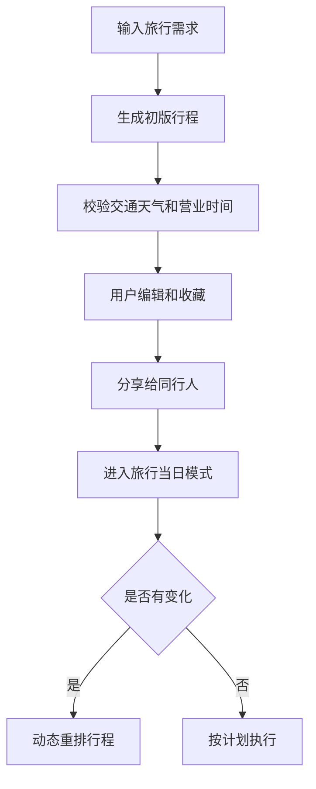

# AI 旅行规划与行程执行助手 PRD

---

## 1. 文档概述

### 1.1 文档信息

| 项目 | 内容 |
|------|------|
| 文档名称 | AI旅行规划与行程执行助手产品需求文档 |
| 文档版本 | v1.0 |
| 创建日期 | 2026-04-28 |
| 文档状态 | 草稿 |
| 目标受众 | 产品、设计、移动端、后端、AI 工程、测试 |

### 1.2 项目背景

旅行规划涉及目的地选择、景点筛选、交通、餐饮、住宿、预算和时间安排。用户通常需要在多个平台之间反复切换，最终行程仍可能不合理。本项目希望通过 AI 生成可执行行程，并在旅行过程中根据天气、营业时间、延误和体力状态动态调整。

**项目特点：**
- 根据预算、兴趣、同行人和时间生成行程。
- 结合地图、交通、天气和营业时间做可行性校验。
- 旅行中提供日程提醒和动态调整。
- 支持多人协同规划和投票。

---

## 2. 产品概述

### 2.1 产品定位

一款 AI 旅行规划和执行助手，帮助用户从灵感到落地完成完整旅行安排。

### 2.2 目标用户

| 用户角色 | 特征描述 | 核心需求 |
|----------|----------|----------|
| 自由行用户 | 喜欢自主规划 | 高效生成合理路线 |
| 家庭旅行者 | 成员需求不同 | 节奏舒适、安全省心 |
| 情侣/朋友出游 | 需要共同决策 | 协同收藏和投票 |
| 商务顺带旅行者 | 时间有限 | 在空档中安排轻量行程 |

### 2.3 核心价值

1. **减少规划成本**：一次输入偏好即可生成完整行程。
2. **提高可执行性**：校验距离、营业时间、交通和天气。
3. **动态应变**：遇到变化时自动重排当天计划。
4. **多人更好决策**：收藏、投票和评论让同行人参与规划。

---

## 3. 功能需求

### 3.1 P0：核心功能（MVP）

#### 3.1.1 需求采集

| 功能编号 | 功能名称 | 功能描述 | 验收标准 |
|----------|----------|----------|----------|
| F001 | 基础信息 | 输入目的地、日期、人数、预算 | 保存为旅行项目 |
| F002 | 兴趣偏好 | 选择美食、自然、博物馆、购物、亲子等偏好 | 偏好影响推荐 |
| F003 | 节奏设置 | 选择轻松、普通、紧凑 | 行程密度随设置变化 |
| F004 | 禁忌约束 | 输入不想去的地点、饮食忌口、行动限制 | 生成时避开约束 |

#### 3.1.2 行程生成

| 功能编号 | 功能名称 | 功能描述 | 验收标准 |
|----------|----------|----------|----------|
| F011 | 多日行程 | 自动生成每天景点、餐饮、交通和休息点 | 行程按时间排序 |
| F012 | 地图路线 | 在地图上展示当天路线 | 路线点顺序合理 |
| F013 | 可行性检查 | 检查营业时间、距离和交通耗时 | 不可行项有提示 |
| F014 | 替代方案 | 每天提供备选景点或餐厅 | 可一键替换 |

#### 3.1.3 行程编辑

| 功能编号 | 功能名称 | 功能描述 | 验收标准 |
|----------|----------|----------|----------|
| F021 | 拖拽调整 | 用户可拖拽调整地点顺序 | 时间和路线重新计算 |
| F022 | 收藏地点 | 收藏想去地点加入候选池 | 可从候选池插入行程 |
| F023 | 预算估算 | 估算门票、交通、餐饮成本 | 展示总预算和每日预算 |
| F024 | 导出分享 | 导出 PDF、图片或分享链接 | 分享内容可查看 |

#### 3.1.4 行程执行

| 功能编号 | 功能名称 | 功能描述 | 验收标准 |
|----------|----------|----------|----------|
| F031 | 当日模式 | 展示今天要去的地点、时间和导航入口 | 移动端清晰可用 |
| F032 | 动态调整 | 因天气、延误或用户跳过地点重新规划 | 给出调整原因 |
| F033 | 提醒 | 出发、预约、闭馆前提醒 | 提醒时间可配置 |

### 3.2 P1：重要功能

| 功能编号 | 功能名称 | 功能描述 |
|----------|----------|----------|
| F101 | 多人协作 | 邀请同行人收藏、评论和投票 |
| F102 | 票据管理 | 保存机票、酒店、门票和预约信息 |
| F103 | 离线包 | 离线保存行程、地图摘要和重要信息 |
| F104 | 旅行记账 | 记录实际花费并对比预算 |
| F105 | 照片游记 | 根据照片和行程生成旅行回顾 |

### 3.3 P2：增强功能

| 功能编号 | 功能名称 | 功能描述 |
|----------|----------|----------|
| F201 | 实时价格监控 | 监控机票酒店价格变化 |
| F202 | 本地活动推荐 | 根据当前位置推荐限时活动 |
| F203 | AI 导游讲解 | 到达景点后生成语音讲解 |
| F204 | 签证材料清单 | 根据目的地生成出行准备清单 |

---

## 4. 技术方案

### 4.1 技术栈

| 层级 | 技术选择 |
|------|----------|
| 移动端 | Flutter / React Native |
| 后端 | FastAPI / NestJS |
| 地图 | Mapbox / Google Maps / 高德地图 |
| 数据库 | PostgreSQL + PostGIS、Redis |
| AI 能力 | 行程生成、路线重排、摘要 |
| 外部数据 | 天气、交通、POI、营业时间 API |

### 4.2 系统架构

```text
用户旅行需求
  ↓
AI 行程规划引擎
  ↓
POI / 地图 / 天气 / 交通校验
  ↓
行程编辑器
  ↓
当日执行助手 / 动态重排 / 分享导出
```

---

## 5. 数据模型

### 5.1 Trip

| 字段名 | 类型 | 必填 | 说明 |
|--------|------|:----:|------|
| id | string | ✓ | 旅行 ID |
| destination | string | ✓ | 目的地 |
| startDate | date | ✓ | 开始日期 |
| endDate | date | ✓ | 结束日期 |
| budget | number | ✗ | 总预算 |
| preferences | array | ✗ | 兴趣偏好 |
| pace | enum | ✓ | relaxed/normal/packed |

### 5.2 ItineraryItem

| 字段名 | 类型 | 必填 | 说明 |
|--------|------|:----:|------|
| id | string | ✓ | 行程项 ID |
| tripId | string | ✓ | 所属旅行 |
| dayIndex | number | ✓ | 第几天 |
| title | string | ✓ | 地点或活动名称 |
| type | enum | ✓ | attraction/food/hotel/transport/rest |
| startTime | datetime | ✗ | 开始时间 |
| endTime | datetime | ✗ | 结束时间 |
| location | object | ✗ | 经纬度和地址 |

---

## 6. 核心流程



---

## 7. 非功能需求

| 类别 | 要求 |
|------|------|
| 准确性 | 营业时间和交通信息需展示数据更新时间 |
| 性能 | 初版行程生成时间不超过 15 秒 |
| 可用性 | 移动端当日模式支持弱网查看 |
| 隐私 | 旅行位置共享需用户主动开启 |
| 可靠性 | 外部 API 失败时提供降级行程 |

---

## 8. 开发计划

| 阶段 | 周期 | 交付内容 |
|------|------|----------|
| 第一阶段 | 2 周 | 需求采集、行程生成、地图展示 |
| 第二阶段 | 2 周 | 编辑、收藏、预算、分享 |
| 第三阶段 | 2 周 | 当日模式、提醒、动态调整 |
| 第四阶段 | 1 周 | 多人协作、离线包、测试上线 |

