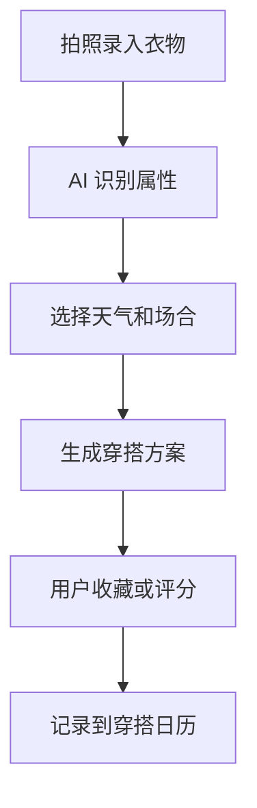

# AI 穿搭衣橱实验室 PRD

---

## 1. 文档概述

| 项目 | 内容 |
|------|------|
| 文档名称 | AI穿搭衣橱实验室产品需求文档 |
| 文档版本 | v1.0 |
| 创建日期 | 2026-04-28 |
| 文档状态 | 草稿 |
| 目标受众 | 产品、设计、移动端、AI 工程、电商运营、测试 |

## 2. 项目背景

很多人衣柜里衣服不少，却仍然觉得“没衣服穿”。穿搭 App 常推荐新衣服，但不充分利用用户已有衣物。本产品通过拍照建立个人数字衣橱，根据天气、场合、身材偏好、颜色和已有单品生成穿搭方案，并支持“少买但买对”的补充建议。

## 3. 产品概述

### 3.1 产品定位

一款个人数字衣橱与 AI 穿搭实验工具，帮助用户用已有衣物组合出更多适合场景的搭配。

### 3.2 目标用户

| 用户角色 | 特征描述 | 核心需求 |
|----------|----------|----------|
| 职场用户 | 每天需要得体穿搭 | 快速生成通勤搭配 |
| 学生/年轻人 | 喜欢尝试风格 | 低成本探索穿搭 |
| 极简生活用户 | 希望减少购买 | 提高衣物利用率 |
| 电商用户 | 购买前犹豫 | 判断是否能搭已有衣物 |

### 3.3 核心价值

1. **盘活已有衣橱**：优先用用户已有衣服做搭配。
2. **场景化推荐**：通勤、约会、旅行、运动、正式场合不同策略。
3. **减少冲动消费**：买新衣前显示可搭配次数。
4. **形成穿搭记忆**：记录哪些搭配穿过、效果如何。

## 4. 功能需求

### 4.1 P0：核心功能（MVP）

| 功能编号 | 功能名称 | 功能描述 | 验收标准 |
|----------|----------|----------|----------|
| F001 | 衣物录入 | 拍照上传衣物并自动抠图分类 | 分类可编辑 |
| F002 | 属性识别 | 识别颜色、类型、季节、风格 | 输出置信度 |
| F003 | 穿搭生成 | 根据天气和场合生成 3-5 套搭配 | 每套包含上装/下装/鞋包建议 |
| F004 | 搭配日历 | 记录每天穿过的搭配 | 避免短期重复推荐 |
| F005 | 收藏评分 | 用户收藏、评分或标记不喜欢 | 后续推荐受影响 |
| F006 | 天气接入 | 获取当地天气并提示温度适配 | 天气异常时提醒 |

### 4.2 P1：重要功能

| 功能编号 | 功能名称 | 功能描述 |
|----------|----------|----------|
| F101 | 虚拟试穿 | 在用户人像上预览大致效果 |
| F102 | 购买前判断 | 上传商品图判断能搭配几套已有衣物 |
| F103 | 行李箱模式 | 根据旅行天数生成最少单品组合 |
| F104 | 风格实验 | 生成法式、日系、极简等风格方案 |
| F105 | 衣物利用率 | 统计闲置单品并给出处理建议 |

### 4.3 P2：增强功能

| 功能编号 | 功能名称 | 功能描述 |
|----------|----------|----------|
| F201 | 社交穿搭挑战 | 好友发起一周不重样挑战 |
| F202 | 二手转卖建议 | 对低利用率衣物生成转卖文案 |
| F203 | 品牌尺码记忆 | 记录不同品牌尺码适配情况 |
| F204 | 智能洗护提醒 | 根据穿着次数和材质提醒清洗 |

## 5. 技术方案

| 层级 | 技术选择 |
|------|----------|
| 移动端 | Flutter / React Native |
| 后端 | FastAPI / NestJS |
| 数据库 | PostgreSQL |
| AI 能力 | 图像分割、服饰分类、搭配推荐 |
| 外部服务 | 天气 API、电商商品解析 |

## 6. 数据模型

### 6.1 WardrobeItem

| 字段名 | 类型 | 必填 | 说明 |
|--------|------|:----:|------|
| id | string | ✓ | 衣物 ID |
| userId | string | ✓ | 用户 ID |
| imageUrl | string | ✓ | 衣物图 |
| category | string | ✓ | 上衣/裤子/鞋等 |
| colors | array | ✗ | 颜色 |
| season | array | ✗ | 适合季节 |
| styleTags | array | ✗ | 风格标签 |
| wearCount | number | ✓ | 穿着次数 |

## 7. 核心流程

## 8. 验收指标

| 指标 | 目标 |
|------|------|
| 衣物识别可用率 | ≥ 80% |
| 穿搭收藏率 | ≥ 25% |
| 用户平均录入衣物数 | ≥ 20 件 |
| 闲置单品再次使用率 | ≥ 15% |

