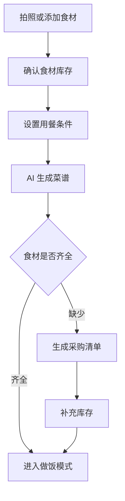

# AI 菜谱与冰箱管家 PRD

---

## 1. 文档概述

### 1.1 文档信息

| 项目 | 内容 |
|------|------|
| 文档名称 | AI菜谱与冰箱管家产品需求文档 |
| 文档版本 | v1.0 |
| 创建日期 | 2026-04-28 |
| 文档状态 | 草稿 |
| 目标受众 | 产品、设计、前端、后端、AI 工程、测试 |

### 1.2 项目背景

很多用户每天都会遇到“今天吃什么”的问题。菜谱 App 往往从菜品出发，但用户真正的约束是冰箱里有什么、还剩多少时间、饮食偏好、健康目标和烹饪能力。本项目通过识别冰箱食材、理解饮食偏好，并生成可执行的家常菜方案，让做饭决策从“搜索菜谱”变成“根据现状自动规划”。

**项目特点：**
- 拍照识别冰箱和食材。
- 根据已有食材生成菜谱和一周菜单。
- 结合健康目标、忌口、预算和烹饪时间。
- 自动生成缺料清单和复用剩菜建议。

---

## 2. 产品概述

### 2.1 产品定位

一款 AI 家庭做饭助手，根据用户手头食材和饮食偏好生成菜谱、菜单和采购计划。

### 2.2 目标用户

| 用户角色 | 特征描述 | 核心需求 |
|----------|----------|----------|
| 上班族 | 时间少，想在家快速做饭 | 15-30 分钟内搞定一餐 |
| 新手厨师 | 不知道食材如何搭配 | 步骤清晰、失败率低 |
| 减脂人群 | 关注热量和营养 | 控制热量、提高蛋白质 |
| 家庭做饭者 | 要照顾多人喜好 | 一周菜单和采购计划 |

### 2.3 核心价值

1. **降低决策成本**：直接告诉用户今天能做什么。
2. **提高食材利用率**：优先使用临期和剩余食材。
3. **适配个人偏好**：根据忌口、口味和健康目标调整菜谱。
4. **连通采购与烹饪**：缺什么自动生成购物清单。

---

## 3. 功能需求

### 3.1 P0：核心功能（MVP）

#### 3.1.1 食材录入

| 功能编号 | 功能名称 | 功能描述 | 验收标准 |
|----------|----------|----------|----------|
| F001 | 拍照识别 | 用户拍摄冰箱或食材照片，系统识别食材 | 识别结果可编辑确认 |
| F002 | 手动添加 | 手动添加食材名称、数量、单位 | 食材进入可用食材库 |
| F003 | 保质期 | 为食材设置购买日期或保质期 | 临期食材有明显标记 |
| F004 | 食材分类 | 自动分类为肉蛋奶、蔬菜、主食、调料等 | 支持用户修改分类 |

#### 3.1.2 菜谱生成

| 功能编号 | 功能名称 | 功能描述 | 验收标准 |
|----------|----------|----------|----------|
| F011 | 即时推荐 | 根据当前食材推荐 3-5 道菜 | 每道菜说明已具备和缺少食材 |
| F012 | 条件筛选 | 按时间、难度、口味、热量筛选 | 筛选结果符合约束 |
| F013 | 步骤生成 | 生成清晰的烹饪步骤和用量 | 步骤按时间顺序展示 |
| F014 | 替代建议 | 缺少食材时推荐替代品 | 替代方案不影响主要风味 |

#### 3.1.3 菜单规划

| 功能编号 | 功能名称 | 功能描述 | 验收标准 |
|----------|----------|----------|----------|
| F021 | 一日菜单 | 生成早餐、午餐、晚餐建议 | 每餐符合热量和偏好 |
| F022 | 一周菜单 | 根据预算和饮食目标生成一周菜单 | 菜单支持编辑替换 |
| F023 | 营养估算 | 显示热量、蛋白质、脂肪、碳水估算 | 数值来源和估算提示明确 |
| F024 | 剩菜复用 | 根据上顿剩余推荐下一餐组合 | 支持标记剩余食物 |

#### 3.1.4 采购清单

| 功能编号 | 功能名称 | 功能描述 | 验收标准 |
|----------|----------|----------|----------|
| F031 | 缺料清单 | 从菜谱中提取缺失食材 | 可一键加入采购清单 |
| F032 | 合并同类项 | 多个菜谱缺同一食材时合并数量 | 清单无明显重复 |
| F033 | 勾选购买 | 支持在购物时勾选已买 | 勾选后可补充到库存 |

### 3.2 P1：重要功能

| 功能编号 | 功能名称 | 功能描述 |
|----------|----------|----------|
| F101 | 家庭偏好 | 为家庭成员配置忌口、过敏和喜欢的菜 |
| F102 | 厨房设备 | 根据空气炸锅、电饭煲、烤箱等设备推荐做法 |
| F103 | 预算控制 | 生成指定预算内的一周菜单 |
| F104 | 菜谱收藏 | 收藏成功菜谱并记录个人调整 |
| F105 | 做饭模式 | 烹饪时提供逐步计时和语音播报 |

### 3.3 P2：增强功能

| 功能编号 | 功能名称 | 功能描述 |
|----------|----------|----------|
| F201 | 自动复盘 | 根据用户评分优化未来推荐 |
| F202 | 商超联动 | 采购清单关联附近商超或电商 |
| F203 | 慢病饮食 | 针对控糖、低嘌呤、低钠等目标生成方案 |
| F204 | 社区菜谱 | 用户分享自己的冰箱菜谱组合 |

---

## 4. 技术方案

### 4.1 技术栈

| 层级 | 技术选择 |
|------|----------|
| 移动端 | Flutter / React Native |
| 后端 | FastAPI / NestJS |
| 数据库 | PostgreSQL、Redis |
| AI 能力 | 图像识别、LLM 菜谱生成、营养估算 |
| 数据源 | 食材营养数据库、菜谱知识库 |

### 4.2 系统架构

```text
移动端拍照/录入
  ↓
食材识别服务
  ↓
食材库存
  ↓
菜谱生成引擎 ── 营养估算服务
  ↓
菜单规划 / 采购清单 / 做饭模式
```

---

## 5. 数据模型

### 5.1 Ingredient

| 字段名 | 类型 | 必填 | 说明 |
|--------|------|:----:|------|
| id | string | ✓ | 食材 ID |
| name | string | ✓ | 食材名称 |
| category | string | ✓ | 分类 |
| quantity | number | ✗ | 数量 |
| unit | string | ✗ | 单位 |
| expireDate | date | ✗ | 保质期 |
| source | enum | ✓ | photo/manual/shopping |

### 5.2 RecipePlan

| 字段名 | 类型 | 必填 | 说明 |
|--------|------|:----:|------|
| id | string | ✓ | 菜谱计划 ID |
| title | string | ✓ | 菜名 |
| ingredients | array | ✓ | 所需食材 |
| missingIngredients | array | ✗ | 缺失食材 |
| steps | array | ✓ | 烹饪步骤 |
| estimatedMinutes | number | ✓ | 预计耗时 |
| nutrition | object | ✗ | 营养估算 |

---

## 6. 核心流程



---

## 7. 非功能需求

| 类别 | 要求 |
|------|------|
| 准确性 | 图像识别结果必须经过用户确认后入库 |
| 安全 | 过敏、禁忌和慢病建议必须有风险提示 |
| 性能 | 菜谱推荐响应时间不超过 8 秒 |
| 可用性 | 新手用户能在 1 分钟内生成第一道菜 |
| 隐私 | 食材照片默认不公开，不用于社区展示 |

---

## 8. 开发计划

| 阶段 | 周期 | 交付内容 |
|------|------|----------|
| 第一阶段 | 2 周 | 食材录入、库存、基础推荐 |
| 第二阶段 | 2 周 | 菜谱生成、营养估算、采购清单 |
| 第三阶段 | 2 周 | 一周菜单、做饭模式、偏好设置 |
| 第四阶段 | 1 周 | 安全提示、测试、发布 |

