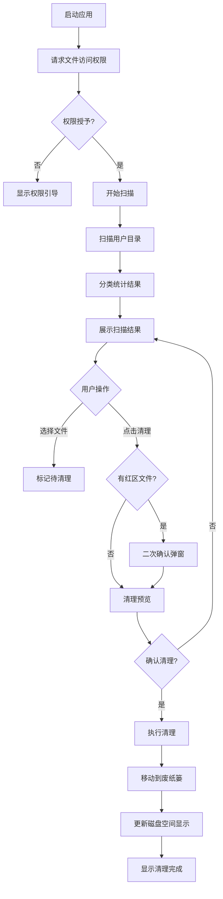
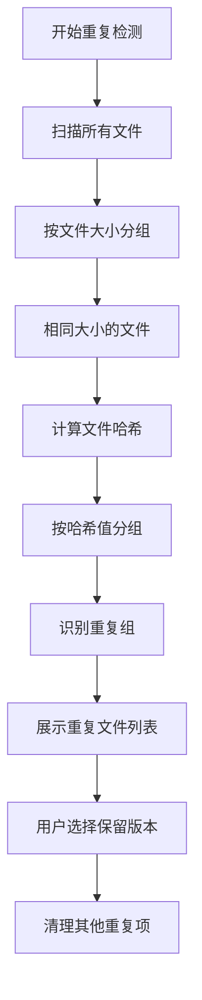

# DiskCleaner 产品需求文档（PRD）

---

## 1. 文档概述

### 1.1 文档信息

| 项目 | 内容 |
|------|------|
| 文档名称 | DiskCleaner 产品需求文档 |
| 文档版本 | v1.0 |
| 创建日期 | 2026-03-13 |
| 文档状态 | 草稿 |
| 目标受众 | 开发团队 |

### 1.2 修订历史

| 版本 | 日期 | 修订人 | 修订内容 |
|------|------|--------|----------|
| v1.0 | 2026-03-13 | - | 初始版本创建 |

### 1.3 项目背景

Mac 用户经常遇到磁盘空间不足的问题，但 macOS 自带的存储管理工具功能有限，第三方工具如 CleanMyMac 价格昂贵，DaisyDisk 功能复杂。用户需要一个**快速、简洁、免费**的磁盘清理工具。

**解决的核心问题：**
- 磁盘空间不足导致系统卡顿
- 难以快速定位占用空间大的文件
- 不清楚哪些文件可以安全清理

**项目特点：**
- **快速**：秒级扫描，即时展示结果
- **简洁**：极简 UI，无广告无捆绑
- **免费**：完全免费，无内购

---

## 2. 产品概述

### 2.1 产品定位

DiskCleaner 是一款面向普通 Mac 用户的免费磁盘清理工具，帮助用户快速发现并清理占用磁盘空间的大文件、缓存、日志和重复文件。

### 2.2 目标用户

| 用户角色 | 特征描述 | 核心需求 |
|----------|----------|----------|
| 普通用户 | 非技术背景，Mac 使用经验有限 | 一键清理，操作简单 |
| 轻度用户 | 偶尔清理磁盘，对速度敏感 | 快速扫描，快速完成 |
| 存储紧张用户 | 磁盘空间经常不足（如 128G/256G 机型） | 找出大文件，释放空间 |

### 2.3 核心价值

1. **快速扫描**：采用异步并发扫描技术，全盘扫描 < 10 秒
2. **简洁易用**：三步完成清理：扫描 → 预览 → 清理
3. **安全可靠**：权限分级保护，重要文件需二次确认

---

## 3. 角色与权限体系

### 3.1 角色定义

#### 3.1.1 普通用户

- 应用程序的唯一角色
- 可执行所有扫描和清理操作
- 受系统权限限制（如访问桌面、文稿等目录需授权）

### 3.2 权限体系

应用层面的权限控制，通过**文件分级保护机制**防止误删：

| 文件等级 | 说明 | 清理时行为 |
|----------|------|------------|
| 绿区（安全） | 系统缓存、应用缓存、临时文件 | 勾选后直接清理 |
| 黄区（谨慎） | 日志文件、下载目录中的大文件 | 需二次确认 |
| 红区（危险） | 用户文档、系统文件、隐藏文件 | 默认不可选，需手动解锁 |

---

## 4. 功能需求

### 4.1 P0：核心功能（MVP）

#### 4.1.1 磁盘扫描

| 功能编号 | 功能名称 | 功能描述 |
|----------|----------|----------|
| F001 | 快速扫描 | 扫描用户主目录及常见缓存目录，展示空间占用 |
| F002 | 可视化展示 | 使用树状图或列表展示文件/文件夹大小 |
| F003 | 分类统计 | 按类型分类展示：大文件、缓存、日志、重复文件 |
| F004 | 实时进度 | 显示扫描进度和当前扫描路径 |

#### 4.1.2 文件清理

| 功能编号 | 功能名称 | 功能描述 |
|----------|----------|----------|
| F011 | 批量选择 | 支持全选、反选、按分类选择 |
| F012 | 安全清理 | 根据文件等级执行不同的确认流程 |
| F013 | 清理预览 | 清理前展示将删除的文件列表和可释放空间 |
| F014 | 清理执行 | 移动到废纸篓（可恢复）或直接删除 |

#### 4.1.3 大文件发现

| 功能编号 | 功能名称 | 功能描述 |
|----------|----------|----------|
| F021 | 大文件列表 | 展示超过 100MB 的文件，按大小排序 |
| F022 | 文件定位 | 在 Finder 中显示文件位置 |
| F023 | 快速预览 | 支持空格键快速预览文件内容 |

### 4.2 P1：重要功能

#### 4.2.1 重复文件检测

| 功能编号 | 功能名称 | 功能描述 |
|----------|----------|----------|
| F101 | 重复扫描 | 通过文件大小和哈希值检测重复文件 |
| F102 | 智能建议 | 推荐保留最新/最大的版本 |
| F103 | 批量清理 | 一键清理重复文件 |

#### 4.2.2 缓存清理

| 功能编号 | 功能名称 | 功能描述 |
|----------|----------|----------|
| F111 | 系统缓存 | 清理系统临时文件、缓存 |
| F112 | 应用缓存 | 清理各应用程序的缓存目录 |
| F113 | 浏览器缓存 | 清理 Safari、Chrome 等浏览器缓存 |

### 4.3 P2：增强功能（后续迭代）

| 功能编号 | 功能名称 | 功能描述 |
|----------|----------|----------|
| F201 | 定时清理 | 设置定时自动扫描提醒 |
| F202 | 清理历史 | 记录清理历史，展示累计释放空间 |
| F203 | 磁盘监控 | 菜单栏实时显示磁盘使用情况 |
| F204 | 多语言支持 | 支持中英文界面 |

---

## 5. 非功能需求

### 5.1 性能要求

| 指标 | 要求 | 说明 |
|------|------|------|
| 扫描速度 | < 10 秒 | 用户主目录（约 100GB） |
| 内存占用 | < 200MB | 扫描和清理过程中 |
| 启动时间 | < 2 秒 | 冷启动时间 |
| UI 响应 | < 100ms | 交互响应时间 |

### 5.2 安全要求

| 要求 | 说明 |
|------|------|
| 文件保护 | 红区文件默认不可删除，需手动解锁 |
| 废纸篓机制 | 默认移入废纸篓，支持撤销恢复 |
| 权限最小化 | 仅申请必要的文件访问权限 |
| 无网络请求 | 不上传任何用户数据 |

### 5.3 兼容性要求

| 类别 | 要求 |
|------|------|
| 系统版本 | macOS 12.0 (Monterey) 及以上 |
| 处理器 | 支持 Intel 和 Apple Silicon |
| 屏幕分辨率 | 支持 Retina 显示 |

### 5.4 用户体验要求

| 指标 | 要求 |
|------|------|
| 学习成本 | 新用户 30 秒内完成首次清理 |
| 操作步骤 | 核心流程不超过 3 步 |

---

## 6. 数据模型

### 6.1 核心实体

#### 6.1.1 扫描结果（ScanResult）

| 字段名 | 类型 | 必填 | 说明 |
|--------|------|:----:|------|
| id | UUID | ✓ | 扫描任务唯一标识 |
| scanPath | String | ✓ | 扫描的根路径 |
| scanTime | Date | ✓ | 扫描时间 |
| totalSize | Int64 | ✓ | 扫描总大小（字节） |
| files | [FileInfo] | ✓ | 文件列表 |

#### 6.1.2 文件信息（FileInfo）

| 字段名 | 类型 | 必填 | 说明 |
|--------|------|:----:|------|
| id | UUID | ✓ | 文件唯一标识 |
| path | String | ✓ | 文件完整路径 |
| name | String | ✓ | 文件名 |
| size | Int64 | ✓ | 文件大小（字节） |
| category | Category | ✓ | 分类：大文件/缓存/日志/重复 |
| riskLevel | RiskLevel | ✓ | 风险等级：绿/黄/红 |
| isSelected | Bool | | 是否被选中清理 |
| duplicateGroup | UUID | | 重复文件组 ID |

#### 6.1.3 清理记录（CleanRecord）

| 字段名 | 类型 | 必填 | 说明 |
|--------|------|:----:|------|
| id | UUID | ✓ | 清理记录唯一标识 |
| cleanTime | Date | ✓ | 清理时间 |
| freedSpace | Int64 | ✓ | 释放空间（字节） |
| fileCount | Int | ✓ | 清理文件数量 |
| files | [FileInfo] | ✓ | 已清理文件列表（用于撤销） |

### 6.2 枚举定义

```
Category: 大文件 | 缓存 | 日志 | 重复文件 | 其他
RiskLevel: 绿区(安全) | 黄区(谨慎) | 红区(危险)
```

---

## 7. 业务流程

### 7.1 核心业务流程

#### 7.1.1 磁盘清理流程



#### 7.1.2 重复文件检测流程



### 7.2 状态流转

#### 7.2.1 扫描任务状态

| 状态 | 说明 | 可转换状态 |
|------|------|------------|
| idle | 空闲 | scanning |
| scanning | 扫描中 | completed, cancelled, failed |
| completed | 扫描完成 | idle |
| cancelled | 已取消 | idle |
| failed | 扫描失败 | idle |

---

## 8. 界面设计规范

### 8.1 整体布局

采用单窗口三栏式布局：

```
┌─────────────────────────────────────────────────────────────┐
│  DiskCleaner                          [最小化] [最大化] [关闭] │
├──────────────┬──────────────────────────────────────────────┤
│              │  ┌─────────────────────────────────────────┐ │
│  📊 概览      │  │  磁盘空间可视化（圆形图/树状图）           │ │
│  ────────    │  └─────────────────────────────────────────┘ │
│  📁 大文件    │  ┌─────────────────────────────────────────┐ │
│  🗑️ 缓存      │  │                                         │ │
│  📝 日志      │  │           文件列表                       │ │
│  👥 重复文件  │  │        （按大小/类型排序）                │ │
│              │  │                                         │ │
│              │  └─────────────────────────────────────────┘ │
│              │  ┌─────────────────────────────────────────┐ │
│              │  │ 已选择: 3 项  可释放: 2.3GB   [清理按钮]  │ │
│              │  └─────────────────────────────────────────┘ │
└──────────────┴──────────────────────────────────────────────┘
```

### 8.2 关键页面说明

#### 8.2.1 概览页

| 元素 | 说明 |
|------|------|
| 磁盘空间环形图 | 展示总容量、已用、可用空间 |
| 分类快捷入口 | 大文件/缓存/日志/重复文件的快捷入口 |
| 一键扫描按钮 | 开始全盘扫描 |

#### 8.2.2 大文件列表页

| 元素 | 说明 |
|------|------|
| 文件名 | 显示文件名和图标 |
| 文件大小 | 人性化显示（KB/MB/GB） |
| 文件路径 | 简化显示，hover 显示完整路径 |
| 风险标记 | 绿/黄/红色圆点标识 |
| 操作按钮 | 在 Finder 中显示、快速预览 |

#### 8.2.3 清理确认弹窗

| 元素 | 说明 |
|------|------|
| 文件列表 | 展示即将删除的文件 |
| 释放空间 | 高亮显示可释放的总空间 |
| 警告提示 | 红区文件特别提示 |
| 确认/取消按钮 | 双按钮设计，确认按钮使用强调色 |

### 8.3 交互规范

| 场景 | 交互说明 |
|------|----------|
| 扫描进行中 | 进度条 + 当前扫描路径，支持取消 |
| 文件选中 | 左侧勾选框，选中行高亮 |
| 危险操作 | 红区文件删除需输入确认或长按确认 |
| 清理完成 | 显示释放空间 + 成功动画 |

---

## 9. 技术建议

### 9.1 技术栈推荐

| 组件 | 推荐方案 | 说明 |
|------|----------|------|
| 开发语言 | Swift 5.9+ | 苹果官方推荐，性能最优 |
| UI 框架 | SwiftUI | 现代声明式 UI，开发效率高 |
| 架构模式 | MVVM | 清晰的数据绑定，便于测试 |
| 数据存储 | SwiftData / UserDefaults | 轻量级本地存储 |
| 最低版本 | macOS 12.0 | 覆盖 90%+ 用户 |

**推荐理由：**
- Swift + SwiftUI 是苹果官方主推的技术栈，与系统集成度高
- 原生应用性能最佳，启动快、内存占用低
- SwiftUI 开发效率高，适合小团队快速迭代

### 9.2 架构设计

```
┌─────────────────────────────────────────────────────────────┐
│                      Views (SwiftUI)                         │
│  ┌──────────┐ ┌──────────┐ ┌──────────┐ ┌──────────┐       │
│  │ Overview │ │ BigFiles │ │  Cache   │ │Duplicate │       │
│  └────┬─────┘ └────┬─────┘ └────┬─────┘ └────┬─────┘       │
└───────┼────────────┼────────────┼────────────┼──────────────┘
        │            │            │            │
        └────────────┴─────┬──────┴────────────┘
                           │
┌──────────────────────────▼──────────────────────────────────┐
│                    ViewModels (ObservableObject)             │
│  ┌─────────────────────────────────────────────────────┐    │
│  │              ScanViewModel / CleanViewModel          │    │
│  └─────────────────────────────────────────────────────┘    │
└──────────────────────────┬──────────────────────────────────┘
                           │
┌──────────────────────────▼──────────────────────────────────┐
│                     Services (Singleton)                     │
│  ┌───────────┐ ┌───────────┐ ┌───────────┐ ┌───────────┐   │
│  │ScanService│ │FileService│ │HashService│ │CleanService│  │
│  └───────────┘ └───────────┘ └───────────┘ └───────────┘   │
└──────────────────────────┬──────────────────────────────────┘
                           │
┌──────────────────────────▼──────────────────────────────────┐
│                     Models (Structs/Classes)                 │
│  ┌───────────┐ ┌───────────┐ ┌───────────┐                 │
│  │ FileInfo  │ │ ScanResult│ │CleanRecord│                 │
│  └───────────┘ └───────────┘ └───────────┘                 │
└─────────────────────────────────────────────────────────────┘
```

### 9.3 核心模块说明

| 模块 | 职责 |
|------|------|
| ScanService | 异步扫描文件系统，使用 FileManager 和 DispatchQueue |
| FileService | 文件操作封装，包括获取文件属性、分类判断 |
| HashService | 计算文件哈希值（MD5/SHA256）用于重复检测 |
| CleanService | 执行文件清理，移动到废纸篓 |

### 9.4 开发优先级建议

**Phase 1（第 1-2 周）：MVP 核心功能 - 能用**
- 基础 UI 框架搭建
- 磁盘扫描功能
- 大文件列表展示
- 基础清理功能

**Phase 2（第 3-4 周）：完善功能 - 好用**
- 分类统计（缓存、日志）
- 文件风险分级
- 清理确认流程
- 重复文件检测

**Phase 3（第 5 周及以后）：根据实际需求迭代**
- 定时提醒
- 清理历史
- 菜单栏监控
- 多语言支持

---

## 10. 附录

### 10.1 术语表

| 术语 | 说明 |
|------|------|
| 树状图 | Treemap，一种用矩形面积表示文件大小的可视化方式 |
| 哈希值 | 通过算法计算的文件指纹，用于识别相同文件 |
| 废纸篓 | macOS 的回收站，删除的文件可从中恢复 |
| 绿/黄/红区 | 文件风险等级分类，用于防止误删 |

### 10.2 参考文档

- [Apple Human Interface Guidelines](https://developer.apple.com/design/human-interface-guidelines/macos)
- [SwiftUI Documentation](https://developer.apple.com/documentation/swiftui)
- [FileManager Class Reference](https://developer.apple.com/documentation/foundation/filemanager)

### 10.3 常见缓存路径

| 类型 | 路径 |
|------|------|
| 用户缓存 | ~/Library/Caches/ |
| 系统日志 | /var/log/ |
| 用户日志 | ~/Library/Logs/ |
| 浏览器缓存 | ~/Library/Caches/Google/Chrome/ |
| Xcode 派生数据 | ~/Library/Developer/Xcode/DerivedData/ |

---

**文档结束**
