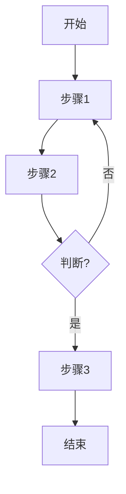

# [产品名称] 产品需求文档（PRD）

---

## 1. 文档概述

### 1.1 文档信息

| 项目 | 内容 |
|------|------|
| 文档名称 | [产品名称]产品需求文档 |
| 文档版本 | v1.0 |
| 创建日期 | YYYY-MM-DD |
| 文档状态 | [草稿/评审中/已批准] |
| 目标受众 | [开发团队/利益相关者/...] |

### 1.2 修订历史

| 版本 | 日期 | 修订人 | 修订内容 |
|------|------|--------|----------|
| v1.0 | YYYY-MM-DD | - | 初始版本创建 |

### 1.3 项目背景

[描述项目的背景、动机和目标。包括：]
- 为什么要做这个产品/功能？
- 解决什么问题？
- 面向什么场景？

**项目特点：**
- [特点1]
- [特点2]
- [特点3]

---

## 2. 产品概述

### 2.1 产品定位

[一句话描述产品是什么，为谁解决什么问题]

### 2.2 目标用户

| 用户角色 | 人数/规模 | 主要职责 |
|----------|----------|----------|
| [角色1] | [数量] | [职责描述] |
| [角色2] | [数量] | [职责描述] |
| [角色3] | [数量] | [职责描述] |

### 2.3 核心价值

1. **[价值点1]**：[具体描述]
2. **[价值点2]**：[具体描述]
3. **[价值点3]**：[具体描述]

---

## 3. 角色与权限体系

### 3.1 角色定义

#### 3.1.1 [角色1名称]

[角色描述和职责]

#### 3.1.2 [角色2名称]

[角色描述和职责]

#### 3.1.3 [角色3名称]

[角色描述和职责]

### 3.2 权限矩阵

| 功能模块 | [角色1] | [角色2] | [角色3] |
|----------|:------:|:----:|:----:|
| [功能1] | ✓ | ✗ | ✗ |
| [功能2] | ✓ | ✓ | ✗ |
| [功能3] | ✗ | ✗ | ✓ |

> ✓：有权限 | ✗：无权限

---

## 4. 功能需求

### 4.1 P0：核心功能（MVP）

#### 4.1.1 [功能模块1名称]

| 功能编号 | 功能名称 | 功能描述 |
|----------|----------|----------|
| F001 | [功能名] | [功能描述] |
| F002 | [功能名] | [功能描述] |

#### 4.1.2 [功能模块2名称]

| 功能编号 | 功能名称 | 功能描述 |
|----------|----------|----------|
| F011 | [功能名] | [功能描述] |
| F012 | [功能名] | [功能描述] |

### 4.2 P1：重要功能

| 功能编号 | 功能名称 | 功能描述 |
|----------|----------|----------|
| F101 | [功能名] | [功能描述] |
| F102 | [功能名] | [功能描述] |

### 4.3 P2：增强功能（后续迭代）

| 功能编号 | 功能名称 | 功能描述 |
|----------|----------|----------|
| F201 | [功能名] | [功能描述] |
| F202 | [功能名] | [功能描述] |

---

## 5. 非功能需求

### 5.1 性能要求

| 指标 | 要求 | 说明 |
|------|------|------|
| 并发用户 | ≥[数量] | [说明] |
| 响应时间 | <[时间] | [说明] |
| [其他指标] | [要求] | [说明] |

### 5.2 安全要求

| 要求 | 说明 |
|------|------|
| [要求1] | [描述] |
| [要求2] | [描述] |

### 5.3 兼容性要求

| 类别 | 要求 |
|------|------|
| 浏览器 | [支持的浏览器版本] |
| 分辨率 | [支持的分辨率] |
| 服务器 | [部署环境要求] |

### 5.4 可用性要求

| 指标 | 要求 |
|------|------|
| 系统可用性 | [百分比] |
| 数据持久性 | [百分比] |

---

## 6. 数据模型

### 6.1 核心实体

#### 6.1.1 [实体1名称]

| 字段名 | 类型 | 必填 | 说明 |
|--------|------|:----:|------|
| id | string | ✓ | [说明] |
| name | string | ✓ | [说明] |
| createdAt | datetime | ✓ | 创建时间 |

#### 6.1.2 [实体2名称]

| 字段名 | 类型 | 必填 | 说明 |
|--------|------|:----:|------|
| id | string | ✓ | [说明] |
| [字段名] | [类型] | [是/否] | [说明] |

### 6.2 实体关系图（ERD）

```
┌─────────────┐       ┌─────────────┐
│   [实体1]   │───────│   [实体2]   │
└─────────────┘  1:n  └─────────────┘
```

---

## 7. 业务流程

### 7.1 核心业务流程

#### 7.1.1 [流程1名称]



#### 7.1.2 [流程2名称]

[流程描述或流程图]

### 7.2 状态流转说明

#### 7.2.1 [实体名称]状态

| 状态 | 说明 | 可转换状态 |
|------|------|------------|
| [状态1] | [说明] | [可转换的状态] |
| [状态2] | [说明] | [可转换的状态] |

---

## 8. 界面设计规范

### 8.1 整体布局

[描述整体布局结构]

```
┌─────────────────────────────────────────────────┐
│  Header                                          │
├──────────┬──────────────────────────────────────┤
│          │                                       │
│  Sidebar │           主内容区                    │
│          │                                       │
└──────────┴──────────────────────────────────────┘
```

### 8.2 关键页面说明

#### 8.2.1 [页面1名称]

| 元素 | 说明 |
|------|------|
| [元素1] | [描述] |
| [元素2] | [描述] |

#### 8.2.2 [页面2名称]

| 元素 | 说明 |
|------|------|
| [元素1] | [描述] |
| [元素2] | [描述] |

### 8.3 交互规范

| 场景 | 交互说明 |
|------|----------|
| [场景1] | [交互描述] |
| [场景2] | [交互描述] |

---

## 9. 技术建议

### 9.1 技术栈推荐

#### 9.1.1 后端技术

| 组件 | 推荐方案 | 说明 |
|------|----------|------|
| 开发语言 | [语言] | [说明] |
| Web框架 | [框架] | [说明] |
| 数据库 | [数据库] | [说明] |

**推荐理由：**
- [理由1]
- [理由2]

#### 9.1.2 前端技术

| 组件 | 推荐方案 | 说明 |
|------|----------|------|
| 框架 | [框架] | [说明] |
| UI组件库 | [库] | [说明] |

### 9.2 架构设计

```
┌─────────────────────────────────────────────────┐
│              前端                                 │
└────────────────────┬────────────────────────────┘
                     │ HTTP API
                     ▼
┌─────────────────────────────────────────────────┐
│              后端                                 │
└────────────────────┬────────────────────────────┘
                     │
                     ▼
┌─────────────────────────────────────────────────┐
│              数据库                               │
└─────────────────────────────────────────────────┘
```

### 9.3 部署建议

| 环境 | 部署方式 |
|------|----------|
| 开发环境 | [描述] |
| 生产环境 | [描述] |

### 9.4 开发优先级建议

**Phase 1（第X-Y周）：MVP核心功能 - 能用**
- [功能1]
- [功能2]

**Phase 2（第X-Y周）：完善功能 - 好用**
- [功能1]
- [功能2]

**Phase 3（第X周及以后）：根据实际需求迭代**
- [功能1]
- [功能2]

---

## 10. 附录

### 10.1 术语表

| 术语 | 说明 |
|------|------|
| PRD | Product Requirements Document，产品需求文档 |
| MVP | Minimum Viable Product，最小可行产品 |
| [术语] | [说明] |

### 10.2 参考文档

- [参考文档1]
- [参考文档2]

---

**文档结束**
