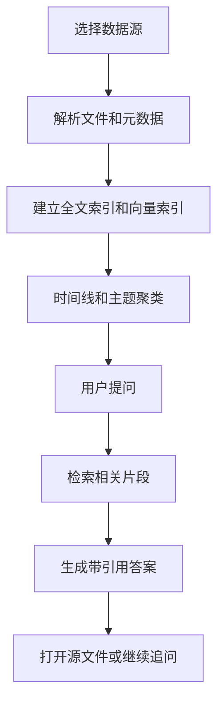

# 个人知识时光机 PRD

---

## 1. 文档概述

### 1.1 文档信息

| 项目 | 内容 |
|------|------|
| 文档名称 | 个人知识时光机产品需求文档 |
| 文档版本 | v1.0 |
| 创建日期 | 2026-04-28 |
| 文档状态 | 草稿 |
| 目标受众 | 产品、设计、前端、后端、AI 工程、测试 |

### 1.2 项目背景

很多人会在笔记软件、聊天记录、书签、邮件和文档中积累大量信息，但真正需要回忆时很难找到。传统搜索依赖关键词，无法回答“我去年为什么做这个决定”“上次研究这个问题有什么结论”这类时间和上下文问题。本项目希望把个人信息整理成可搜索、可问答、可回溯的时间线，让用户像访问“自己的第二大脑”一样回顾过去。

**项目特点：**
- 聚合笔记、文档、网页收藏和聊天摘要。
- 按时间、主题、人物和项目组织个人知识。
- 支持自然语言问答和证据引用。
- 重点强调本地优先、隐私保护和可控同步。

---

## 2. 产品概述

### 2.1 产品定位

一款个人知识检索与回溯工具，帮助用户从过去的资料中找回上下文、决策过程和长期思考脉络。

### 2.2 目标用户

| 用户角色 | 特征描述 | 核心需求 |
|----------|----------|----------|
| 独立开发者 | 项目和资料分散 | 找回技术决策和需求变化 |
| 研究人员 | 阅读大量论文和笔记 | 追踪观点形成过程 |
| 创作者 | 有大量素材和草稿 | 重用灵感和历史片段 |
| 管理者 | 会议和沟通信息多 | 回顾决策依据和承诺事项 |

### 2.3 核心价值

1. **找回上下文**：不仅找到文件，还能找到当时的原因和相关事件。
2. **降低遗忘成本**：让历史资料变成可问答资产。
3. **形成知识脉络**：按时间线展示观点、项目和决策演化。
4. **隐私可控**：用户可以选择本地索引、本地模型或私有云部署。

---

## 3. 功能需求

### 3.1 P0：核心功能（MVP）

#### 3.1.1 数据导入

| 功能编号 | 功能名称 | 功能描述 | 验收标准 |
|----------|----------|----------|----------|
| F001 | 文件夹导入 | 选择本地 Markdown、PDF、TXT、DOCX 文件夹 | 文件被解析并建立索引 |
| F002 | 网页收藏导入 | 导入浏览器书签或 Pocket/Readwise 数据 | 展示网页标题、链接和摘要 |
| F003 | 笔记软件导入 | 支持 Obsidian/Notion 导出文件导入 | 保留标题、标签和时间 |
| F004 | 增量同步 | 重新扫描时只处理变化文件 | 修改后的文件被更新 |

#### 3.1.2 时间线视图

| 功能编号 | 功能名称 | 功能描述 | 验收标准 |
|----------|----------|----------|----------|
| F011 | 时间轴 | 按创建或修改时间展示资料 | 支持按年/月/日缩放 |
| F012 | 主题聚类 | 自动把资料聚合为项目、主题、人物 | 聚类结果可编辑 |
| F013 | 关键节点 | 识别重要笔记、决策和里程碑 | 关键节点可手动标记 |
| F014 | 筛选器 | 按来源、标签、主题、文件类型筛选 | 筛选结果实时更新 |

#### 3.1.3 语义搜索与问答

| 功能编号 | 功能名称 | 功能描述 | 验收标准 |
|----------|----------|----------|----------|
| F021 | 自然语言搜索 | 用户输入问题，返回相关资料片段 | 结果包含来源引用 |
| F022 | 时间范围问答 | 支持“去年三月关于 X 的结论是什么” | 返回限定时间内答案 |
| F023 | 证据引用 | 回答中展示原文片段和文件路径 | 点击可打开源文件 |
| F024 | 追问上下文 | 支持基于上次答案继续追问 | 会话保留检索上下文 |

#### 3.1.4 本地知识库

| 功能编号 | 功能名称 | 功能描述 | 验收标准 |
|----------|----------|----------|----------|
| F031 | 本地索引 | 建立全文索引和向量索引 | 断网时可检索本地资料 |
| F032 | 索引状态 | 展示索引进度、失败文件和更新时间 | 用户能看到处理状态 |
| F033 | 数据删除 | 用户可删除来源或重建索引 | 删除后搜索不到相关内容 |

### 3.2 P1：重要功能

| 功能编号 | 功能名称 | 功能描述 |
|----------|----------|----------|
| F101 | 决策回放 | 按时间重建一个项目的关键决策链 |
| F102 | 周期回顾 | 自动生成周报、月报和年度回顾 |
| F103 | 知识图谱 | 展示主题、人物、项目之间的关系 |
| F104 | 浏览器插件 | 保存网页并自动写入知识库 |
| F105 | 重复和过期内容提醒 | 识别重复资料和可能过时的结论 |

### 3.3 P2：增强功能

| 功能编号 | 功能名称 | 功能描述 |
|----------|----------|----------|
| F201 | 个人写作助手 | 根据历史资料辅助写文章、方案和邮件 |
| F202 | 多设备同步 | 支持端到端加密的跨设备同步 |
| F203 | 语音记忆 | 录音转写后加入时间线 |
| F204 | 私有部署 | 为团队或个人服务器提供 Docker 部署 |

---

## 4. 技术方案

### 4.1 技术栈

| 层级 | 技术选择 |
|------|----------|
| 桌面端 | Electron / Tauri |
| 前端 | React、虚拟列表、时间线组件 |
| 后端/本地服务 | Rust / Python FastAPI |
| 检索 | SQLite FTS、向量数据库 Chroma / LanceDB |
| AI 能力 | Embedding、RAG、摘要生成 |
| 文件解析 | MarkItDown、PDF parser、docx parser |

### 4.2 系统架构

```text
本地文件/导出数据
  ↓
解析器
  ↓
全文索引 + 向量索引
  ↓
检索编排服务
  ↓
问答引擎 / 时间线引擎
  ↓
桌面端 UI
```

---

## 5. 数据模型

### 5.1 KnowledgeItem

| 字段名 | 类型 | 必填 | 说明 |
|--------|------|:----:|------|
| id | string | ✓ | 知识条目 ID |
| sourceType | enum | ✓ | file/web/note/chat/audio |
| title | string | ✓ | 标题 |
| contentHash | string | ✓ | 内容哈希 |
| createdAt | datetime | ✗ | 原始创建时间 |
| modifiedAt | datetime | ✗ | 原始修改时间 |
| tags | array | ✗ | 标签 |
| pathOrUrl | string | ✓ | 文件路径或链接 |

### 5.2 MemoryChunk

| 字段名 | 类型 | 必填 | 说明 |
|--------|------|:----:|------|
| id | string | ✓ | 片段 ID |
| itemId | string | ✓ | 所属条目 |
| text | text | ✓ | 文本片段 |
| embeddingId | string | ✗ | 向量索引 ID |
| startOffset | number | ✗ | 起始位置 |
| endOffset | number | ✗ | 结束位置 |

---

## 6. 核心流程



---

## 7. 非功能需求

| 类别 | 要求 |
|------|------|
| 隐私 | 默认本地存储，不主动上传用户文件 |
| 性能 | 1 万篇 Markdown 笔记首次索引在 30 分钟内完成 |
| 可解释性 | 所有 AI 答案必须提供引用来源 |
| 可靠性 | 索引失败不影响其他文件处理 |
| 兼容性 | 支持 macOS、Windows，优先 macOS |

---

## 8. 开发计划

| 阶段 | 周期 | 交付内容 |
|------|------|----------|
| 第一阶段 | 2 周 | 文件导入、解析、全文搜索 |
| 第二阶段 | 2 周 | 向量检索、问答、引用 |
| 第三阶段 | 2 周 | 时间线、主题聚类、回顾 |
| 第四阶段 | 2 周 | 桌面封装、隐私设置、性能优化 |

