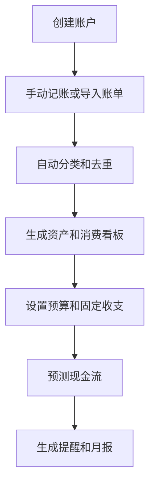

# 个人财务驾驶舱 PRD

---

## 1. 文档概述

### 1.1 文档信息

| 项目 | 内容 |
|------|------|
| 文档名称 | 个人财务驾驶舱产品需求文档 |
| 文档版本 | v1.0 |
| 创建日期 | 2026-04-28 |
| 文档状态 | 草稿 |
| 目标受众 | 产品、设计、前端、后端、测试 |

### 1.2 项目背景

个人财务信息分散在银行卡、信用卡、支付宝、微信、券商、基金和手工账本中。用户很难获得“现在到底有多少钱、每月钱花到哪里、未来现金流是否安全”的整体视图。本项目通过手动导入和结构化分析，为用户提供一个隐私友好的财务驾驶舱。

**项目特点：**
- 聚合资产、负债、收支和预算。
- 支持 CSV/账单导入和手动记账。
- 提供现金流预测和异常消费提醒。
- 不提供投资建议，只做信息整理和风险提示。

---

## 2. 产品概述

### 2.1 产品定位

一款个人财务管理工具，帮助用户看清资产负债、消费结构和未来现金流。

### 2.2 目标用户

| 用户角色 | 特征描述 | 核心需求 |
|----------|----------|----------|
| 城市白领 | 收入稳定但消费分散 | 预算和月度复盘 |
| 自由职业者 | 收入不稳定 | 现金流预测 |
| 家庭财务管理者 | 需要统筹家庭开支 | 多账户和共享预算 |
| 理财入门用户 | 想了解资产结构 | 资产负债总览 |

### 2.3 核心价值

1. **全局视图**：统一查看资产、负债、收入和支出。
2. **预算可控**：按类别设置预算并追踪执行。
3. **风险提前发现**：提示信用卡还款、现金流缺口和异常消费。
4. **隐私优先**：支持本地导入，不强制绑定银行账户。

---

## 3. 功能需求

### 3.1 P0：核心功能（MVP）

#### 3.1.1 账户与资产

| 功能编号 | 功能名称 | 功能描述 | 验收标准 |
|----------|----------|----------|----------|
| F001 | 账户创建 | 添加现金、银行卡、信用卡、基金、股票等账户 | 账户进入资产总览 |
| F002 | 余额维护 | 手动更新账户余额 | 总资产实时更新 |
| F003 | 负债记录 | 记录信用卡、贷款、分期等负债 | 负债计入净资产 |
| F004 | 净资产看板 | 展示总资产、总负债、净资产 | 数字计算准确 |

#### 3.1.2 交易导入与分类

| 功能编号 | 功能名称 | 功能描述 | 验收标准 |
|----------|----------|----------|----------|
| F011 | 手动记账 | 输入金额、类别、账户、备注 | 记录保存到流水 |
| F012 | CSV 导入 | 导入银行或支付平台账单 CSV | 用户可映射字段 |
| F013 | 自动分类 | 根据商户和备注识别消费类别 | 分类结果可修改 |
| F014 | 去重检测 | 导入时识别重复流水 | 用户可确认跳过 |

#### 3.1.3 预算与分析

| 功能编号 | 功能名称 | 功能描述 | 验收标准 |
|----------|----------|----------|----------|
| F021 | 月度预算 | 按餐饮、交通、购物等类别设置预算 | 展示预算剩余 |
| F022 | 消费分析 | 展示分类占比和趋势 | 支持月度切换 |
| F023 | 异常提醒 | 识别超预算或异常大额消费 | 提醒包含原因 |
| F024 | 周/月报 | 自动生成财务复盘报告 | 报告可导出 |

#### 3.1.4 现金流预测

| 功能编号 | 功能名称 | 功能描述 | 验收标准 |
|----------|----------|----------|----------|
| F031 | 固定收支 | 设置工资、房租、贷款、订阅等固定项 | 自动进入预测 |
| F032 | 未来余额 | 预测未来 30/90 天现金余额 | 支持查看明细 |
| F033 | 还款提醒 | 信用卡和贷款到期前提醒 | 提醒时间可配置 |

### 3.2 P1：重要功能

| 功能编号 | 功能名称 | 功能描述 |
|----------|----------|----------|
| F101 | 家庭账本 | 多人共享预算和部分账户 |
| F102 | 订阅管理 | 识别每月订阅和续费项目 |
| F103 | 目标储蓄 | 设置旅行、买房、备用金等目标 |
| F104 | 票据附件 | 为交易上传发票或截图 |
| F105 | 数据加密备份 | 加密备份到用户指定云盘 |

### 3.3 P2：增强功能

| 功能编号 | 功能名称 | 功能描述 |
|----------|----------|----------|
| F201 | AI 财务问答 | 查询“这个月钱花到哪里了” |
| F202 | 税务资料整理 | 汇总年度收入和可抵扣凭证 |
| F203 | 多币种 | 支持外币资产和汇率换算 |
| F204 | FIRE 进度 | 估算财务自由进度和支出倍数 |

---

## 4. 技术方案

### 4.1 技术栈

| 层级 | 技术选择 |
|------|----------|
| 前端 | React / Vue / Flutter |
| 后端 | FastAPI / NestJS |
| 数据库 | PostgreSQL、SQLite 本地模式 |
| 数据处理 | CSV parser、规则分类引擎 |
| AI 能力 | 交易分类、报告生成、自然语言查询 |
| 安全 | 本地加密、端到端备份 |

### 4.2 系统架构

```text
手动输入 / CSV 导入
  ↓
交易清洗和分类
  ↓
账户余额与预算引擎
  ↓
分析看板 / 现金流预测 / 报告导出
```

---

## 5. 数据模型

### 5.1 Account

| 字段名 | 类型 | 必填 | 说明 |
|--------|------|:----:|------|
| id | string | ✓ | 账户 ID |
| name | string | ✓ | 账户名称 |
| type | enum | ✓ | cash/bank/credit/investment/loan |
| balance | number | ✓ | 当前余额 |
| currency | string | ✓ | 币种 |
| includeInNetWorth | boolean | ✓ | 是否计入净资产 |

### 5.2 Transaction

| 字段名 | 类型 | 必填 | 说明 |
|--------|------|:----:|------|
| id | string | ✓ | 流水 ID |
| accountId | string | ✓ | 所属账户 |
| amount | number | ✓ | 金额 |
| category | string | ✓ | 分类 |
| occurredAt | datetime | ✓ | 发生时间 |
| merchant | string | ✗ | 商户 |
| note | text | ✗ | 备注 |

---

## 6. 核心流程



---

## 7. 非功能需求

| 类别 | 要求 |
|------|------|
| 安全 | 财务数据本地加密，云同步需用户授权 |
| 准确性 | 导入金额和账户余额计算需可追溯 |
| 可用性 | 新增一笔流水不超过 15 秒 |
| 合规 | 不提供证券买卖建议 |
| 可靠性 | 导入失败需展示失败行和原因 |

---

## 8. 开发计划

| 阶段 | 周期 | 交付内容 |
|------|------|----------|
| 第一阶段 | 2 周 | 账户、流水、资产看板 |
| 第二阶段 | 2 周 | CSV 导入、分类、预算 |
| 第三阶段 | 2 周 | 现金流预测、提醒、月报 |
| 第四阶段 | 1 周 | 加密、导出、测试上线 |

