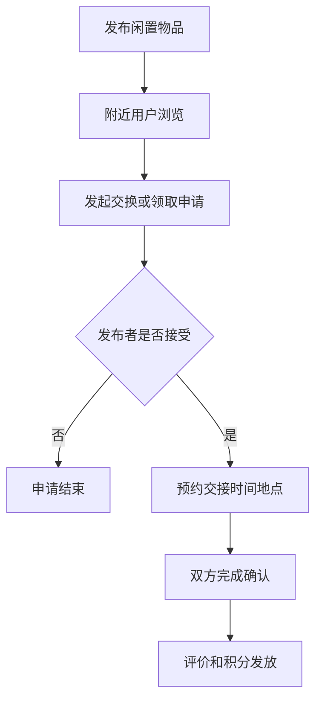

# 二手物品交换社区 PRD

---

## 1. 文档概述

### 1.1 文档信息

| 项目 | 内容 |
|------|------|
| 文档名称 | 二手物品交换社区产品需求文档 |
| 文档版本 | v1.0 |
| 创建日期 | 2026-04-28 |
| 文档状态 | 草稿 |
| 目标受众 | 产品、设计、前端、后端、运营、测试 |

### 1.2 项目背景

很多闲置物品价值不高但仍可使用，直接卖二手流程繁琐，扔掉又浪费。社区内的邻里交换、赠送和低价转让能提高物品流转效率，但需要解决可信、距离、沟通和履约问题。本项目希望构建一个以“附近”和“交换”为核心的轻量社区，让用户用物换物、免费赠送或低价转让。

**项目特点：**
- 以小区、学校、园区等近距离社区为主。
- 支持交换、赠送、低价转让三种模式。
- 强调信用、预约、取货和安全。
- 通过环保积分和社区活动提升参与感。

---

## 2. 产品概述

### 2.1 产品定位

一款附近闲置物品交换平台，帮助用户低成本处理闲置、获得需要的物品，并促进社区循环利用。

### 2.2 目标用户

| 用户角色 | 特征描述 | 核心需求 |
|----------|----------|----------|
| 闲置发布者 | 家中有可用但不需要的物品 | 快速发布并让物品被拿走 |
| 需求用户 | 想低成本获取物品 | 搜索附近可交换物 |
| 学生/租房用户 | 搬家频繁，预算有限 | 处理和获取家具、家电、小物 |
| 社区运营方 | 关注邻里活跃和环保 | 组织活动，降低浪费 |

### 2.3 核心价值

1. **降低流转成本**：附近交易减少物流和沟通成本。
2. **提升闲置利用率**：低价值物品也能被再利用。
3. **增强社区关系**：通过交换和赠送建立邻里连接。
4. **环保可量化**：通过积分和报告展示减少浪费成果。

---

## 3. 功能需求

### 3.1 P0：核心功能（MVP）

#### 3.1.1 物品发布

| 功能编号 | 功能名称 | 功能描述 | 验收标准 |
|----------|----------|----------|----------|
| F001 | 发布物品 | 上传图片、标题、分类、成色、描述 | 发布后进入附近列表 |
| F002 | 流转方式 | 支持交换、赠送、低价转让 | 用户必须选择一种方式 |
| F003 | 位置范围 | 选择小区/学校/园区或大致距离 | 不展示精确住址 |
| F004 | 期望交换 | 发布者可填写想换什么 | 在详情页清晰展示 |

#### 3.1.2 浏览与搜索

| 功能编号 | 功能名称 | 功能描述 | 验收标准 |
|----------|----------|----------|----------|
| F011 | 附近列表 | 按距离、时间和热度展示物品 | 支持下拉刷新 |
| F012 | 分类筛选 | 支持家具、数码、书籍、母婴、服饰等分类 | 筛选后列表更新 |
| F013 | 关键词搜索 | 搜索标题和描述 | 结果按相关性排序 |
| F014 | 物品详情 | 展示图片、描述、发布者、位置范围和交换条件 | 用户可发起沟通 |

#### 3.1.3 沟通与预约

| 功能编号 | 功能名称 | 功能描述 | 验收标准 |
|----------|----------|----------|----------|
| F021 | 私信沟通 | 用户可就物品发起聊天 | 聊天关联物品卡片 |
| F022 | 交换申请 | 需求方提交交换或领取申请 | 发布者可接受或拒绝 |
| F023 | 取货预约 | 双方确认时间和地点 | 预约信息双方可见 |
| F024 | 状态流转 | 物品状态为上架、沟通中、已预约、已完成、已下架 | 状态变化有记录 |

#### 3.1.4 信用与评价

| 功能编号 | 功能名称 | 功能描述 | 验收标准 |
|----------|----------|----------|----------|
| F031 | 完成确认 | 双方确认交换或领取完成 | 完成后物品下架 |
| F032 | 评价系统 | 双方可进行星级和文字评价 | 评价展示在用户主页 |
| F033 | 举报机制 | 举报虚假物品、爽约、骚扰 | 举报进入后台审核 |

### 3.2 P1：重要功能

| 功能编号 | 功能名称 | 功能描述 |
|----------|----------|----------|
| F101 | 社区认证 | 通过邀请码或位置验证加入社区 |
| F102 | 环保积分 | 发布、完成交换、赠送获得积分 |
| F103 | 安全取货点 | 推荐物业、门卫、驿站等公共交接点 |
| F104 | 愿望清单 | 用户发布自己想要的物品 |
| F105 | 搬家模式 | 批量发布待处理物品 |

### 3.3 P2：增强功能

| 功能编号 | 功能名称 | 功能描述 |
|----------|----------|----------|
| F201 | AI 发布助手 | 根据照片自动生成标题、分类和描述 |
| F202 | 智能匹配 | 将用户愿望清单与新发布物品匹配 |
| F203 | 社区活动 | 支持线下换物集市活动报名 |
| F204 | 碳减排报告 | 估算物品再利用带来的环保贡献 |

---

## 4. 技术方案

### 4.1 技术栈

| 层级 | 技术选择 |
|------|----------|
| 前端 | React Native / Flutter / 小程序 |
| 后端 | NestJS / Spring Boot |
| 数据库 | PostgreSQL、Redis、Elasticsearch |
| 地理能力 | GeoHash / PostGIS |
| 消息 | WebSocket、推送通知 |
| AI 能力 | 图片分类、文本生成、内容审核 |

### 4.2 系统架构

```text
客户端
  ↓
API 网关
  ↓
物品服务 ── 搜索服务 ── 聊天服务
  ↓           ↓          ↓
数据库       搜索索引     消息队列
  ↓
内容审核 / 评价信用 / 运营后台
```

---

## 5. 数据模型

### 5.1 Item

| 字段名 | 类型 | 必填 | 说明 |
|--------|------|:----:|------|
| id | string | ✓ | 物品 ID |
| ownerId | string | ✓ | 发布者 |
| title | string | ✓ | 标题 |
| category | string | ✓ | 分类 |
| images | array | ✓ | 图片列表 |
| mode | enum | ✓ | swap/giveaway/sell |
| condition | enum | ✓ | 成色 |
| status | enum | ✓ | listed/chatting/reserved/done/offline |
| communityId | string | ✓ | 所属社区 |

### 5.2 ExchangeRequest

| 字段名 | 类型 | 必填 | 说明 |
|--------|------|:----:|------|
| id | string | ✓ | 申请 ID |
| itemId | string | ✓ | 目标物品 |
| requesterId | string | ✓ | 申请人 |
| offeredItemId | string | ✗ | 用于交换的物品 |
| message | text | ✗ | 申请说明 |
| status | enum | ✓ | pending/accepted/rejected/canceled/done |

---

## 6. 核心流程



---

## 7. 非功能需求

| 类别 | 要求 |
|------|------|
| 隐私 | 不展示用户精确住址和手机号 |
| 安全 | 私信支持举报和拉黑 |
| 性能 | 附近列表首屏加载不超过 2 秒 |
| 内容审核 | 图片和文本需进行基础违规检测 |
| 可靠性 | 预约和状态变更需保留操作日志 |

---

## 8. 开发计划

| 阶段 | 周期 | 交付内容 |
|------|------|----------|
| 第一阶段 | 2 周 | 发布、列表、详情、搜索 |
| 第二阶段 | 2 周 | 私信、申请、预约、状态流转 |
| 第三阶段 | 2 周 | 信用评价、举报、社区认证 |
| 第四阶段 | 1 周 | AI 发布助手、运营后台、测试发布 |

