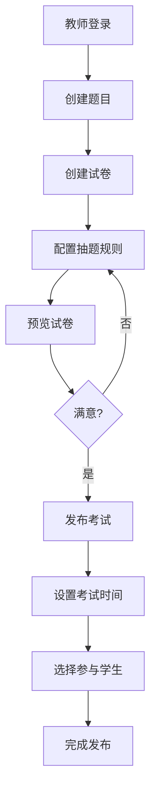
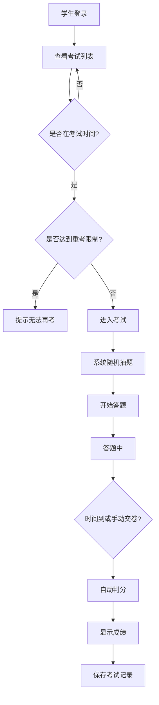
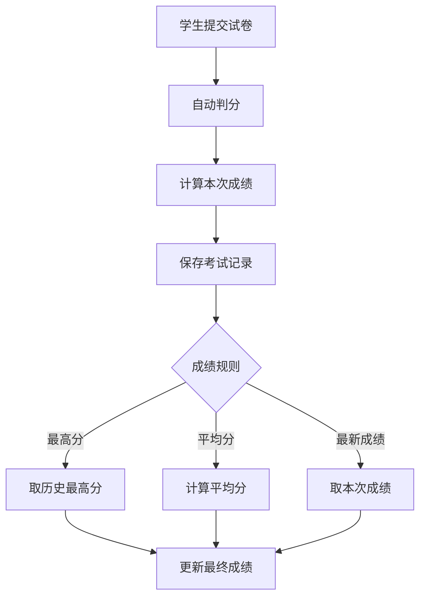

# 在线评测系统 产品需求文档（PRD）

---

## 1. 文档概述

### 1.1 文档信息

| 项目 | 内容 |
|------|------|
| 文档名称 | 在线评测系统产品需求文档 |
| 文档版本 | v1.0 |
| 创建日期 | 2026-03-04 |
| 文档状态 | [草稿/评审中/已批准] |
| 目标受众 | 开发团队（前后端、测试） |

### 1.2 修订历史

| 版本 | 日期 | 修订人 | 修订内容 |
|------|------|--------|----------|
| v1.0 | 2026-03-04 | - | 初始版本创建 |

### 1.3 项目背景

本项目旨在开发一套面向教育场景的在线评测系统，支持教师创建题库、组卷、发布考试，学生在线答题并自动判分。系统部署于本地服务器，初期服务于约50人的小规模用户群体（40名学生、10名教师、5名管理员），高峰期同时在线人数不超过10人。

**项目特点：**
- 全新开发，无历史系统迁移负担
- 纯Web端访问
- 支持单选题、多选题、判断题三种题型
- 题目内容为纯文本
- 交付周期：1-2个月

---

## 2. 产品概述

### 2.1 产品定位

一款轻量级的在线考试与评测管理平台，服务于教育培训场景，提供从题库管理、试卷组卷到在线考试、自动判分的全流程解决方案。

### 2.2 目标用户

| 用户角色 | 人数 | 主要职责 |
|----------|------|----------|
| 管理员 | 5人 | 系统管理、用户管理、全局配置 |
| 教师 | 10人 | 题库管理、组卷发布、成绩查看、统计分析 |
| 学生 | 40人 | 参加考试、查看成绩、错题回顾 |

### 2.3 核心价值

1. **提高效率**：自动抽题、自动判分，减轻教师工作量
2. **公平公正**：随机抽题机制确保每位学生题目不同
3. **数据洞察**：提供单次考试统计和题目分析，辅助教学改进
4. **灵活管理**：支持多次答题、多种成绩计算规则

---

## 3. 角色与权限体系

### 3.1 角色定义

#### 3.1.1 管理员（Administrator）

系统最高权限角色，负责系统整体运维和用户管理。

#### 3.1.2 教师（Teacher）

出题人与评测人，负责题库维护、试卷组织、成绩分析。

#### 3.1.3 学生（Student）

答题人，参加考试并查看个人成绩。

### 3.2 权限矩阵

| 功能模块 | 管理员 | 教师 | 学生 |
|----------|:------:|:----:|:----:|
| 用户管理 | ✓ | ✗ | ✗ |
| 角色管理 | ✓ | ✗ | ✗ |
| 题目管理 | ✓ | ✓ | ✗ |
| 试卷管理 | ✓ | ✓ | ✗ |
| 考试发布 | ✓ | ✓ | ✗ |
| 参加考试 | ✗ | ✗ | ✓ |
| 查看所有成绩 | ✓ | ✓ | ✗ |
| 查看个人成绩 | ✗ | ✗ | ✓ |
| 统计分析 | ✓ | ✓ | ✗ |
| 系统配置 | ✓ | ✗ | ✗ |

> ✓：有权限 | ✗：无权限

---

## 4. 功能需求

按优先级划分功能需求，确保在1-2个月的紧急周期内完成核心功能交付。

### 4.1 P0：核心功能（MVP）

#### 4.1.1 用户管理

| 功能编号 | 功能名称 | 功能描述 |
|----------|----------|----------|
| F001 | 用户登录 | 支持账号密码登录，区分角色身份 |
| F002 | 密码修改 | 用户可修改自己的登录密码 |
| F003 | 用户列表 | 管理员可查看所有用户列表 |
| F004 | 创建用户 | 管理员可创建新用户并分配角色 |
| F005 | 禁用/启用用户 | 管理员可禁用或启用用户账号 |

#### 4.1.2 题库管理

| 功能编号 | 功能名称 | 功能描述 |
|----------|----------|----------|
| F011 | 题目创建 | 支持创建单选题、多选题、判断题 |
| F012 | 题目编辑 | 可修改题目内容、选项、答案、难度 |
| F013 | 题目删除 | 删除无用题目（需确认） |
| F014 | 题目查询 | 按题型、难度、关键词搜索题目 |
| F015 | 题目属性 | 每道题包含：题干、选项、正确答案、难度、分值 |

**题目数据结构：**

```json
{
  "id": "题目标识",
  "type": "single|multiple|boolean",
  "content": "题干内容",
  "options": ["选项A", "选项B", "选项C", "选项D"],
  "answer": "正确答案",
  "difficulty": "easy|medium|hard",
  "points": 10,
  "createdBy": "创建人",
  "createdAt": "创建时间"
}
```

#### 4.1.3 试卷管理

| 功能编号 | 功能名称 | 功能描述 |
|----------|----------|----------|
| F021 | 创建试卷 | 设置试卷名称、考试时长、抽题规则 |
| F022 | 随机抽题 | 按题型、难度比例从题库随机抽取指定数量题目 |
| F023 | 编辑试卷 | 修改试卷配置和抽题规则 |
| F024 | 删除试卷 | 删除未发布的试卷 |
| F025 | 预览试卷 | 预览抽题结果（非答题视图） |

**抽题规则配置：**

| 配置项 | 说明 |
|--------|------|
| 题型分布 | 各题型抽取数量（如：单选10题、多选5题、判断5题） |
| 难度分布 | 各难度抽取数量或比例（如：简单30%、中等50%、困难20%） |
| 题库范围 | 指定从哪些题目中抽取（如：某章节、某难度） |
| 总题数 | 试卷总题数 |
| 总分 | 试卷总分（自动计算或手动设置） |

**抽题逻辑：**
- 从题库中随机抽取符合规则的题目
- 确保每位学生获取的题目组合具有随机性
- 题库不足时给予提示

#### 4.1.4 考试管理

| 功能编号 | 功能名称 | 功能描述 |
|----------|----------|----------|
| F031 | 发布考试 | 将试卷发布给指定学生或学生组 |
| F032 | 设置考试时间 | 设置考试开始时间、结束时间 |
| F033 | 答题次数配置 | 设置允许重考次数及重考时间间隔 |
| F034 | 成绩规则配置 | 选择成绩计算方式（最高分/平均分/最新成绩） |
| F035 | 取消考试 | 取消已发布的考试 |
| F036 | 考试列表 | 查看所有已发布考试 |

#### 4.1.5 在线答题

| 功能编号 | 功能名称 | 功能描述 |
|----------|----------|----------|
| F041 | 进入考试 | 学生可进入已发布的考试 |
| F042 | 随机出题 | 进入考试时按规则随机抽取题目 |
| F043 | 答题界面 | 显示题目、选项，支持答题和修改答案 |
| F044 | 答题进度 | 显示当前题号、总题数、已答/未答状态 |
| F045 | 题目导航 | 可跳转到指定题目 |
| F046 | 手动交卷 | 学生可主动提交试卷 |
| F047 | 自动交卷 | 考试时间到达自动提交试卷 |
| F048 | 倒计时显示 | 显示剩余时间，最后5分钟红色预警 |

#### 4.1.6 自动判分

| 功能编号 | 功能名称 | 功能描述 |
|----------|----------|----------|
| F051 | 客观题判分 | 自动判分单选题、多选题、判断题 |
| F052 | 成绩计算 | 按题目分值自动计算总分 |
| F053 | 判分结果 | 显示得分、正确题数、错误题数 |

#### 4.1.7 成绩查看

| 功能编号 | 功能名称 | 功能描述 |
|----------|----------|----------|
| F061 | 学生查看成绩 | 学生可查看个人考试成绩 |
| F062 | 教师查看成绩 | 教师可查看所有学生的考试成绩 |
| F063 | 考试记录 | 查看历史考试记录和成绩 |

---

### 4.2 P1：重要功能

#### 4.2.1 统计分析

| 功能编号 | 功能名称 | 功能描述 |
|----------|----------|----------|
| F101 | 单次考试统计 | 查看某次考试的统计数据：参考人数、平均分、最高分、最低分、及格率 |
| F102 | 题目分析 | 分析每道题的正确率、错误率 |
| F103 | 成绩分布 | 显示成绩分段分布（如：90-100、80-89等） |

#### 4.2.2 考试记录回溯

| 功能编号 | 功能名称 | 功能描述 |
|----------|----------|----------|
| F111 | 答题详情 | 查看每次考试的答题详情（题目、学生答案、正确答案） |
| F112 | 时间分布 | 记录每道题的答题时间 |

#### 4.2.3 多次答题管理

| 功能编号 | 功能名称 | 功能描述 |
|----------|----------|----------|
| F121 | 重考次数限制 | 限制学生可参加考试的次数 |
| F122 | 重考时间间隔 | 设置两次考试之间的最小时间间隔 |
| F123 | 成绩计算规则 | 支持取最高分、平均分、最新成绩三种方式 |

---

### 4.3 P2：增强功能（后续迭代）

| 功能编号 | 功能名称 | 功能描述 |
|----------|----------|----------|
| F201 | 学生分组 | 支持将学生分组，便于批量管理 |
| F202 | 批量导入用户 | 支持Excel批量导入用户 |
| F203 | 题目收藏 | 学生可收藏错题便于复习 |
| F204 | 成绩趋势图 | 可视化展示学生成绩变化趋势 |
| F205 | 消息通知 | 考试开始/结束前发送通知 |

---

## 5. 非功能需求

### 5.1 性能要求

| 指标 | 要求 | 说明 |
|------|------|------|
| 并发用户 | ≥20人 | 支持高峰期10人同时在线，预留2倍余量 |
| 响应时间 | <2秒 | 页面加载、接口响应时间 |
| 抽题时间 | <3秒 | 从题库抽取题目生成试卷的时间 |
| 判分时间 | <1秒 | 自动判分并显示成绩的时间 |

### 5.2 安全要求

| 要求 | 说明 |
|------|------|
| 密码加密 | 用户密码使用不可逆加密存储 |
| 身份验证 | 登录后使用Session/JWT保持会话 |
| 权限控制 | 前后端双重权限校验 |
| 答题安全 | 防止复制、切屏检测（可选） |
| 数据备份 | 定期备份数据库 |

### 5.3 兼容性要求

| 类别 | 要求 |
|------|------|
| 浏览器 | Chrome 90+、Edge 90+、Safari 14+、Firefox 88+ |
| 分辨率 | 支持1366×768及以上分辨率 |
| 服务器 | 支持部署在Windows/Linux本地服务器 |

### 5.4 可用性要求

| 指标 | 要求 |
|------|------|
| 系统可用性 | 99% |
| 数据持久性 | 100% |
| 故障恢复 | 支持数据恢复机制 |

---

## 6. 数据模型

### 6.1 核心实体

#### 6.1.1 用户（User）

| 字段名 | 类型 | 必填 | 说明 |
|--------|------|:----:|------|
| id | string | ✓ | 用户唯一标识 |
| username | string | ✓ | 用户名（登录账号） |
| password | string | ✓ | 密码（加密存储） |
| name | string | ✓ | 真实姓名 |
| role | enum | ✓ | 角色：admin/teacher/student |
| status | enum | ✓ | 状态：active/disabled |
| createdAt | datetime | ✓ | 创建时间 |
| updatedAt | datetime | ✓ | 更新时间 |

#### 6.1.2 题目（Question）

| 字段名 | 类型 | 必填 | 说明 |
|--------|------|:----:|------|
| id | string | ✓ | 题目唯一标识 |
| type | enum | ✓ | 题型：single/multiple/boolean |
| content | string | ✓ | 题干内容 |
| options | array | ✓ | 选项列表（判断题为["正确","错误"]） |
| answer | string | ✓ | 正确答案 |
| difficulty | enum | ✓ | 难度：easy/medium/hard |
| points | int | ✓ | 分值 |
| createdBy | string | ✓ | 创建人ID |
| createdAt | datetime | ✓ | 创建时间 |
| updatedAt | datetime | ✓ | 更新时间 |

#### 6.1.3 试卷（Paper）

| 字段名 | 类型 | 必填 | 说明 |
|--------|------|:----:|------|
| id | string | ✓ | 试卷唯一标识 |
| name | string | ✓ | 试卷名称 |
| duration | int | ✓ | 考试时长（分钟） |
| totalPoints | int | ✓ | 试卷总分 |
| drawRules | object | ✓ | 抽题规则配置 |
| createdBy | string | ✓ | 创建人ID |
| createdAt | datetime | ✓ | 创建时间 |
| updatedAt | datetime | ✓ | 更新时间 |

**抽题规则（drawRules）结构：**

```json
{
  "totalQuestions": 20,
  "rules": [
    {
      "type": "single",
      "count": 10,
      "difficulty": { "easy": 3, "medium": 5, "hard": 2 }
    },
    {
      "type": "multiple",
      "count": 5,
      "difficulty": { "easy": 1, "medium": 3, "hard": 1 }
    },
    {
      "type": "boolean",
      "count": 5,
      "difficulty": { "easy": 2, "medium": 2, "hard": 1 }
    }
  ]
}
```

#### 6.1.4 考试（Exam）

| 字段名 | 类型 | 必填 | 说明 |
|--------|------|:----:|------|
| id | string | ✓ | 考试唯一标识 |
| paperId | string | ✓ | 关联试卷ID |
| name | string | ✓ | 考试名称 |
| startTime | datetime | ✓ | 考试开始时间 |
| endTime | datetime | ✓ | 考试结束时间 |
| maxAttempts | int | ✓ | 最大答题次数 |
| attemptInterval | int | ✓ | 重考时间间隔（分钟） |
| scoreRule | enum | ✓ | 成绩规则：max/avg/latest |
| status | enum | ✓ | 状态：draft/published/ended/cancelled |
| createdBy | string | ✓ | 创建人ID |
| createdAt | datetime | ✓ | 创建时间 |
| updatedAt | datetime | ✓ | 更新时间 |

#### 6.1.5 考试记录（ExamRecord）

| 字段名 | 类型 | 必填 | 说明 |
|--------|------|:----:|------|
| id | string | ✓ | 记录唯一标识 |
| examId | string | ✓ | 关联考试ID |
| studentId | string | ✓ | 学生ID |
| attemptNo | int | ✓ | 第几次尝试 |
| questions | array | ✓ | 抽取的题目列表 |
| answers | object | ✓ | 学生答案 |
| score | int | ✓ | 得分 |
| startTime | datetime | ✓ | 开始答题时间 |
| submitTime | datetime | ✓ | 提交时间 |
| timeSpent | int | ✓ | 答题用时（秒） |
| createdAt | datetime | ✓ | 创建时间 |

**答题详情（answers）结构：**

```json
{
  "questionId": {
    "answer": "学生答案",
    "isCorrect": true,
    "timeSpent": 45
  }
}
```

### 6.2 实体关系图（ERD）

```
┌─────────────┐
│    User     │
│  (用户)     │
└──────┬──────┘
       │
       │ 1:n
       ▼
┌─────────────┐       ┌─────────────┐
│  Question   │───────│   Paper     │
│  (题目)     │  n:1  │  (试卷)     │
└─────────────┘       └──────┬──────┘
                             │
                             │ 1:n
                             ▼
                      ┌─────────────┐       ┌─────────────────┐
                      │    Exam     │───────│   ExamRecord    │
                      │  (考试)     │  1:n  │   (考试记录)    │
                      └─────────────┘       └─────────────────┘
```

---

## 7. 业务流程

### 7.1 核心业务流程

#### 7.1.1 教师创建考试流程



#### 7.1.2 学生参加考试流程



#### 7.1.3 成绩计算流程



### 7.2 状态流转说明

#### 7.2.1 考试状态

| 状态 | 说明 | 可转换状态 |
|------|------|------------|
| draft | 草稿 | published, deleted |
| published | 已发布 | ended, cancelled |
| ended | 已结束 | - |
| cancelled | 已取消 | - |

#### 7.2.2 考试记录状态

| 状态 | 说明 |
|------|------|
| in_progress | 答题中 |
| submitted | 已提交 |
| auto_submitted | 自动提交（超时） |

---

## 8. 界面设计规范

### 8.1 整体布局

采用经典的后台管理系统布局：

```
┌─────────────────────────────────────────────────┐
│  Header：Logo + 用户信息 + 退出                    │
├──────────┬──────────────────────────────────────┤
│          │                                       │
│  Sidebar │           主内容区                    │
│          │                                       │
│  导航菜单 │           Content                    │
│          │                                       │
│          │                                       │
└──────────┴──────────────────────────────────────┘
```

### 8.2 关键页面说明

#### 8.2.1 登录页

| 元素 | 说明 |
|------|------|
| Logo/系统名称 | 居中显示 |
| 用户名输入框 | 必填 |
| 密码输入框 | 必填，支持显示/隐藏 |
| 登录按钮 | 主要操作按钮 |
| 错误提示 | 登录失败时显示 |

#### 8.2.2 题目管理页

| 元素 | 说明 |
|------|------|
| 题目列表 | 表格展示，显示题干、题型、难度、分值 |
| 搜索框 | 支持按题型、难度、关键词搜索 |
| 新增按钮 | 跳转到创建题目页面 |
| 编辑按钮 | 修改题目 |
| 删除按钮 | 删除题目（需二次确认） |

#### 8.2.3 创建/编辑题目页

| 元素 | 说明 |
|------|------|
| 题型选择 | 单选：单选题/多选题/判断题 |
| 题干输入 | 文本输入框 |
| 选项输入 | 4个选项输入框（判断题固定为"正确"/"错误"） |
| 正确答案选择 | 单选题单选，多选题多选，判断题单选 |
| 难度选择 | 下拉：简单/中等/困难 |
| 分值输入 | 数字输入框，默认10分 |
| 保存/取消按钮 | 表单操作按钮 |

#### 8.2.4 试卷管理页

| 元素 | 说明 |
|------|------|
| 试卷列表 | 表格展示，显示名称、时长、总分、状态 |
| 新增按钮 | 跳转到创建试卷页面 |
| 编辑按钮 | 修改试卷（仅草稿状态） |
| 删除按钮 | 删除试卷（仅草稿状态） |
| 发布按钮 | 创建考试 |

#### 8.2.5 创建/编辑试卷页

| 元素 | 说明 |
|------|------|
| 试卷名称 | 文本输入框 |
| 考试时长 | 数字输入框（分钟） |
| 抽题规则配置 | 按题型配置数量和难度分布 |
| 预览按钮 | 预览抽题效果 |
| 保存/取消按钮 | 表单操作按钮 |

#### 8.2.6 答题页

| 元素 | 说明 |
|------|------|
| 题目区域 | 显示当前题目的题干和选项 |
| 答题进度 | 显示"第X题/共Y题" |
| 倒计时 | 显示剩余时间，最后5分钟红色显示 |
| 上一题/下一题 | 切换题目按钮 |
| 题目导航 | 快速跳转到指定题目 |
| 答题卡 | 显示所有题目的答题状态（未答/已答） |
| 交卷按钮 | 主要操作按钮，需二次确认 |

#### 8.2.7 成绩页

| 元素 | 说明 |
|------|------|
| 成绩概要 | 显示总分、正确题数、错误题数 |
| 答题详情 | 显示每道题的题目、学生答案、正确答案、是否正确 |
| 返回按钮 | 返回考试列表 |

#### 8.2.8 教师成绩管理页

| 元素 | 说明 |
|------|------|
| 考试选择 | 下拉选择查看某次考试的成绩 |
| 成绩列表 | 表格展示，显示学生姓名、成绩、答题时间 |
| 统计数据 | 显示参考人数、平均分、最高分、最低分、及格率 |
| 答题详情按钮 | 查看某学生的答题详情 |

### 8.3 交互规范

| 场景 | 交互说明 |
|------|----------|
| 删除操作 | 需弹出确认对话框 |
| 交卷操作 | 需弹出确认对话框，显示未答题目数量 |
| 表单验证 | 实时验证，错误信息明确提示 |
| 加载状态 | 数据加载时显示loading提示 |
| 操作反馈 | 操作成功/失败给予明确提示 |

### 8.4 响应式设计

| 分辨率 | 布局调整 |
|--------|----------|
| ≥1366×768 | 标准布局，侧边栏展开 |
| <1366×768 | 侧边栏可折叠 |

---

## 9. 技术建议

### 9.1 技术栈推荐

考虑到项目规模小（50人）、并发低（≤10人）、周期紧（1-2个月），推荐以下技术方案：

#### 9.1.1 后端技术

| 组件 | 推荐方案 | 说明 |
|------|----------|------|
| 开发语言 | Python | 简单易学，生态丰富 |
| Web框架 | Flask | 轻量级、灵活、易上手 |
| 数据库 | SQLite | 零配置、单文件，适合小规模应用 |
| 数据库操作 | SQLAlchemy | Python主流ORM，简单易用 |
| 认证 | Flask-Login | 简单的用户会话管理 |

**推荐理由：**
- Python语法简单，开发效率高
- Flask框架轻量，学习成本低
- SQLite数据库文件直接存储，备份方便
- 适合小团队快速开发

#### 9.1.2 前端技术

| 组件 | 推荐方案 | 说明 |
|------|----------|------|
| 框架 | React | 组件化开发，生态成熟 |
| UI组件库 | Ant Design | 企业级组件，开箱即用 |
| 状态管理 | React State (useState) | 简单场景不需要额外状态管理库 |
| 路由 | React Router | 页面路由管理 |
| HTTP客户端 | Axios | 简单易用的HTTP库 |
| 构建工具 | Vite | 快速的构建工具 |

**推荐理由：**
- 不使用TypeScript，减少配置复杂度
- Vite构建速度快，开发体验好
- 简单状态用React内置state即可，不需要额外库

### 9.2 架构设计

采用简单的前后端分离架构：

```
┌─────────────────────────────────────────────────┐
│              前端 (React + Vite)                  │
│            登录 | 题库 | 试卷 | 考试 | 成绩        │
└────────────────────┬────────────────────────────┘
                     │ HTTP API
                     ▼
┌─────────────────────────────────────────────────┐
│           后端 (Python + Flask)                  │
│        用户认证 | 题库管理 | 考试管理 | 判分       │
└────────────────────┬────────────────────────────┘
                     │
                     ▼
┌─────────────────────────────────────────────────┐
│              数据库 (SQLite)                      │
│         exam.db 单文件数据库                      │
└─────────────────────────────────────────────────┘
```

**架构特点：**
- 简单三层架构：前端 → 后端API → 数据库
- 无需微服务、消息队列等复杂组件
- 前后端分离，便于独立开发和调试

### 9.3 部署建议

| 环境 | 部署方式 |
|------|----------|
| 开发环境 | 本地运行，前端localhost:3000，后端localhost:5000 |
| 生产环境 | 单机部署，使用Gunicorn/uWSGI运行Flask，Nginx反向代理 |

**生产环境配置示例：**

```nginx
# Nginx配置
server {
    listen 80;
    server_name exam.local;

    # 前端静态资源
    location / {
        root /var/www/exam-frontend/dist;
        try_files $uri /index.html;
    }

    # 后端API代理
    location /api {
        proxy_pass http://localhost:5000;
        proxy_set_header Host $host;
        proxy_set_header X-Real-IP $remote_addr;
    }
}
```

### 9.4 开发优先级建议

**核心原则：先做能用，再做好用**

**Phase 1（第1-3周）：MVP核心功能 - 能用**
- 用户登录（简单账号密码，不需要复杂权限）
- 题目增删改查
- 手动组卷（先不做随机抽题，手动选题即可）
- 在线答题
- 自动判分
- 查看成绩

**Phase 2（第4-5周）：完善功能 - 好用**
- 随机抽题
- 考试发布与管理
- 多次答题与成绩规则
- 基础统计

**Phase 3（第6周及以后）：根据实际需求迭代**
- 高级统计分析
- 用户体验优化

---

## 10. 附录

### 10.1 术语表

| 术语 | 说明 |
|------|------|
| PRD | Product Requirements Document，产品需求文档 |
| MVP | Minimum Viable Product，最小可行产品 |
| P0/P1/P2 | 功能优先级，P0最高 |
| ORM | Object-Relational Mapping，对象关系映射 |

### 10.2 参考文档

- [Ant Design组件库](https://ant.design/)
- [React官方文档](https://react.dev/)
- [Flask官方文档](https://flask.palletsprojects.com/)
- [SQLAlchemy文档](https://docs.sqlalchemy.org/)

---

**文档结束**
