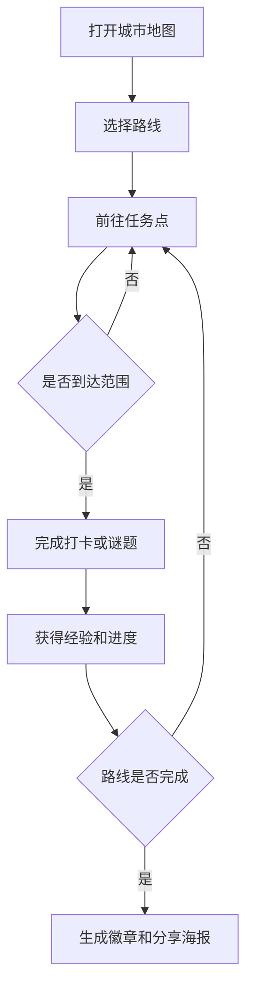

# 城市漫游任务游戏 PRD

---

## 1. 文档概述

### 1.1 文档信息

| 项目 | 内容 |
|------|------|
| 文档名称 | 城市漫游任务游戏产品需求文档 |
| 文档版本 | v1.0 |
| 创建日期 | 2026-04-28 |
| 文档状态 | 草稿 |
| 目标受众 | 产品、设计、移动端、后端、运营、测试 |

### 1.2 项目背景

很多城市居民和游客想探索附近有趣的地方，但常规地图和点评产品更偏向“找店”和“导航”，缺少游戏化探索体验。本项目将城市空间转化为任务地图，通过打卡、谜题、路线和成就系统，鼓励用户走出固定路线，发现街区故事、小店、建筑和公共空间。

**项目特点：**
- 基于真实地理位置生成探索任务。
- 融合城市文化、轻解谜和路线挑战。
- 支持个人漫游、情侣路线、朋友组队和亲子模式。
- 适合本地生活、文旅活动和城市品牌合作。

---

## 2. 产品概述

### 2.1 产品定位

一款城市探索类移动游戏，把真实街区变成可完成任务、收集徽章和解锁故事的互动地图。

### 2.2 目标用户

| 用户角色 | 特征描述 | 核心需求 |
|----------|----------|----------|
| 城市年轻人 | 周末想找新鲜活动 | 有趣、不贵、能拍照分享 |
| 游客 | 在陌生城市短暂停留 | 快速获得特色路线 |
| 亲子家庭 | 需要轻户外活动 | 安全、有教育意义、节奏轻松 |
| 本地商家/文旅方 | 希望引流和活动运营 | 设计路线和奖励机制 |

### 2.3 核心价值

1. **把出门变好玩**：用任务和故事降低探索门槛。
2. **让城市被重新发现**：把小众地点和本地文化结构化呈现。
3. **促进线下消费**：路线可以联动商家优惠和活动。
4. **形成分享传播**：徽章、路线海报和成就适合社交扩散。

---

## 3. 功能需求

### 3.1 P0：核心功能（MVP）

#### 3.1.1 地图与任务

| 功能编号 | 功能名称 | 功能描述 | 验收标准 |
|----------|----------|----------|----------|
| F001 | 城市地图 | 展示当前位置、附近任务点和路线 | 地图加载时间不超过 3 秒 |
| F002 | 任务点详情 | 展示地点故事、任务要求、奖励 | 用户能明确知道要做什么 |
| F003 | 任务分类 | 支持拍照、问答、到访、收集四类任务 | 不同任务有不同图标 |
| F004 | 距离提示 | 显示距离和预计步行时间 | 距离随位置变化更新 |

#### 3.1.2 打卡验证

| 功能编号 | 功能名称 | 功能描述 | 验收标准 |
|----------|----------|----------|----------|
| F011 | 到访验证 | 用户到达任务点范围内后可打卡 | 超出范围不能打卡 |
| F012 | 拍照任务 | 用户提交现场照片完成任务 | 照片保存到任务记录 |
| F013 | 问答任务 | 根据地点内容回答问题 | 回答正确才算完成 |
| F014 | 防作弊 | 检测异常定位和过快移动 | 异常时提示重新验证 |

#### 3.1.3 路线系统

| 功能编号 | 功能名称 | 功能描述 | 验收标准 |
|----------|----------|----------|----------|
| F021 | 推荐路线 | 按主题展示 1-3 小时探索路线 | 路线包含多个任务点 |
| F022 | 路线进度 | 展示当前完成点数和剩余任务 | 完成后生成路线总结 |
| F023 | 路线筛选 | 按亲子、咖啡、建筑、夜游等主题筛选 | 筛选后列表实时更新 |
| F024 | 路线收藏 | 用户可收藏感兴趣路线 | 收藏路线进入个人页 |

#### 3.1.4 奖励与成就

| 功能编号 | 功能名称 | 功能描述 | 验收标准 |
|----------|----------|----------|----------|
| F031 | 经验值 | 完成任务获得经验值 | 经验值实时增加 |
| F032 | 城市徽章 | 完成路线或主题任务获得徽章 | 徽章展示在个人主页 |
| F033 | 分享海报 | 生成路线完成海报 | 海报包含路线、徽章、照片 |

### 3.2 P1：重要功能

| 功能编号 | 功能名称 | 功能描述 |
|----------|----------|----------|
| F101 | 组队探索 | 创建队伍，成员共享路线进度 |
| F102 | 限时活动 | 在节日或城市活动中发布限时任务 |
| F103 | 商家奖励 | 完成任务后领取优惠券或小礼品 |
| F104 | 用户投稿 | 用户可提交新地点和任务建议 |
| F105 | 离线路线 | 提前缓存路线和地图，减少户外网络依赖 |

### 3.3 P2：增强功能

| 功能编号 | 功能名称 | 功能描述 |
|----------|----------|----------|
| F201 | AR 线索 | 通过摄像头识别地标并显示虚拟线索 |
| F202 | AI 路线生成 | 根据时间、体力和兴趣生成个性路线 |
| F203 | 城市护照 | 跨城市收集印章和探索等级 |
| F204 | 创作者后台 | 让本地达人创建和售卖路线 |

---

## 4. 技术方案

### 4.1 技术栈

| 层级 | 技术选择 |
|------|----------|
| 移动端 | React Native / Flutter |
| 地图 | 高德地图 / Mapbox / Google Maps |
| 后端 | NestJS / FastAPI |
| 数据库 | PostgreSQL + PostGIS、Redis |
| 存储 | 对象存储用于照片和海报 |
| AI 能力 | 路线推荐、图片审核、内容生成 |

### 4.2 系统架构

```text
移动端地图
  ↓
位置与任务 API
  ↓
任务服务 ── 路线服务 ── 奖励服务
  ↓
PostGIS 地理数据
  ↓
图片审核 / 海报生成 / 活动运营后台
```

---

## 5. 数据模型

### 5.1 TaskPoint

| 字段名 | 类型 | 必填 | 说明 |
|--------|------|:----:|------|
| id | string | ✓ | 任务点 ID |
| title | string | ✓ | 任务标题 |
| type | enum | ✓ | visit/photo/quiz/collect |
| latitude | number | ✓ | 纬度 |
| longitude | number | ✓ | 经度 |
| radius | number | ✓ | 可打卡半径 |
| story | text | ✗ | 地点故事 |
| rewardExp | number | ✓ | 奖励经验 |

### 5.2 Route

| 字段名 | 类型 | 必填 | 说明 |
|--------|------|:----:|------|
| id | string | ✓ | 路线 ID |
| city | string | ✓ | 所属城市 |
| theme | string | ✓ | 路线主题 |
| taskPointIds | array | ✓ | 任务点列表 |
| estimatedMinutes | number | ✓ | 预计耗时 |
| difficulty | enum | ✓ | easy/normal/hard |

---

## 6. 核心流程



---

## 7. 非功能需求

| 类别 | 要求 |
|------|------|
| 定位准确性 | 城市街区场景误差尽量控制在 50 米内 |
| 安全 | 夜间路线需标记安全提示和营业状态 |
| 性能 | 地图任务点在 500 个以内时滚动和缩放流畅 |
| 隐私 | 位置数据仅用于任务验证和路线推荐 |
| 内容审核 | 用户上传照片和投稿需经过审核 |

---

## 8. 开发计划

| 阶段 | 周期 | 交付内容 |
|------|------|----------|
| 第一阶段 | 2 周 | 地图、任务点、到访打卡 |
| 第二阶段 | 2 周 | 路线系统、成就、分享海报 |
| 第三阶段 | 2 周 | 组队、活动、商家奖励 |
| 第四阶段 | 1 周 | 防作弊、审核、上线准备 |

