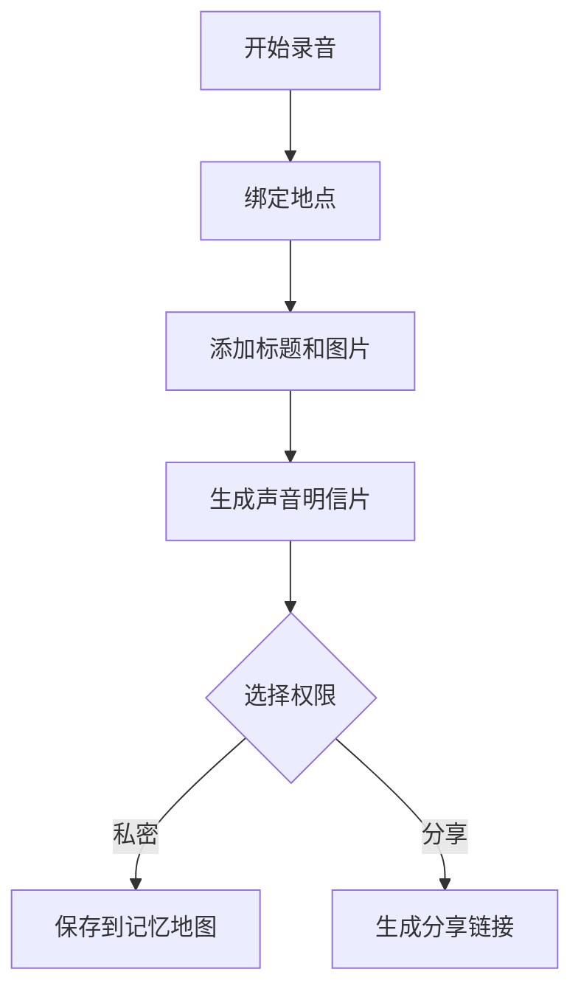

# 声音明信片与记忆地图 PRD

---

## 1. 文档概述

| 项目 | 内容 |
|------|------|
| 文档名称 | 声音明信片与记忆地图产品需求文档 |
| 文档版本 | v1.0 |
| 创建日期 | 2026-04-28 |
| 文档状态 | 草稿 |
| 目标受众 | 产品、设计、移动端、后端、音频工程、测试 |

## 2. 项目背景

照片能记录画面，但很多生活记忆来自声音：一条街的喧闹、海边的风、家人的一句话、旅行时的广播。现有相册产品缺少声音维度，录音工具又缺少位置、故事和分享体验。本产品让用户把短音频、地点、图片和文字组合成“声音明信片”，并在地图上形成私人记忆档案。

## 3. 产品概述

### 3.1 产品定位

一款基于位置的声音记忆工具，让用户用 10-60 秒音频保存地点、关系和事件。

### 3.2 目标用户

| 用户角色 | 特征描述 | 核心需求 |
|----------|----------|----------|
| 旅行者 | 喜欢记录旅途细节 | 保存地点的真实声音 |
| 异地情侣/亲友 | 需要有温度的分享 | 发送带地点的声音卡片 |
| 城市观察者 | 喜欢收集街区片段 | 构建城市声音地图 |
| 内容创作者 | 制作播客/短视频素材 | 管理现场声音素材 |

### 3.3 核心价值

1. **比照片更有现场感**：保存环境声、语气和氛围。
2. **用地图组织记忆**：声音与地点绑定，回看更自然。
3. **低成本表达情感**：一段声音即可生成可分享明信片。
4. **沉淀个人声音档案**：适合长期收藏、检索和导出。

## 4. 功能需求

### 4.1 P0：核心功能（MVP）

| 功能编号 | 功能名称 | 功能描述 | 验收标准 |
|----------|----------|----------|----------|
| F001 | 快速录音 | 用户录制 10-60 秒音频 | 录制过程稳定不中断 |
| F002 | 位置绑定 | 自动记录当前位置或手动选择地点 | 明信片展示地点名称 |
| F003 | 明信片生成 | 音频、标题、图片、文字组合成卡片 | 可预览并保存 |
| F004 | 记忆地图 | 地图上展示已保存声音点 | 点击点位可播放 |
| F005 | 私密/公开 | 设置仅自己可见、链接分享或公开 | 权限生效明确 |
| F006 | 音频降噪 | 对人声录音提供基础降噪 | 用户可开关处理 |

### 4.2 P1：重要功能

| 功能编号 | 功能名称 | 功能描述 |
|----------|----------|----------|
| F101 | 声音合集 | 按旅行、城市、人物创建合集 |
| F102 | 定时寄送 | 选择未来时间发送声音明信片 |
| F103 | 自动转写 | 将人声转为文字，便于搜索 |
| F104 | 协作地图 | 多人共同维护一张声音地图 |
| F105 | 声音封面 | 从地点、照片和波形生成封面图 |

### 4.3 P2：增强功能

| 功能编号 | 功能名称 | 功能描述 |
|----------|----------|----------|
| F201 | AR 回放 | 到达地点后自动弹出当年的声音 |
| F202 | 城市声音展 | 公开声音可进入城市主题展览 |
| F203 | 记忆胶囊 | 多年后自动提醒回听某段声音 |
| F204 | 空间音频 | 支持双耳录音或空间音频播放 |

## 5. 技术方案

| 层级 | 技术选择 |
|------|----------|
| 移动端 | React Native / Flutter |
| 地图 | Mapbox / 高德地图 |
| 后端 | NestJS / FastAPI |
| 存储 | 对象存储、CDN |
| 数据库 | PostgreSQL + PostGIS |
| 音频能力 | 录音、转码、降噪、语音转写 |

## 6. 数据模型

### 6.1 SoundPostcard

| 字段名 | 类型 | 必填 | 说明 |
|--------|------|:----:|------|
| id | string | ✓ | 明信片 ID |
| title | string | ✓ | 标题 |
| audioUrl | string | ✓ | 音频地址 |
| coverUrl | string | ✗ | 封面图 |
| latitude | number | ✓ | 纬度 |
| longitude | number | ✓ | 经度 |
| locationName | string | ✗ | 地点名称 |
| visibility | enum | ✓ | private/link/public |
| transcript | text | ✗ | 转写文本 |

## 7. 核心流程

## 8. 验收指标

| 指标 | 目标 |
|------|------|
| 录音保存成功率 | ≥ 99% |
| 地图点位加载时间 | ≤ 3 秒 |
| 音频首帧播放时间 | ≤ 1.5 秒 |
| 分享链接打开成功率 | ≥ 98% |

