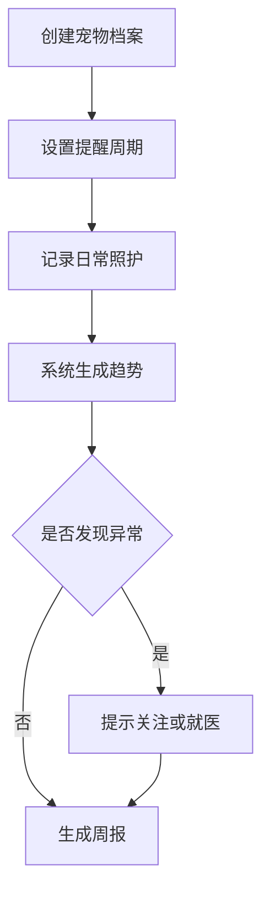

# 宠物健康与喂养助手 PRD

---

## 1. 文档概述

### 1.1 文档信息

| 项目 | 内容 |
|------|------|
| 文档名称 | 宠物健康与喂养助手产品需求文档 |
| 文档版本 | v1.0 |
| 创建日期 | 2026-04-28 |
| 文档状态 | 草稿 |
| 目标受众 | 产品、设计、移动端、后端、测试 |

### 1.2 项目背景

养宠用户需要长期管理喂食、驱虫、疫苗、体重、异常症状和就医记录，但这些信息通常分散在聊天、纸质疫苗本和记忆中。新手宠物主人尤其容易遗漏定期事项。本项目希望用轻量记录和智能提醒，帮助用户建立宠物健康档案。

**项目特点：**
- 支持多宠物档案管理。
- 记录喂食、体重、排便、疫苗、驱虫和就医。
- 提供定期提醒和异常趋势提示。
- 支持家庭成员共同照顾宠物。

---

## 2. 产品概述

### 2.1 产品定位

一款宠物健康与日常照护管理 App，帮助宠物主人记录关键健康数据并减少照护遗漏。

### 2.2 目标用户

| 用户角色 | 特征描述 | 核心需求 |
|----------|----------|----------|
| 新手养宠人 | 缺少照护经验 | 喂养建议和提醒 |
| 多宠家庭 | 同时养猫狗或多只宠物 | 区分每只宠物记录 |
| 家庭成员 | 多人共同照顾宠物 | 同步任务和记录 |
| 宠物店/医生 | 提供服务和建议 | 查看授权健康档案 |

### 2.3 核心价值

1. **照护不遗漏**：自动提醒喂食、疫苗、驱虫和复诊。
2. **健康有记录**：持续追踪体重、食量和异常症状。
3. **多人协同**：家庭成员共享任务状态。
4. **就医更高效**：医生可快速了解历史记录。

---

## 3. 功能需求

### 3.1 P0：核心功能（MVP）

#### 3.1.1 宠物档案

| 功能编号 | 功能名称 | 功能描述 | 验收标准 |
|----------|----------|----------|----------|
| F001 | 创建宠物 | 添加名称、品种、性别、生日、照片 | 创建后显示在首页 |
| F002 | 多宠切换 | 支持管理多只宠物 | 数据按宠物隔离 |
| F003 | 健康基础信息 | 记录绝育、过敏、慢病、常用药 | 可随时编辑 |
| F004 | 文件上传 | 上传疫苗本、化验单、处方照片 | 文件归档到宠物档案 |

#### 3.1.2 日常记录

| 功能编号 | 功能名称 | 功能描述 | 验收标准 |
|----------|----------|----------|----------|
| F011 | 喂食记录 | 记录食物类型、数量、时间 | 可查看每日汇总 |
| F012 | 体重记录 | 记录体重并生成趋势图 | 支持 kg 和 lb |
| F013 | 排便记录 | 记录次数、状态和异常备注 | 可按日查看 |
| F014 | 症状记录 | 记录呕吐、咳嗽、精神差等异常 | 异常记录可添加照片 |

#### 3.1.3 提醒任务

| 功能编号 | 功能名称 | 功能描述 | 验收标准 |
|----------|----------|----------|----------|
| F021 | 喂食提醒 | 设置每日喂食时间 | 到点推送提醒 |
| F022 | 疫苗提醒 | 根据接种日期提醒下一针 | 支持提前提醒 |
| F023 | 驱虫提醒 | 设置体内外驱虫周期 | 周期到期自动提醒 |
| F024 | 任务完成 | 家庭成员可标记任务完成 | 完成状态同步 |

#### 3.1.4 健康报告

| 功能编号 | 功能名称 | 功能描述 | 验收标准 |
|----------|----------|----------|----------|
| F031 | 周报 | 生成一周喂食、体重、异常摘要 | 用户可查看历史周报 |
| F032 | 趋势提示 | 发现体重持续下降等异常趋势时提醒 | 提醒包含数据依据 |
| F033 | 就医导出 | 导出 PDF 健康记录 | 包含关键时间线 |

### 3.2 P1：重要功能

| 功能编号 | 功能名称 | 功能描述 |
|----------|----------|----------|
| F101 | 家庭共享 | 邀请家人共同管理宠物 |
| F102 | 食粮库存 | 记录宠粮、猫砂、药品库存和补货提醒 |
| F103 | 附近医院 | 收藏宠物医院、医生和就诊记录 |
| F104 | 智能喂养建议 | 根据品种、年龄、体重提供喂食参考 |
| F105 | 保险记录 | 记录宠物保险、理赔和账单 |

### 3.3 P2：增强功能

| 功能编号 | 功能名称 | 功能描述 |
|----------|----------|----------|
| F201 | AI 症状预问诊 | 根据症状生成就医前问题清单 |
| F202 | 智能设备接入 | 接入自动喂食器、饮水机和智能猫砂盆 |
| F203 | 宠物成长相册 | 根据照片生成成长时间线 |
| F204 | 医生协作端 | 用户授权医生查看健康档案 |

---

## 4. 技术方案

### 4.1 技术栈

| 层级 | 技术选择 |
|------|----------|
| 移动端 | Flutter / React Native |
| 后端 | FastAPI / NestJS |
| 数据库 | PostgreSQL、Redis |
| 存储 | 对象存储保存照片和文件 |
| 通知 | APNs、FCM、应用内通知 |
| AI 能力 | 趋势分析、症状文本总结 |

### 4.2 系统架构

```text
移动端记录
  ↓
宠物档案服务 ── 提醒服务
  ↓              ↓
健康数据存储    推送通道
  ↓
报告生成 / 趋势分析 / 文件归档
```

---

## 5. 数据模型

### 5.1 Pet

| 字段名 | 类型 | 必填 | 说明 |
|--------|------|:----:|------|
| id | string | ✓ | 宠物 ID |
| name | string | ✓ | 宠物名称 |
| species | enum | ✓ | cat/dog/other |
| breed | string | ✗ | 品种 |
| birthday | date | ✗ | 生日 |
| photoUrl | string | ✗ | 头像 |

### 5.2 HealthRecord

| 字段名 | 类型 | 必填 | 说明 |
|--------|------|:----:|------|
| id | string | ✓ | 记录 ID |
| petId | string | ✓ | 所属宠物 |
| type | enum | ✓ | feeding/weight/symptom/vaccine/deworm |
| recordedAt | datetime | ✓ | 记录时间 |
| value | object | ✓ | 记录内容 |
| note | text | ✗ | 备注 |

---

## 6. 核心流程



---

## 7. 非功能需求

| 类别 | 要求 |
|------|------|
| 隐私 | 宠物健康记录默认仅本人和授权成员可见 |
| 安全 | 健康建议必须说明不能替代兽医诊断 |
| 可用性 | 记录一次喂食不超过 10 秒 |
| 可靠性 | 提醒任务需支持失败重试 |
| 兼容性 | 支持 iOS 和 Android 主流版本 |

---

## 8. 开发计划

| 阶段 | 周期 | 交付内容 |
|------|------|----------|
| 第一阶段 | 2 周 | 宠物档案、日常记录、首页 |
| 第二阶段 | 2 周 | 提醒、家庭共享、趋势图 |
| 第三阶段 | 2 周 | 健康报告、文件上传、导出 |
| 第四阶段 | 1 周 | 测试、推送稳定性、发布 |

