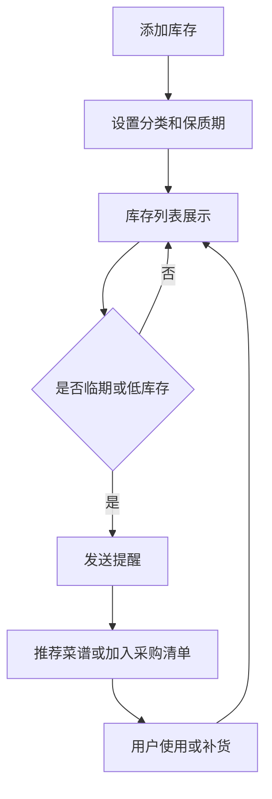

# 家庭库存与保质期管家 PRD

---

## 1. 文档概述

### 1.1 文档信息

| 项目 | 内容 |
|------|------|
| 文档名称 | 家庭库存与保质期管家产品需求文档 |
| 文档版本 | v1.0 |
| 创建日期 | 2026-04-28 |
| 文档状态 | 草稿 |
| 目标受众 | 产品、设计、前端、后端、测试 |

### 1.2 项目背景

家庭用户经常遇到食材过期、重复购买、冰箱里有什么不清楚的问题。尤其是多成员家庭、租房合住和喜欢囤货的人群，缺少一个轻量、低负担的家庭库存管理工具。本项目通过扫码、拍照识别、语音录入和保质期提醒，帮助用户知道家里有什么、快过期什么、今天可以做什么。

**项目特点：**
- 低成本记录家庭食品、日用品和药品库存。
- 自动提醒临期、过期和低库存物品。
- 根据现有食材推荐菜谱和采购清单。
- 支持家庭成员共享和分工。

---

## 2. 产品概述

### 2.1 产品定位

一款面向家庭生活场景的库存管理 App，帮助用户减少浪费、避免重复购买，并提升采购和做饭效率。

### 2.2 目标用户

| 用户角色 | 特征描述 | 核心需求 |
|----------|----------|----------|
| 家庭采购者 | 经常负责买菜和日用品 | 知道缺什么、别买重复 |
| 做饭用户 | 关注食材新鲜和搭配 | 根据库存快速决定吃什么 |
| 囤货用户 | 家里有大量食品和日用品 | 管理保质期和存放位置 |
| 合租用户 | 多人共享冰箱和储物柜 | 区分个人物品和共享物品 |

### 2.3 核心价值

1. **减少浪费**：临期提醒让食材在过期前被使用。
2. **降低重复采购**：购物前快速查看库存。
3. **提升做饭效率**：基于现有食材生成菜谱。
4. **家庭协作**：成员共享库存和采购清单。

---

## 3. 功能需求

### 3.1 P0：核心功能（MVP）

#### 3.1.1 库存录入

| 功能编号 | 功能名称 | 功能描述 | 验收标准 |
|----------|----------|----------|----------|
| F001 | 手动添加 | 输入物品名称、数量、单位、分类、保质期 | 保存后出现在库存列表 |
| F002 | 扫码录入 | 扫描商品条码自动填充名称和规格 | 无法识别时允许手动补全 |
| F003 | 拍照识别 | 对购物小票或冰箱照片进行识别 | 识别结果可逐项确认 |
| F004 | 存放位置 | 支持冰箱、冷冻、橱柜、药箱等位置 | 可按位置筛选库存 |

#### 3.1.2 库存管理

| 功能编号 | 功能名称 | 功能描述 | 验收标准 |
|----------|----------|----------|----------|
| F011 | 库存列表 | 按分类、位置、保质期展示物品 | 支持搜索和筛选 |
| F012 | 数量调整 | 支持使用、补货、丢弃三种操作 | 数量变化记录到日志 |
| F013 | 临期标记 | 根据保质期显示安全、临期、过期状态 | 临期物品优先展示 |
| F014 | 批量处理 | 支持批量删除、移动位置、修改分类 | 操作前二次确认 |

#### 3.1.3 提醒与清单

| 功能编号 | 功能名称 | 功能描述 | 验收标准 |
|----------|----------|----------|----------|
| F021 | 临期提醒 | 在物品到期前 N 天提醒 | 提醒时间可配置 |
| F022 | 低库存提醒 | 常备物品低于阈值时提醒 | 阈值支持自定义 |
| F023 | 采购清单 | 将低库存和手动添加物品加入购物清单 | 支持勾选已购买 |
| F024 | 清单共享 | 家庭成员可共同编辑采购清单 | 多端更新保持一致 |

#### 3.1.4 食材推荐

| 功能编号 | 功能名称 | 功能描述 | 验收标准 |
|----------|----------|----------|----------|
| F031 | 临期优先菜谱 | 根据快过期食材推荐可做菜谱 | 推荐结果展示所需食材 |
| F032 | 缺料提示 | 显示还缺哪些食材 | 可一键加入采购清单 |
| F033 | 饮食偏好 | 设置忌口、口味和烹饪时间 | 推荐结果按偏好过滤 |

### 3.2 P1：重要功能

| 功能编号 | 功能名称 | 功能描述 |
|----------|----------|----------|
| F101 | 家庭空间 | 邀请家庭成员共同管理库存 |
| F102 | 消耗统计 | 统计每月食材浪费、采购频次和高消耗品类 |
| F103 | 常购物品 | 根据历史记录自动识别常购物品 |
| F104 | 语音录入 | 用户说“牛奶两盒下周过期”即可添加库存 |
| F105 | 药品管理 | 支持药品有效期、服用提醒和禁忌备注 |

### 3.3 P2：增强功能

| 功能编号 | 功能名称 | 功能描述 |
|----------|----------|----------|
| F201 | 智能补货预测 | 根据消耗速度预测下次采购时间 |
| F202 | 电商比价 | 采购清单关联电商或本地商超价格 |
| F203 | 营养分析 | 统计家庭食材结构和营养均衡情况 |
| F204 | 智能冰箱接入 | 与智能冰箱或 IoT 设备同步库存 |

---

## 4. 技术方案

### 4.1 技术栈

| 层级 | 技术选择 |
|------|----------|
| 移动端 | Flutter / React Native |
| 后端 | FastAPI / NestJS |
| 数据库 | PostgreSQL、Redis |
| AI 能力 | OCR、小票识别、图像识别、菜谱推荐 |
| 通知 | APNs、FCM、短信或应用内提醒 |

### 4.2 系统架构

```text
移动端
  ↓
API 服务
  ↓
库存服务 ── 提醒服务
  ↓          ↓
数据库      推送通道
  ↓
AI 识别服务 / 菜谱推荐服务
```

---

## 5. 数据模型

### 5.1 InventoryItem

| 字段名 | 类型 | 必填 | 说明 |
|--------|------|:----:|------|
| id | string | ✓ | 物品 ID |
| householdId | string | ✓ | 家庭空间 ID |
| name | string | ✓ | 物品名称 |
| category | string | ✓ | 分类 |
| quantity | number | ✓ | 数量 |
| unit | string | ✓ | 单位 |
| location | string | ✗ | 存放位置 |
| expireDate | date | ✗ | 保质期 |
| status | enum | ✓ | normal/near_expired/expired |

### 5.2 ShoppingListItem

| 字段名 | 类型 | 必填 | 说明 |
|--------|------|:----:|------|
| id | string | ✓ | 清单项 ID |
| name | string | ✓ | 商品名称 |
| quantity | number | ✗ | 计划购买数量 |
| checked | boolean | ✓ | 是否已购买 |
| source | enum | ✓ | manual/low_stock/recipe |

---

## 6. 核心流程



---

## 7. 非功能需求

| 类别 | 要求 |
|------|------|
| 易用性 | 添加一个物品的平均操作时间不超过 15 秒 |
| 准确性 | 条码识别失败时必须允许用户快速手动录入 |
| 数据同步 | 多成员编辑延迟不超过 3 秒 |
| 隐私 | 家庭库存数据默认仅家庭成员可见 |
| 可用性 | 离线时可查看本地缓存库存 |

---

## 8. 开发计划

| 阶段 | 周期 | 交付内容 |
|------|------|----------|
| 第一阶段 | 2 周 | 库存录入、列表、保质期状态 |
| 第二阶段 | 2 周 | 提醒、采购清单、家庭共享 |
| 第三阶段 | 2 周 | OCR/扫码、菜谱推荐 |
| 第四阶段 | 1 周 | 数据统计、测试、发布 |

