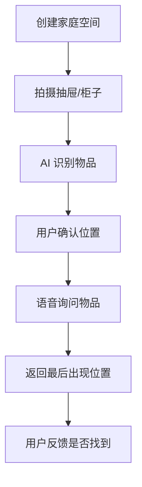

# 居家物品寻回助手 PRD

---

## 1. 文档概述

| 项目 | 内容 |
|------|------|
| 文档名称 | 居家物品寻回助手产品需求文档 |
| 文档版本 | v1.0 |
| 创建日期 | 2026-04-28 |
| 文档状态 | 草稿 |
| 目标受众 | 产品、设计、移动端、AI 工程、IoT 工程、测试 |

## 2. 项目背景

钥匙、证件、充电器、遥控器和工具经常在家里找不到。传统物品管理需要主动登记，蓝牙防丢器又只适合少量贵重物品。本产品结合拍照盘点、空间记忆、语音询问和可选蓝牙标签，让用户用“我上次把护照放哪了？”这样的自然语言找回家中物品。

## 3. 产品概述

### 3.1 产品定位

一款家庭物品位置记忆工具，通过拍照、语音和 AI 识别帮助用户快速找回常用物品。

### 3.2 目标用户

| 用户角色 | 特征描述 | 核心需求 |
|----------|----------|----------|
| 普通家庭 | 物品多、收纳位置变化 | 快速知道东西在哪里 |
| 租房用户 | 空间小、搬家频繁 | 轻量记录物品位置 |
| 老年人家庭 | 容易忘记放置位置 | 语音询问和家人协助 |
| 手作爱好者 | 工具零件多 | 按类别查找 |

### 3.3 核心价值

1. **减少寻找时间**：通过最后出现位置快速定位。
2. **降低登记成本**：拍一张收纳照片即可识别多件物品。
3. **自然语言查询**：不用记分类，直接问即可。
4. **家庭共享**：家人共同维护位置记忆。

## 4. 功能需求

### 4.1 P0：核心功能（MVP）

| 功能编号 | 功能名称 | 功能描述 | 验收标准 |
|----------|----------|----------|----------|
| F001 | 空间建档 | 创建房间、柜子、抽屉等位置 | 支持层级位置 |
| F002 | 拍照识别 | 拍摄收纳区域识别物品 | 识别结果可编辑 |
| F003 | 物品搜索 | 输入或语音询问物品位置 | 返回最后记录位置 |
| F004 | 位置更新 | 用户移动物品后快速更新位置 | 支持一键改到新位置 |
| F005 | 家庭共享 | 邀请家人查看和编辑物品 | 权限可控 |
| F006 | 找到反馈 | 标记是否找到，修正系统记录 | 反馈进入准确率统计 |

### 4.2 P1：重要功能

| 功能编号 | 功能名称 | 功能描述 |
|----------|----------|----------|
| F101 | 常找物品 | 统计频繁搜索的物品并建议固定位置 |
| F102 | 蓝牙标签 | 接入蓝牙防丢器显示距离 |
| F103 | 搬家模式 | 打包箱编号和物品列表绑定 |
| F104 | 过期证件提醒 | 对证件、药品等设置有效期 |
| F105 | 家人代找 | 生成带图片和位置说明的求助卡 |

### 4.3 P2：增强功能

| 功能编号 | 功能名称 | 功能描述 |
|----------|----------|----------|
| F201 | AR 指引 | 摄像头叠加箭头提示所在柜子 |
| F202 | 智能收纳建议 | 根据使用频率建议物品摆放 |
| F203 | 摄像头被动记忆 | 家庭摄像头识别物品移动轨迹 |
| F204 | 维修工具箱 | 按任务推荐需要找出的工具 |

## 5. 技术方案

| 层级 | 技术选择 |
|------|----------|
| 移动端 | Flutter / React Native |
| 后端 | FastAPI / NestJS |
| 数据库 | PostgreSQL |
| AI 能力 | 图像识别、OCR、语音识别、语义搜索 |
| IoT | Bluetooth LE 标签接入 |

## 6. 数据模型

### 6.1 HomeItem

| 字段名 | 类型 | 必填 | 说明 |
|--------|------|:----:|------|
| id | string | ✓ | 物品 ID |
| name | string | ✓ | 物品名称 |
| category | string | ✗ | 分类 |
| locationId | string | ✓ | 当前记录位置 |
| imageUrl | string | ✗ | 识别图片 |
| lastSeenAt | datetime | ✓ | 最后记录时间 |
| confidence | number | ✗ | 识别置信度 |

### 6.2 HomeLocation

| 字段名 | 类型 | 必填 | 说明 |
|--------|------|:----:|------|
| id | string | ✓ | 位置 ID |
| name | string | ✓ | 位置名称 |
| parentId | string | ✗ | 上级位置 |
| room | string | ✗ | 房间 |

## 7. 核心流程

## 8. 验收指标

| 指标 | 目标 |
|------|------|
| 搜索命中可用率 | ≥ 80% |
| 拍照识别确认率 | ≥ 70% |
| 家庭共享邀请成功率 | ≥ 95% |
| 常用物品平均查找时间 | 降低 50% |

