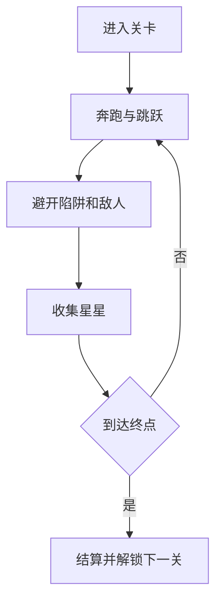

# 弹跳蘑菇岛网页游戏 PRD

---

## 1. 文档概述

### 1.1 文档信息

| 项目 | 内容 |
|------|------|
| 文档名称 | 弹跳蘑菇岛网页游戏产品需求文档 |
| 文档版本 | v1.0 |
| 创建日期 | 2026-04-28 |
| 文档状态 | 草稿 |
| 目标受众 | 产品、设计、前端、关卡设计、测试 |

### 1.2 项目背景

弹跳蘑菇岛是一款网页端横版平台跳跃游戏。玩家控制一个原创小角色在漂浮岛屿中奔跑、跳跃、踩弹簧蘑菇、收集星星并到达终点旗帜。项目重点不在复杂剧情，而在平台跳跃游戏最核心的“手感”：起跳、滞空、落地、碰撞、踩踏和关卡节奏。

**项目特点：**
- 以跳跃手感为第一优先级。
- 关卡短小，适合反复挑战。
- 画面可用原创蘑菇、云朵、草地等低成本资产。
- 可扩展为多关卡平台游戏作品集案例。

---

## 2. 产品概述

### 2.1 产品定位

一款轻量级网页横版平台跳跃游戏，面向休闲玩家和游戏开发学习者，提供完整的 2D 平台动作原型。

### 2.2 目标用户

| 用户角色 | 特征描述 | 核心需求 |
|----------|----------|----------|
| 休闲玩家 | 喜欢简单直接的动作游戏 | 容易上手、即时反馈、关卡不拖沓 |
| 平台跳跃爱好者 | 关注跳跃手感和路线优化 | 操作稳定、碰撞准确、挑战合理 |
| 开发学习者 | 想学习网页游戏开发 | 代码结构清楚、机制典型 |
| 作品集观看者 | 快速评估项目完成度 | 首屏可玩、视觉完整、关卡明确 |

### 2.3 核心价值

1. **手感训练样板**：覆盖加速度、重力、跳跃缓冲、土狼时间等关键机制。
2. **关卡可读性强**：平台、敌人、收集物、终点目标清晰。
3. **扩展成本低**：新关卡主要通过地图数据和少量敌人配置完成。

---

## 3. 游戏设计

### 3.1 核心循环

玩家进入关卡后从起点出发，通过移动和跳跃越过地形，利用弹跳蘑菇到达高处，躲避或踩踏敌人，收集星星，最终到达终点。通关后根据用时、收集和死亡次数结算。

### 3.2 操作方式

| 输入 | 桌面端 | 移动端 | 说明 |
|------|--------|--------|------|
| 左右移动 | A/D 或方向键 | 虚拟左右键 | 控制水平移动 |
| 跳跃 | Space / W / 上方向键 | 跳跃按钮 | 支持短按小跳、长按高跳 |
| 冲刺 | Shift / K | 冲刺按钮 | P1 功能，可选 |
| 暂停 | Esc | 暂停按钮 | 打开菜单 |

### 3.3 手感规则

| 机制 | 描述 |
|------|------|
| 加速度移动 | 角色不是瞬间达到最高速度，而是平滑加速 |
| 摩擦减速 | 松开方向键后角色自然减速 |
| 可变跳高 | 按住跳跃更高，松开跳跃提前下落 |
| 土狼时间 | 离开平台后短时间内仍可起跳 |
| 跳跃缓冲 | 提前按跳跃，落地瞬间自动起跳 |
| 踩踏敌人 | 从上方落到敌人身上击败敌人并反弹 |
| 受伤反馈 | 从侧面接触敌人或陷阱后掉血或重置检查点 |

---

## 4. 功能需求

### 4.1 P0：核心功能（MVP）

#### 4.1.1 游戏框架

| 功能编号 | 功能名称 | 功能描述 | 验收标准 |
|----------|----------|----------|----------|
| F001 | 首页入口 | 展示开始、关卡选择、设置 | 用户可直接进入第一关 |
| F002 | 关卡系统 | 支持加载多个横版关卡 | 至少包含 5 个 MVP 关卡 |
| F003 | 摄像机跟随 | 镜头平滑跟随角色移动 | 角色始终处于舒适可见区域 |
| F004 | 暂停与重开 | 支持暂停、继续、重开、返回首页 | 状态切换不丢失或错乱 |

#### 4.1.2 角色控制

| 功能编号 | 功能名称 | 功能描述 | 验收标准 |
|----------|----------|----------|----------|
| F011 | 左右移动 | 角色可横向移动，受加速度和摩擦影响 | 启停自然，无漂移失控 |
| F012 | 跳跃 | 支持普通跳跃和可变跳高 | 长短按跳跃高度明显不同 |
| F013 | 土狼时间 | 离开平台后 80-150ms 内仍可跳跃 | 边缘起跳更宽容 |
| F014 | 跳跃缓冲 | 落地前 80-150ms 按跳可自动起跳 | 连续跳跃更顺滑 |
| F015 | 检查点复活 | 掉落或受伤后从最近检查点复活 | 复活状态正确，死亡次数增加 |

#### 4.1.3 地形与互动

| 功能编号 | 功能名称 | 功能描述 | 验收标准 |
|----------|----------|----------|----------|
| F021 | 平台地形 | 支持地面、浮空平台、单向平台 | 碰撞准确，不穿模 |
| F022 | 弹跳蘑菇 | 玩家踩上后获得额外向上弹力 | 弹力高度稳定，有动画反馈 |
| F023 | 星星收集 | 关卡内放置可收集星星 | 收集后 UI 数量更新 |
| F024 | 终点旗帜 | 到达终点触发通关 | 弹出结算面板 |
| F025 | 陷阱区域 | 深坑、尖刺等导致受伤或重置 | 触发后有明确反馈 |

#### 4.1.4 敌人与挑战

| 功能编号 | 功能名称 | 功能描述 | 验收标准 |
|----------|----------|----------|----------|
| F031 | 巡逻敌人 | 敌人在平台上往返移动 | 遇到边缘或墙体转向 |
| F032 | 踩踏击败 | 玩家从上方踩到敌人时击败敌人 | 敌人消失或播放击败动画 |
| F033 | 侧面受伤 | 玩家从侧面接触敌人时受伤 | 掉血或回检查点 |
| F034 | 生命系统 | 玩家有 3 点生命或无限重试模式 | 状态栏展示当前生命 |

### 4.2 P1：重要功能

| 功能编号 | 功能名称 | 功能描述 | 验收标准 |
|----------|----------|----------|----------|
| F101 | 星级评分 | 根据用时、收集星星和死亡次数评星 | 结算面板展示评分依据 |
| F102 | 冲刺动作 | 支持短距离水平冲刺 | 冲刺有冷却或次数限制 |
| F103 | 移动平台 | 平台按路径移动，玩家可站立其上 | 玩家不滑落或抖动 |
| F104 | 音效与音乐 | 跳跃、收集、踩敌、通关、失败有音效 | 可静音 |
| F105 | 移动端按钮 | 提供左右、跳跃、冲刺按钮 | 小屏幕可顺畅操作 |

### 4.3 P2：增强功能

| 功能编号 | 功能名称 | 功能描述 |
|----------|----------|----------|
| F201 | 关卡主题 | 增加森林、云海、洞穴、夜晚等主题 |
| F202 | Boss 小关 | 加入简单 Boss，考验跳跃和躲避 |
| F203 | 影子回放 | 展示玩家最佳通关路线 |
| F204 | 关卡编辑器 | 支持拖拽平台、敌人、星星并导出关卡 |
| F205 | 排行榜 | 记录最短通关时间和最高收集率 |

---

## 5. 关卡规划

### 5.1 MVP 关卡

| 关卡 | 名称 | 引入内容 | 通关目标 |
|------|------|----------|----------|
| 1 | 草地起跳 | 移动、跳跃、星星、终点 | 无死亡压力，建立操作 |
| 2 | 蘑菇弹床 | 弹跳蘑菇、高台 | 利用弹跳到达终点 |
| 3 | 小怪巡逻 | 巡逻敌人、踩踏 | 学会踩敌和避让 |
| 4 | 云朵断桥 | 深坑、单向平台 | 控制跳跃距离 |
| 5 | 星星路线 | 分支路线、收集挑战 | 完成基本综合关 |

### 5.2 难度原则

- 第一关必须无强制死亡点。
- 相机前方预留足够视野，避免突然撞敌。
- 每个难点前给玩家一次安全预演。
- 关卡单次通关目标时长控制在 45-120 秒。

---

## 6. 技术方案

### 6.1 推荐技术栈

| 层级 | 技术选择 |
|------|----------|
| 游戏引擎 | Phaser 3 |
| 渲染 | HTML Canvas / WebGL |
| 物理 | Phaser Arcade Physics |
| 地图 | Tiled JSON 或自定义 tilemap |
| 存档 | localStorage |
| 部署 | 静态站点，支持 GitHub Pages / Vercel |

### 6.2 数据模型

#### Level

| 字段名 | 类型 | 必填 | 说明 |
|--------|------|:----:|------|
| id | string | ✓ | 关卡 ID |
| name | string | ✓ | 关卡名称 |
| tilemap | string | ✓ | 地图资源路径或内联数据 |
| spawn | object | ✓ | 玩家出生点 |
| checkpoints | array | ✗ | 检查点列表 |
| enemies | array | ✗ | 敌人配置 |
| collectibles | array | ✗ | 星星配置 |
| parTime | number | ✗ | 参考通关时间 |

#### PlayerState

| 字段名 | 类型 | 必填 | 说明 |
|--------|------|:----:|------|
| x | number | ✓ | 角色坐标 x |
| y | number | ✓ | 角色坐标 y |
| velocityX | number | ✓ | 水平速度 |
| velocityY | number | ✓ | 垂直速度 |
| lives | number | ✓ | 生命值 |
| stars | number | ✓ | 当前关收集数量 |
| deaths | number | ✓ | 当前关死亡次数 |

---

## 7. 界面与视觉

### 7.1 页面结构

| 区域 | 内容 |
|------|------|
| 顶部状态栏 | 生命、星星、用时、暂停 |
| 游戏区域 | 横版关卡、角色、敌人、地形 |
| 移动端控制区 | 左右按钮、跳跃按钮、冲刺按钮 |
| 结算弹窗 | 用时、星星、死亡次数、星级、下一关 |

### 7.2 视觉方向

采用明亮、柔和、玩具感的岛屿世界。角色和敌人必须是原创造型，避免使用任何已有 IP 的角色、道具或图标。平台边缘、陷阱、弹跳蘑菇和终点旗帜要有高可读性。

---

## 8. 非功能需求

| 类别 | 要求 |
|------|------|
| 性能 | 桌面端稳定 60 FPS，移动端目标 30 FPS 以上 |
| 输入延迟 | 跳跃输入到反馈小于 80ms |
| 加载 | 首屏小于 5MB，首次可玩时间小于 3 秒 |
| 兼容 | Chrome、Edge、Safari、Firefox 近两年版本 |
| 响应式 | 支持 390px 移动端到 1440px 桌面端 |
| 存档 | 保存关卡解锁、最佳成绩、音效设置 |

---

## 9. 验收标准

1. 玩家可完成至少 5 个横版平台关卡。
2. 角色移动、跳跃、土狼时间、跳跃缓冲和碰撞表现稳定。
3. 弹跳蘑菇、敌人、星星、陷阱、终点旗帜均可正常工作。
4. 关卡死亡后能从检查点快速复活。
5. 桌面和移动端均可完成完整流程。

---

## 10. 里程碑

| 阶段 | 周期 | 交付物 |
|------|------|--------|
| M1 手感原型 | 2-3 天 | 移动、跳跃、碰撞、相机 |
| M2 MVP 机制 | 4-6 天 | 蘑菇、敌人、星星、陷阱、终点 |
| M3 关卡内容 | 3-5 天 | 5 个关卡、结算、存档 |
| M4 打磨发布 | 2-3 天 | 音效、动画、移动端适配、部署 |

