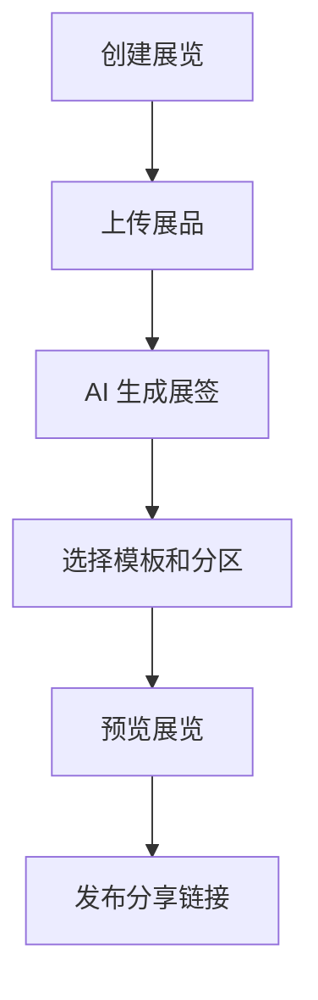

# 微型博物馆策展工具 PRD

---

## 1. 文档概述

| 项目 | 内容 |
|------|------|
| 文档名称 | 微型博物馆策展工具产品需求文档 |
| 文档版本 | v1.0 |
| 创建日期 | 2026-04-28 |
| 文档状态 | 草稿 |
| 目标受众 | 产品、设计、前端、后端、AI 工程、测试 |

## 2. 项目背景

很多普通人、学校、社群和小店都有值得展示的物品与故事，但搭建一个线上展览通常门槛很高，需要设计、排版、文案和网站能力。本产品让用户上传物品照片、故事和音频，AI 自动生成展览主题、展签、导览路线和可分享网页，把个人收藏、班级作品、小店历史或家庭记忆变成一个“微型博物馆”。

## 3. 产品概述

### 3.1 产品定位

一款低门槛线上策展工具，帮助非专业用户把物品、故事和图片组织成可浏览的数字展览。

### 3.2 目标用户

| 用户角色 | 特征描述 | 核心需求 |
|----------|----------|----------|
| 教师 | 组织学生作品展示 | 快速生成班级展览 |
| 收藏爱好者 | 有小型私人收藏 | 展示藏品和故事 |
| 小店/品牌 | 想讲述品牌历史 | 做轻量品牌展厅 |
| 家庭用户 | 保存老照片和物件 | 制作家庭记忆展 |

### 3.3 核心价值

1. **降低策展门槛**：无需设计能力即可生成展览。
2. **让物品有故事**：AI 帮助补全展签、导览和主题。
3. **适合轻量传播**：一个链接即可浏览展览。
4. **支持教育场景**：学生作品可以快速归档和展示。

## 4. 功能需求

### 4.1 P0：核心功能（MVP）

| 功能编号 | 功能名称 | 功能描述 | 验收标准 |
|----------|----------|----------|----------|
| F001 | 展品上传 | 上传图片、标题、年代、故事 | 单展览至少 5 个展品 |
| F002 | AI 展签 | 根据资料生成 80-150 字展签 | 支持编辑和重写 |
| F003 | 主题生成 | 自动生成展览标题、前言和分区 | 用户可选择不同风格 |
| F004 | 展览模板 | 提供时间线、画廊、路线三类模板 | 一键切换布局 |
| F005 | 公开链接 | 生成可分享展览网页 | 移动端可正常浏览 |
| F006 | 草稿管理 | 保存未发布展览 | 支持继续编辑 |

### 4.2 P1：重要功能

| 功能编号 | 功能名称 | 功能描述 |
|----------|----------|----------|
| F101 | 语音导览 | 为每个展区生成导览文案和音频 |
| F102 | 协作策展 | 多人共同上传和编辑展品 |
| F103 | 观众留言 | 观众可对展品留言或点赞 |
| F104 | 二维码海报 | 为线下展览生成二维码海报 |
| F105 | 版权标注 | 为图片和文字设置授权说明 |

### 4.3 P2：增强功能

| 功能编号 | 功能名称 | 功能描述 |
|----------|----------|----------|
| F201 | AR 展签 | 线下扫描物品显示数字展签 |
| F202 | 3D 展厅 | 自动生成简易三维展厅 |
| F203 | 策展商市场 | 模板作者可发布付费模板 |
| F204 | 学校空间 | 班级、年级、学校多级展览管理 |

## 5. 技术方案

| 层级 | 技术选择 |
|------|----------|
| 前端 | Next.js / Vue |
| 后端 | NestJS / FastAPI |
| 存储 | 对象存储、图片 CDN |
| 数据库 | PostgreSQL |
| AI 能力 | 图片理解、文案生成、语音合成 |
| 发布 | 静态页面生成、分享链接 |

## 6. 数据模型

### 6.1 Exhibition

| 字段名 | 类型 | 必填 | 说明 |
|--------|------|:----:|------|
| id | string | ✓ | 展览 ID |
| title | string | ✓ | 展览标题 |
| intro | text | ✗ | 展览前言 |
| template | enum | ✓ | timeline/gallery/route |
| status | enum | ✓ | draft/published |
| visibility | enum | ✓ | private/link/public |

### 6.2 ExhibitItem

| 字段名 | 类型 | 必填 | 说明 |
|--------|------|:----:|------|
| id | string | ✓ | 展品 ID |
| exhibitionId | string | ✓ | 所属展览 |
| imageUrl | string | ✓ | 展品图片 |
| title | string | ✓ | 展品名称 |
| labelText | text | ✗ | 展签文案 |
| year | string | ✗ | 年代 |

## 7. 核心流程

## 8. 验收指标

| 指标 | 目标 |
|------|------|
| 首个展览发布完成率 | ≥ 55% |
| 移动端页面加载时间 | ≤ 3 秒 |
| AI 展签采纳率 | ≥ 70% |
| 图片上传成功率 | ≥ 99% |

