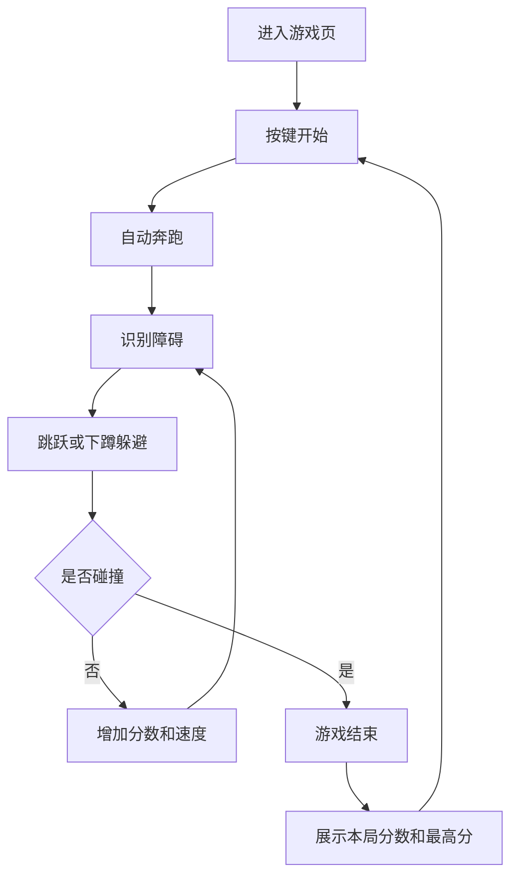

# 恐龙跑酷网页游戏 PRD

---

## 1. 文档概述

### 1.1 文档信息

| 项目 | 内容 |
|------|------|
| 文档名称 | 恐龙跑酷网页游戏产品需求文档 |
| 文档版本 | v1.0 |
| 创建日期 | 2026-04-29 |
| 文档状态 | 草稿 |
| 目标受众 | 产品、设计、前端、游戏开发、测试 |

### 1.2 项目背景

恐龙跑酷是一款参考 Chrome 离线小恐龙体验的轻量级网页端横版无尽跑酷游戏。玩家控制一只原创像素恐龙在沙漠场景中自动向前奔跑，通过跳跃、下蹲或快速反应避开仙人掌、飞鸟等障碍，尽可能获得更高分数。

项目目标是做出一个首屏即可游玩、规则极简、反馈明确、适合网页快速打开的小游戏。MVP 不追求复杂剧情和重资产美术，而是重点打磨输入响应、碰撞判定、速度递增和失败后立即重开的节奏。

**项目特点：**
- 单键即可开始，3 秒内理解玩法。
- 以无尽跑酷和分数挑战为核心。
- 低美术成本，适合像素风或极简黑白风格。
- 可作为网页游戏、前端 Canvas 或 Phaser 练习项目。

---

## 2. 产品概述

### 2.1 产品定位

一款轻量级网页无尽跑酷游戏，面向休闲玩家和前端游戏学习者，提供类似离线小恐龙的即时挑战体验。

### 2.2 目标用户

| 用户角色 | 特征描述 | 核心需求 |
|----------|----------|----------|
| 休闲玩家 | 碎片时间打开小游戏 | 快速开始、失败重来快、分数有挑战 |
| 怀旧玩家 | 熟悉 Chrome 小恐龙玩法 | 操作接近经典体验，但视觉和细节原创 |
| 前端学习者 | 想学习 Canvas/网页游戏开发 | 机制典型、代码结构清晰、可扩展 |
| 作品集观看者 | 快速评估项目完整度 | 首屏可玩、视觉完整、交互稳定 |

### 2.3 核心价值

1. **低门槛高反馈**：玩家只需跳跃和下蹲即可参与，操作结果即时可见。
2. **节奏可持续挑战**：速度、障碍组合和昼夜变化让游戏逐渐变难。
3. **实现成本可控**：使用简单角色、障碍和背景滚动即可完成完整体验。

---

## 3. 游戏设计

### 3.1 核心循环

玩家进入页面后按键开始游戏。恐龙自动向前奔跑，地面和背景向左滚动。玩家根据障碍类型选择跳跃或下蹲。成功避开障碍会持续累积分数；碰撞障碍后游戏结束，展示本局分数和历史最高分，玩家可一键重开。

### 3.2 操作方式

| 输入 | 桌面端 | 移动端 | 说明 |
|------|--------|--------|------|
| 开始游戏 | Space / 上方向键 / 点击画面 | 点击画面 | 从待机或结束状态进入游戏 |
| 跳跃 | Space / W / 上方向键 | 点击跳跃区域 | 越过低矮障碍，如仙人掌 |
| 下蹲 | S / 下方向键 | 按住下蹲区域 | 躲避低空飞行障碍 |
| 重开 | Space / Enter | 点击重开按钮 | 游戏结束后快速重新开始 |
| 暂停 | Esc / P | 暂停按钮 | P1 功能，可选 |

### 3.3 核心规则

| 规则 | 描述 |
|------|------|
| 自动奔跑 | 恐龙水平位置基本固定，场景和障碍向左移动 |
| 跳跃物理 | 跳跃包含起跳、上升、下落、落地状态，受重力影响 |
| 下蹲判定 | 下蹲时恐龙碰撞盒高度降低，但不能在空中下蹲 |
| 障碍生成 | 系统按间隔生成仙人掌、连续仙人掌、飞鸟等障碍 |
| 速度递增 | 随分数或时间提升滚动速度和障碍频率 |
| 碰撞失败 | 恐龙碰到障碍后立即进入 Game Over 状态 |
| 分数累计 | 存活时间越久分数越高，可额外在整百/整千分播放提示 |
| 最高分保存 | 使用 localStorage 保存本地最高分 |

### 3.4 游戏状态

| 状态 | 说明 | 可转换状态 |
|------|------|------------|
| Ready | 初始待机，恐龙站立或小幅动画 | Running |
| Running | 正常游戏中，障碍滚动、分数增加 | Paused、GameOver |
| Jumping | Running 子状态，恐龙在空中 | Running、GameOver |
| Ducking | Running 子状态，恐龙低姿态奔跑 | Running、GameOver |
| Paused | 游戏暂停，画面冻结 | Running、Ready |
| GameOver | 碰撞结束，展示分数和重开提示 | Running、Ready |

---

## 4. 功能需求

### 4.1 P0：核心功能（MVP）

#### 4.1.1 游戏框架

| 功能编号 | 功能名称 | 功能描述 | 验收标准 |
|----------|----------|----------|----------|
| F001 | 首屏游戏入口 | 页面加载后直接展示游戏画布、标题、开始提示 | 用户无需进入二级页面即可开始 |
| F002 | 游戏状态管理 | 支持 Ready、Running、GameOver 三个基础状态 | 状态切换稳定，不出现重复计分或卡死 |
| F003 | 主循环 | 使用 requestAnimationFrame 或游戏引擎循环更新输入、物理、碰撞和渲染 | 60 FPS 目标运行，低端设备不低于 30 FPS |
| F004 | 一键重开 | GameOver 后按 Space/点击即可重新开始 | 重开后分数、障碍、速度恢复初始状态 |

#### 4.1.2 角色控制

| 功能编号 | 功能名称 | 功能描述 | 验收标准 |
|----------|----------|----------|----------|
| F011 | 恐龙奔跑动画 | 游戏中恐龙播放双腿奔跑动画 | 奔跑帧随速度变化自然切换 |
| F012 | 跳跃动作 | 支持起跳、上升、下落、落地 | 能稳定越过单个仙人掌 |
| F013 | 跳跃缓冲 | 起跳输入在极短时间内防抖，避免连续误触 | 长按 Space 不会无限连跳 |
| F014 | 下蹲动作 | 按住下方向键时降低碰撞盒并切换下蹲动画 | 能躲过低空飞鸟 |
| F015 | 碰撞盒调试配置 | 为站立、跳跃、下蹲配置不同碰撞盒 | 碰撞符合视觉直觉，不明显误判 |

#### 4.1.3 障碍与场景

| 功能编号 | 功能名称 | 功能描述 | 验收标准 |
|----------|----------|----------|----------|
| F021 | 地面滚动 | 地面线、石子或沙丘持续向左滚动 | 无缝循环，不出现明显断裂 |
| F022 | 仙人掌障碍 | 生成单个、双个或高低不同的仙人掌 | 玩家必须跳跃才能躲避 |
| F023 | 飞鸟障碍 | 生成不同高度的飞鸟 | 低空飞鸟需要下蹲，高空飞鸟可忽略 |
| F024 | 障碍生成器 | 根据速度和距离生成障碍，避免不可躲组合 | 任意障碍之间保留可反应距离 |
| F025 | 背景元素 | 云朵、太阳/月亮、远景沙丘等缓慢滚动 | 不影响碰撞，仅增强速度感 |

#### 4.1.4 分数与反馈

| 功能编号 | 功能名称 | 功能描述 | 验收标准 |
|----------|----------|----------|----------|
| F031 | 实时分数 | 存活期间持续增加分数 | UI 每帧或固定频率更新 |
| F032 | 最高分 | 本地保存并展示历史最高分 | 刷新页面后仍保留 |
| F033 | 速度成长 | 分数越高，游戏速度逐步提升 | 难度曲线平滑，无突然失控 |
| F034 | 碰撞反馈 | 碰撞后播放失败动画、停止滚动、展示 Game Over | 玩家能明确知道失败原因 |
| F035 | 音效反馈 | 起跳、得分里程碑、碰撞有音效 | 可通过浏览器正常播放，默认音量不过高 |

### 4.2 P1：重要功能

| 功能编号 | 功能名称 | 功能描述 | 验收标准 |
|----------|----------|----------|----------|
| F101 | 暂停功能 | 支持暂停、继续、重新开始 | 暂停后计时、障碍和动画冻结 |
| F102 | 昼夜切换 | 分数达到阈值后背景在白天和夜晚间切换 | 切换平滑，不影响可读性 |
| F103 | 移动端适配 | 移动端支持点击跳跃和按住下蹲 | 390px 宽屏幕可正常操作 |
| F104 | 难度配置 | 支持调整初始速度、加速度、障碍间隔 | 配置变更不需要改动核心逻辑 |
| F105 | 静音开关 | 玩家可打开或关闭音效 | 设置保存在本地 |

### 4.3 P2：增强功能

| 功能编号 | 功能名称 | 功能描述 |
|----------|----------|----------|
| F201 | 皮肤系统 | 解锁不同恐龙、场景主题或障碍外观 |
| F202 | 成就系统 | 达到指定分数、连续躲避、首次夜晚等触发成就 |
| F203 | 排行榜 | 接入后端记录全站最高分 |
| F204 | 每日挑战 | 每日固定随机种子，所有玩家挑战同一障碍序列 |
| F205 | 回放分享 | 记录输入序列，生成可分享的回放链接 |

---

## 5. 难度与障碍规划

### 5.1 难度阶段

| 阶段 | 分数范围 | 速度 | 主要障碍 | 设计目标 |
|------|----------|------|----------|----------|
| 新手期 | 0-300 | 低 | 单个仙人掌 | 让玩家建立跳跃节奏 |
| 入门期 | 301-800 | 中低 | 双仙人掌、不同高度仙人掌 | 增加跳跃时机要求 |
| 进阶期 | 801-1500 | 中 | 仙人掌组合、少量飞鸟 | 引入下蹲判断 |
| 挑战期 | 1501-3000 | 中高 | 飞鸟与仙人掌交替 | 考验连续反应 |
| 极限期 | 3000+ | 高 | 高密度组合障碍 | 保持可躲，但容错更低 |

### 5.2 障碍生成原则

- 同一屏内不得生成视觉上完全重叠的障碍。
- 障碍间距必须满足当前速度下玩家至少有 450ms 反应时间。
- 飞鸟高度至少分为高、中、低三档；只有低档强制下蹲。
- 连续仙人掌宽度增加时，后续间距必须同步增加。
- 难度提升优先增加速度和组合变化，避免直接生成无法通过的障碍。

---

## 6. 技术方案

### 6.1 推荐技术栈

| 层级 | 技术选择 |
|------|----------|
| 渲染 | HTML Canvas 2D |
| 游戏循环 | requestAnimationFrame |
| 物理 | 自定义轻量跳跃物理 |
| 状态管理 | 原生 JavaScript 对象或 TypeScript class |
| 资源 | PNG/SVG 精灵图、Web Audio 音效 |
| 存储 | localStorage |
| 部署 | 静态站点，支持 GitHub Pages / Vercel / Netlify |

> MVP 可不引入完整游戏引擎。若后续需要更多动画、资源管理和场景系统，可升级为 Phaser 3。

### 6.2 核心参数建议

| 参数 | 建议值 | 说明 |
|------|--------|------|
| 画布尺寸 | 900 x 300，按比例响应式缩放 | 保持横版跑酷视野 |
| 初始速度 | 280-360 px/s | 根据画布尺寸微调 |
| 最大速度 | 800-1000 px/s | 防止后期完全不可控 |
| 重力 | 1800-2400 px/s² | 确保跳跃有重量感 |
| 起跳速度 | 650-800 px/s | 能越过基础仙人掌 |
| 最小障碍间距 | 280-420 px | 随速度动态调整 |
| 分数倍率 | 每 0.1 秒或每移动距离增加 | 保持分数增长稳定 |

### 6.3 数据模型

#### GameState

| 字段名 | 类型 | 必填 | 说明 |
|--------|------|:----:|------|
| status | enum | 是 | ready/running/paused/gameOver |
| score | number | 是 | 当前分数 |
| highScore | number | 是 | 本地最高分 |
| speed | number | 是 | 当前滚动速度 |
| elapsedTime | number | 是 | 本局存活时间 |
| theme | enum | 否 | day/night |

#### Dino

| 字段名 | 类型 | 必填 | 说明 |
|--------|------|:----:|------|
| x | number | 是 | 角色横坐标 |
| y | number | 是 | 角色纵坐标 |
| width | number | 是 | 当前显示宽度 |
| height | number | 是 | 当前显示高度 |
| velocityY | number | 是 | 垂直速度 |
| state | enum | 是 | run/jump/duck/dead |
| hitbox | object | 是 | 当前碰撞盒 |

#### Obstacle

| 字段名 | 类型 | 必填 | 说明 |
|--------|------|:----:|------|
| id | string | 是 | 障碍实例 ID |
| type | enum | 是 | cactus/bird |
| x | number | 是 | 障碍横坐标 |
| y | number | 是 | 障碍纵坐标 |
| width | number | 是 | 宽度 |
| height | number | 是 | 高度 |
| variant | string | 否 | 外观或尺寸变体 |
| passed | boolean | 是 | 是否已被玩家通过 |

---

## 7. 界面与视觉

### 7.1 页面结构

| 区域 | 内容 |
|------|------|
| 顶部状态栏 | 当前分数、最高分、静音/暂停按钮 |
| 游戏画布 | 恐龙、地面、障碍、背景元素 |
| 开始提示 | Ready 状态显示“按 Space 开始” |
| 结束提示 | Game Over、当前分数、最高分、重新开始提示 |

### 7.2 视觉风格

| 元素 | 设计要求 |
|------|----------|
| 恐龙 | 原创像素小恐龙，不直接复制 Chrome 原素材 |
| 障碍 | 仙人掌、飞鸟等沙漠元素，轮廓清晰 |
| 色彩 | MVP 可采用黑白灰；P1 可加入昼夜主题 |
| 动画 | 奔跑、跳跃、下蹲、死亡至少有状态差异 |
| 可读性 | 障碍与背景必须有足够对比度 |

### 7.3 响应式要求

- 桌面端画布居中显示，最大宽度不超过 960px。
- 移动端画布按宽度等比缩放，操作区域不遮挡核心障碍。
- 横屏体验优先；竖屏需保持可玩但允许显示更紧凑视野。
- 所有文字在 390px 宽度下不重叠、不溢出。

---

## 8. 非功能需求

### 8.1 性能要求

| 指标 | 要求 | 说明 |
|------|------|------|
| 首屏加载 | < 2 秒 | 不含极慢网络场景 |
| 运行帧率 | 目标 60 FPS，最低 30 FPS | 普通笔记本和主流手机浏览器 |
| 资源体积 | MVP 总资源 < 2 MB | 优先使用轻量图片和音效 |
| 输入延迟 | < 80ms | 跳跃和下蹲必须即时响应 |

### 8.2 兼容性要求

| 类别 | 要求 |
|------|------|
| 桌面浏览器 | Chrome、Edge、Safari、Firefox 最近 2 个大版本 |
| 移动浏览器 | iOS Safari、Android Chrome 最近 2 个大版本 |
| 分辨率 | 390px-1440px 宽度下可用 |
| 离线能力 | P1 可通过 Service Worker 缓存资源，实现离线可玩 |

### 8.3 可用性要求

| 指标 | 要求 |
|------|------|
| 学习成本 | 新用户 10 秒内理解基本操作 |
| 重开成本 | Game Over 后 1 次按键或点击即可重开 |
| 误判率 | 常规障碍碰撞不得出现明显“没碰到却失败”的感受 |
| 可访问性 | 支持键盘操作；重要状态不能只靠颜色表达 |

---

## 9. 测试与验收

### 9.1 功能测试

| 测试项 | 验收标准 |
|--------|----------|
| 开始游戏 | Ready 状态按 Space 后进入 Running |
| 跳跃 | 恐龙能越过基础仙人掌，落地后恢复奔跑 |
| 下蹲 | 按住下方向键能降低碰撞盒并躲过低空飞鸟 |
| 碰撞 | 接触仙人掌或飞鸟后进入 GameOver |
| 重开 | GameOver 后按 Space 重新开始，分数清零 |
| 最高分 | 超过历史分数后更新并持久保存 |

### 9.2 体验测试

| 测试项 | 验收标准 |
|--------|----------|
| 难度曲线 | 前 30 秒不出现过难组合 |
| 障碍可读性 | 玩家能在当前速度下识别障碍类型 |
| 输入响应 | 连续 20 次跳跃无明显延迟或漏响应 |
| 移动端操作 | 点击跳跃区域不会误触浏览器滚动 |
| 视觉完整性 | 画布、分数、提示文字不重叠 |

### 9.3 边界测试

| 场景 | 预期结果 |
|------|----------|
| 页面刷新 | 回到 Ready 状态，最高分保留 |
| 切换标签页 | P1 暂停或降低更新频率，不导致分数异常暴涨 |
| 长时间运行 | 10 分钟内不出现障碍生成错乱或内存明显增长 |
| 快速连按 | 不出现多段跳、重复开始、重复结算 |

---

## 10. 里程碑规划

| 阶段 | 目标 | 交付内容 |
|------|------|----------|
| M1 原型 | 完成基础跑酷闭环 | 画布、恐龙、跳跃、仙人掌、碰撞、重开 |
| M2 MVP | 完成可发布版本 | 分数、最高分、速度递增、飞鸟、音效、基础适配 |
| M3 优化 | 提升体验完整度 | 昼夜切换、暂停、移动端优化、配置化难度 |
| M4 扩展 | 增加长期玩法 | 成就、皮肤、每日挑战、排行榜 |

---

## 11. 风险与对策

| 风险 | 影响 | 对策 |
|------|------|------|
| 碰撞误判影响体验 | 玩家觉得不公平 | 使用独立碰撞盒并提供调试显示 |
| 速度递增过快 | 新手留存差 | 设置难度阶段和最大速度上限 |
| 障碍组合不可通过 | 游戏失去可信度 | 生成器基于当前速度计算最小安全距离 |
| 移动端误触 | 操作不稳定 | 明确划分跳跃/下蹲触控区域 |
| 素材侵权 | 发布风险 | 角色、障碍和音效全部使用原创或可商用资源 |

---

## 12. 附录

### 12.1 术语表

| 术语 | 说明 |
|------|------|
| 无尽跑酷 | 没有固定终点，以存活时间和分数为目标的跑酷玩法 |
| 碰撞盒 | 用于碰撞检测的矩形或多边形区域 |
| 障碍生成器 | 按规则动态创建障碍的系统 |
| 速度曲线 | 游戏速度随时间或分数增长的规则 |
| localStorage | 浏览器本地存储，用于保存最高分和设置 |

### 12.2 MVP 验收结论标准

MVP 完成的最低标准是：用户打开页面后可以立即开始游戏，恐龙能奔跑、跳跃、下蹲，系统能生成仙人掌和飞鸟，碰撞后结束并展示分数，最高分可本地保存，游戏可一键重开，桌面端和移动端均可完成至少 1 分钟连续游玩。
