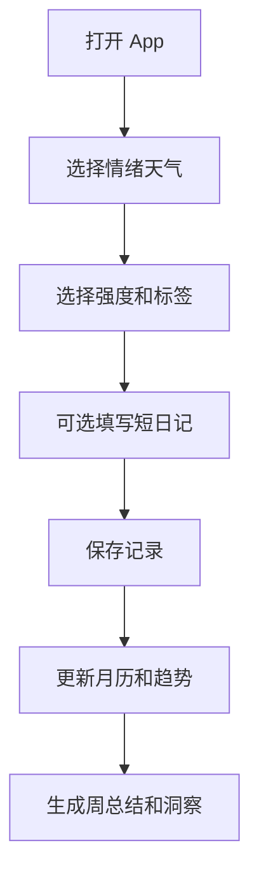

# 情绪天气日记 PRD

---

## 1. 文档概述

### 1.1 文档信息

| 项目 | 内容 |
|------|------|
| 文档名称 | 情绪天气日记产品需求文档 |
| 文档版本 | v1.0 |
| 创建日期 | 2026-04-28 |
| 文档状态 | 草稿 |
| 目标受众 | 产品、设计、移动端、后端、测试 |

### 1.2 项目背景

很多用户想记录情绪，但传统日记输入成本高，长期坚持困难。情绪记录类产品又常常停留在简单打卡，缺少对环境、事件和身体状态的关联分析。本项目把情绪比作天气，让用户用更轻松的方式记录每天的心理状态，并通过趋势、触发因素和温和建议帮助用户理解自己。

**项目特点：**
- 用天气、颜色和简短文本表达情绪。
- 支持 30 秒快速记录。
- 关联睡眠、天气、运动、经期、工作压力等因素。
- 提供私密、温和、非诊断式的情绪洞察。

---

## 2. 产品概述

### 2.1 产品定位

一款轻量级情绪记录和自我观察 App，帮助用户用低压力方式持续记录情绪并发现影响因素。

### 2.2 目标用户

| 用户角色 | 特征描述 | 核心需求 |
|----------|----------|----------|
| 高压上班族 | 情绪受工作影响明显 | 快速记录压力和触发事件 |
| 学生 | 情绪波动较频繁 | 建立自我觉察习惯 |
| 自我成长用户 | 喜欢复盘生活 | 发现长期情绪模式 |
| 心理咨询来访者 | 需要向咨询师回顾状态 | 导出情绪报告 |

### 2.3 核心价值

1. **降低记录门槛**：用天气隐喻和轻交互替代长篇日记。
2. **提升自我理解**：把情绪和事件、环境、身体状态关联起来。
3. **形成长期趋势**：通过月历、曲线和报告看到变化。
4. **保持私密安全**：所有记录默认私密，支持本地锁和导出控制。

---

## 3. 功能需求

### 3.1 P0：核心功能（MVP）

#### 3.1.1 情绪记录

| 功能编号 | 功能名称 | 功能描述 | 验收标准 |
|----------|----------|----------|----------|
| F001 | 天气情绪 | 用户选择晴、多云、雨、雾、雷暴等情绪天气 | 选择后生成当天主情绪 |
| F002 | 情绪强度 | 使用 1-5 档或滑杆记录强度 | 强度保存到记录中 |
| F003 | 快速标签 | 选择工作、关系、健康、学习、金钱等触发因素 | 支持多选 |
| F004 | 短文本日记 | 输入当日简短记录 | 文本可编辑和删除 |
| F005 | 多次记录 | 一天支持多次记录情绪变化 | 日视图按时间展示 |

#### 3.1.2 日历与趋势

| 功能编号 | 功能名称 | 功能描述 | 验收标准 |
|----------|----------|----------|----------|
| F011 | 情绪月历 | 用颜色和天气图标展示每天情绪 | 点击日期查看详情 |
| F012 | 趋势曲线 | 展示近 7 天、30 天情绪强度变化 | 支持时间范围切换 |
| F013 | 标签统计 | 统计常见触发因素和对应情绪 | 结果按频率排序 |
| F014 | 连续记录 | 显示连续记录天数 | 断签后重新计算 |

#### 3.1.3 温和洞察

| 功能编号 | 功能名称 | 功能描述 | 验收标准 |
|----------|----------|----------|----------|
| F021 | 周总结 | 自动生成一周情绪摘要 | 摘要包含高低点和常见触发因素 |
| F022 | 关联分析 | 关联睡眠、运动、天气等因素 | 只展示明显相关的结果 |
| F023 | 自我照顾建议 | 根据情绪状态给出非医疗建议 | 建议措辞温和，不做诊断 |
| F024 | 危机提示 | 当用户记录极端负面内容时提示寻求帮助 | 提示包含紧急求助说明 |

#### 3.1.4 隐私保护

| 功能编号 | 功能名称 | 功能描述 | 验收标准 |
|----------|----------|----------|----------|
| F031 | 应用锁 | 支持密码或生物识别解锁 | 退出后重新进入需验证 |
| F032 | 本地优先 | 记录默认存储在本地 | 不登录也可使用 |
| F033 | 数据导出 | 导出 PDF 或 CSV 报告 | 用户可选择时间范围 |

### 3.2 P1：重要功能

| 功能编号 | 功能名称 | 功能描述 |
|----------|----------|----------|
| F101 | 语音日记 | 录音转文字并保存为情绪记录 |
| F102 | 照片记忆 | 添加当天照片作为辅助记录 |
| F103 | 提醒设置 | 每天固定时间温和提醒记录 |
| F104 | 咨询报告 | 生成适合心理咨询前回顾的报告 |
| F105 | Apple Health/Google Fit 集成 | 关联睡眠、步数、运动数据 |

### 3.3 P2：增强功能

| 功能编号 | 功能名称 | 功能描述 |
|----------|----------|----------|
| F201 | AI 对话复盘 | 用户可和 AI 复盘一段时间的情绪变化 |
| F202 | 情绪预测 | 根据历史规律提醒潜在低谷期 |
| F203 | 伴侣/家庭共享 | 可选择共享有限状态给可信联系人 |
| F204 | 治疗师协作版 | 允许用户授权咨询师查看报告 |

---

## 4. 技术方案

### 4.1 技术栈

| 层级 | 技术选择 |
|------|----------|
| 移动端 | SwiftUI / Kotlin / Flutter |
| 本地存储 | SQLite / Core Data |
| 后端 | 可选，用于同步和账户 |
| AI 能力 | 情绪摘要、标签提取、温和建议 |
| 数据集成 | Apple HealthKit、Google Fit、天气 API |

### 4.2 系统架构

```text
移动端记录
  ↓
本地加密存储
  ↓
统计与趋势引擎
  ↓
AI 摘要服务（可选）
  ↓
报告导出 / 同步备份
```

---

## 5. 数据模型

### 5.1 MoodEntry

| 字段名 | 类型 | 必填 | 说明 |
|--------|------|:----:|------|
| id | string | ✓ | 记录 ID |
| recordedAt | datetime | ✓ | 记录时间 |
| weatherMood | enum | ✓ | 情绪天气 |
| intensity | number | ✓ | 情绪强度 |
| tags | array | ✗ | 触发因素 |
| note | text | ✗ | 文本日记 |
| photos | array | ✗ | 图片地址 |

### 5.2 InsightReport

| 字段名 | 类型 | 必填 | 说明 |
|--------|------|:----:|------|
| id | string | ✓ | 报告 ID |
| rangeStart | date | ✓ | 开始日期 |
| rangeEnd | date | ✓ | 结束日期 |
| summary | text | ✓ | 周期摘要 |
| topTags | array | ✗ | 高频标签 |
| generatedAt | datetime | ✓ | 生成时间 |

---

## 6. 核心流程



---

## 7. 非功能需求

| 类别 | 要求 |
|------|------|
| 隐私 | 本地数据加密，云同步需用户主动开启 |
| 安全 | 不提供医学诊断，不替代专业心理咨询 |
| 易用性 | 完成一次快速记录不超过 30 秒 |
| 可访问性 | 情绪颜色必须配合图标和文本，不能只靠颜色区分 |
| 可靠性 | 数据导出前必须校验文件生成完整性 |

---

## 8. 开发计划

| 阶段 | 周期 | 交付内容 |
|------|------|----------|
| 第一阶段 | 2 周 | 情绪记录、月历、趋势 |
| 第二阶段 | 2 周 | 周总结、标签统计、提醒 |
| 第三阶段 | 2 周 | 隐私锁、导出、健康数据集成 |
| 第四阶段 | 1 周 | 危机提示、测试、发布 |

