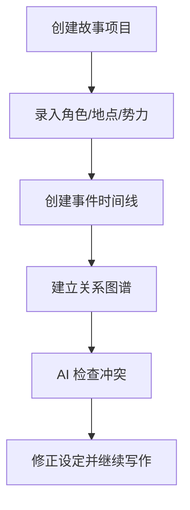

# 故事宇宙设定管理器 PRD

---

## 1. 文档概述

| 项目 | 内容 |
|------|------|
| 文档名称 | 故事宇宙设定管理器产品需求文档 |
| 文档版本 | v1.0 |
| 创建日期 | 2026-04-28 |
| 文档状态 | 草稿 |
| 目标受众 | 产品、设计、前端、后端、AI 工程、测试 |

## 2. 项目背景

小说、剧本、漫画和游戏创作者经常需要管理大量角色、地点、时间线、设定和伏笔。普通文档适合写正文，但不擅长维护复杂关系；表格又缺少创作语境。本产品提供一个“故事宇宙数据库”，让创作者以卡片、关系图和时间线管理设定，并用 AI 检查冲突、补全细节和生成剧情建议。

## 3. 产品概述

### 3.1 产品定位

一款面向故事创作者的世界观与剧情管理工具，用结构化数据库管理复杂叙事资产。

### 3.2 目标用户

| 用户角色 | 特征描述 | 核心需求 |
|----------|----------|----------|
| 小说作者 | 长篇连载、角色众多 | 维护设定一致性 |
| 编剧 | 剧情线和人物关系复杂 | 时间线和伏笔管理 |
| 漫画作者 | 需要视觉设定沉淀 | 管理角色与场景 |
| 游戏策划 | 世界观、任务、NPC 多 | 统一叙事资料库 |

### 3.3 核心价值

1. **防止设定混乱**：自动发现时间、年龄、关系冲突。
2. **提高创作效率**：角色、地点、事件可复用和关联。
3. **支持复杂叙事**：多时间线、多势力、多视角可管理。
4. **辅助灵感生成**：AI 基于现有设定给出合理建议。

## 4. 功能需求

### 4.1 P0：核心功能（MVP）

| 功能编号 | 功能名称 | 功能描述 | 验收标准 |
|----------|----------|----------|----------|
| F001 | 角色卡片 | 创建角色基础信息、目标、秘密、关系 | 支持自定义字段 |
| F002 | 地点卡片 | 管理地点描述、归属势力、出现场景 | 可关联事件 |
| F003 | 事件时间线 | 创建事件并排列到时间轴 | 支持拖拽调整顺序 |
| F004 | 关系图谱 | 展示角色、势力、地点关系 | 点击节点进入详情 |
| F005 | 冲突检查 | 检测年龄、地点、时间、关系矛盾 | 输出冲突原因 |
| F006 | 搜索引用 | 搜索设定并查看被哪些章节引用 | 结果可跳转 |

### 4.2 P1：重要功能

| 功能编号 | 功能名称 | 功能描述 |
|----------|----------|----------|
| F101 | 伏笔追踪 | 标记埋伏笔、回收状态和章节位置 |
| F102 | 章节同步 | 将正文片段关联到设定卡片 |
| F103 | AI 补全 | 根据已有设定补全角色动机和背景 |
| F104 | 多版本设定 | 支持草稿版、正式版、废案 |
| F105 | 导出资料集 | 导出 PDF、Markdown 或 JSON |

### 4.3 P2：增强功能

| 功能编号 | 功能名称 | 功能描述 |
|----------|----------|----------|
| F201 | 协作房间 | 多位作者共同维护世界观 |
| F202 | 剧情模拟 | AI 模拟角色在某事件中的选择 |
| F203 | 设定百科站 | 一键生成读者可访问百科 |
| F204 | IP 资产管理 | 管理版权、授权和素材版本 |

## 5. 技术方案

| 层级 | 技术选择 |
|------|----------|
| 前端 | React / Next.js |
| 后端 | NestJS / FastAPI |
| 数据库 | PostgreSQL、图数据库可选 Neo4j |
| AI 能力 | 冲突检测、实体抽取、剧情建议 |
| 存储 | 文档与图片对象存储 |

## 6. 数据模型

### 6.1 StoryEntity

| 字段名 | 类型 | 必填 | 说明 |
|--------|------|:----:|------|
| id | string | ✓ | 实体 ID |
| projectId | string | ✓ | 项目 ID |
| type | enum | ✓ | character/place/faction/item |
| name | string | ✓ | 名称 |
| fields | object | ✗ | 自定义字段 |
| status | enum | ✓ | draft/canon/archived |

### 6.2 StoryEvent

| 字段名 | 类型 | 必填 | 说明 |
|--------|------|:----:|------|
| id | string | ✓ | 事件 ID |
| title | string | ✓ | 事件标题 |
| timelineAt | string | ✗ | 故事内时间 |
| entityIds | array | ✗ | 关联实体 |
| chapterRef | string | ✗ | 章节引用 |

## 7. 核心流程

## 8. 验收指标

| 指标 | 目标 |
|------|------|
| 项目创建完成率 | ≥ 65% |
| 冲突检查有效反馈率 | ≥ 70% |
| 关系图加载时间 | ≤ 3 秒 |
| 数据导出成功率 | ≥ 99% |

