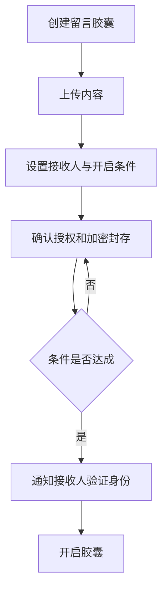

# 数字分身留言胶囊 PRD

---

## 1. 文档概述

| 项目 | 内容 |
|------|------|
| 文档名称 | 数字分身留言胶囊产品需求文档 |
| 文档版本 | v1.0 |
| 创建日期 | 2026-04-28 |
| 文档状态 | 草稿 |
| 目标受众 | 产品、设计、前端、后端、AI 工程、法务、测试 |

## 2. 项目背景

人们常想把一些话留给未来的自己、孩子、伴侣或朋友，但普通定时邮件缺少情境、身份验证和长期保存体验。本产品允许用户创建未来留言胶囊，并可选训练一个受限的“数字分身”来回答预设主题问题。它不是替代本人，而是把用户主动授权的故事、观点和祝福整理成未来可开启的互动记忆。

## 3. 产品概述

### 3.1 产品定位

一款面向个人和家庭的未来留言与互动记忆产品，用定时胶囊和受限数字分身保存重要话语。

### 3.2 目标用户

| 用户角色 | 特征描述 | 核心需求 |
|----------|----------|----------|
| 父母 | 想给孩子未来留言 | 分阶段留下祝福和建议 |
| 伴侣/朋友 | 纪念日和远期约定 | 定时开启情感内容 |
| 个人用户 | 给未来自己写信 | 保存阶段性想法 |
| 家庭长辈 | 想记录人生故事 | 让后辈以后能听到 |

### 3.3 核心价值

1. **让重要的话不丢失**：长期保存文字、音频、视频和照片。
2. **按时间开启**：未来某天、某年龄或某事件触发。
3. **有边界的互动**：数字分身只基于授权素材回答。
4. **重视伦理和安全**：明确标注 AI 生成，不冒充真人实时意愿。

## 4. 功能需求

### 4.1 P0：核心功能（MVP）

| 功能编号 | 功能名称 | 功能描述 | 验收标准 |
|----------|----------|----------|----------|
| F001 | 创建胶囊 | 添加文字、图片、音频或视频 | 支持至少 4 类素材 |
| F002 | 开启条件 | 设置日期、年龄、地点或手动授权开启 | 条件清晰可预览 |
| F003 | 接收人管理 | 指定接收人和联系方式 | 接收人可验证身份 |
| F004 | 到期通知 | 到期后通知接收人开启 | 邮件/短信/站内信至少一种 |
| F005 | 私密加密 | 胶囊内容加密存储 | 未授权不可访问 |
| F006 | 开启记录 | 记录何时由谁开启 | 用户可查看日志 |

### 4.2 P1：重要功能

| 功能编号 | 功能名称 | 功能描述 |
|----------|----------|----------|
| F101 | 数字分身素材库 | 用户上传故事、问答、语音素材 |
| F102 | 受限问答 | 接收人只能围绕授权主题提问 |
| F103 | 纪念日胶囊 | 按生日、毕业、婚礼等模板创建 |
| F104 | 继承联系人 | 设置紧急联系人和权限转移 |
| F105 | 法务声明 | 用户确认授权范围和 AI 标识 |

### 4.3 P2：增强功能

| 功能编号 | 功能名称 | 功能描述 |
|----------|----------|----------|
| F201 | 声音还原 | 在明确授权下生成留言朗读 |
| F202 | 家族档案馆 | 多位家庭成员共同维护记忆库 |
| F203 | 实体二维码 | 生成可贴在相册或礼物上的开启码 |
| F204 | 长期托管 | 提供多年存储和迁移保障 |

## 5. 技术方案

| 层级 | 技术选择 |
|------|----------|
| 前端 | Next.js / 移动端 H5 |
| 后端 | NestJS / FastAPI |
| 数据库 | PostgreSQL |
| 存储 | 加密对象存储 |
| AI 能力 | 语义检索、受限问答、语音合成可选 |
| 安全 | 端到端加密、身份验证、审计日志 |

## 6. 数据模型

### 6.1 TimeCapsule

| 字段名 | 类型 | 必填 | 说明 |
|--------|------|:----:|------|
| id | string | ✓ | 胶囊 ID |
| ownerId | string | ✓ | 创建人 |
| recipientIds | array | ✓ | 接收人 |
| unlockRule | object | ✓ | 开启条件 |
| status | enum | ✓ | draft/sealed/unlocked/revoked |
| encryptedPayloadRef | string | ✓ | 加密内容引用 |
| aiPersonaEnabled | boolean | ✓ | 是否启用分身 |

## 7. 核心流程

## 8. 验收指标

| 指标 | 目标 |
|------|------|
| 胶囊封存成功率 | ≥ 99% |
| 未授权访问事件 | 0 |
| 到期通知送达率 | ≥ 95% |
| AI 回答越界率 | ≤ 2% |

