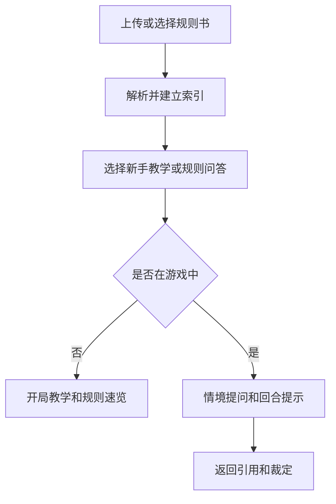

# 桌游规则助手 PRD

---

## 1. 文档概述

### 1.1 文档信息

| 项目 | 内容 |
|------|------|
| 文档名称 | 桌游规则助手产品需求文档 |
| 文档版本 | v1.0 |
| 创建日期 | 2026-04-28 |
| 文档状态 | 草稿 |
| 目标受众 | 产品、设计、前端、后端、AI 工程、测试 |

### 1.2 项目背景

桌游规则书往往篇幅长、术语多、学习成本高。玩家在开局前需要讲规则，游戏中又会频繁查细节，影响体验。本项目希望将桌游规则书结构化，并通过自然语言问答、回合引导和争议裁定，帮助玩家更快开局、更少翻书。

**项目特点：**
- 支持上传规则书 PDF 或选择内置游戏。
- 提供规则问答、开局教学和回合提示。
- 对复杂规则给出引用来源。
- 支持多人游戏中的争议记录。

---

## 2. 产品概述

### 2.1 产品定位

一款面向桌游玩家的规则查询和教学助手，让玩家快速理解规则并在游戏中获得准确提示。

### 2.2 目标用户

| 用户角色 | 特征描述 | 核心需求 |
|----------|----------|----------|
| 桌游新手 | 不熟悉复杂规则 | 快速上手和术语解释 |
| 桌游主持人 | 经常带新游戏 | 减少讲解成本 |
| 硬核玩家 | 关注规则细节 | 精确查询和引用页码 |
| 桌游店 | 需要教学和组织活动 | 提供标准化教学流程 |

### 2.3 核心价值

1. **更快开局**：用教学流程替代长时间读规则书。
2. **减少争议**：回答附带规则来源，便于玩家确认。
3. **降低主持压力**：回合流程和常见问题自动提示。
4. **沉淀玩法经验**：记录房规、勘误和玩家习惯。

---

## 3. 功能需求

### 3.1 P0：核心功能（MVP）

#### 3.1.1 游戏规则库

| 功能编号 | 功能名称 | 功能描述 | 验收标准 |
|----------|----------|----------|----------|
| F001 | 游戏创建 | 添加游戏名称、人数、时长、复杂度 | 游戏出现在规则库 |
| F002 | 规则书上传 | 上传 PDF 或图片规则书 | 系统解析并建立索引 |
| F003 | 规则目录 | 自动识别章节和页码 | 用户可按目录跳转 |
| F004 | 勘误备注 | 用户可添加官方勘误或自定义备注 | 问答时可被引用 |

#### 3.1.2 规则问答

| 功能编号 | 功能名称 | 功能描述 | 验收标准 |
|----------|----------|----------|----------|
| F011 | 自然语言提问 | 用户提问具体规则问题 | 返回答案和引用 |
| F012 | 术语解释 | 解释游戏中的关键词和图标 | 解释关联原规则 |
| F013 | 情境裁定 | 输入当前情境，系统给出规则判断 | 输出包含判断依据 |
| F014 | 追问 | 支持围绕同一问题继续追问 | 保留上下文 |

#### 3.1.3 开局教学

| 功能编号 | 功能名称 | 功能描述 | 验收标准 |
|----------|----------|----------|----------|
| F021 | 新手教学 | 按步骤讲解目标、组件、流程、胜利条件 | 新手可按步骤完成学习 |
| F022 | 开局设置 | 指导玩家摆放版图、发牌、分配资源 | 每一步可勾选完成 |
| F023 | 规则速览 | 生成 3 分钟规则摘要 | 摘要覆盖核心流程 |
| F024 | 常见错误 | 展示新手易错点 | 可在游戏中快速查看 |

#### 3.1.4 游戏中辅助

| 功能编号 | 功能名称 | 功能描述 | 验收标准 |
|----------|----------|----------|----------|
| F031 | 回合流程 | 展示当前阶段可执行动作 | 支持手动切换阶段 |
| F032 | 计分助手 | 根据规则记录分数和触发条件 | 结果可编辑 |
| F033 | 房规记录 | 保存本局采用的房规 | 下次开局可复用 |

### 3.2 P1：重要功能

| 功能编号 | 功能名称 | 功能描述 |
|----------|----------|----------|
| F101 | 官方规则包 | 内置授权或用户自建规则包 |
| F102 | 多人共享 | 同一局玩家可查看统一规则页 |
| F103 | 语音提问 | 游戏过程中用语音快速询问 |
| F104 | 模组扩展 | 支持扩展包和基础版规则差异 |
| F105 | 战局记录 | 记录对局日志和最终计分 |

### 3.3 P2：增强功能

| 功能编号 | 功能名称 | 功能描述 |
|----------|----------|----------|
| F201 | 规则教学视频脚本 | 自动生成主持人讲解稿 |
| F202 | 图像识别组件 | 拍摄卡牌或版图识别规则 |
| F203 | 桌游店模式 | 管理多桌教学和活动 |
| F204 | 社区规则问答 | 玩家共享高质量规则解释 |

---

## 4. 技术方案

### 4.1 技术栈

| 层级 | 技术选择 |
|------|----------|
| 前端 | React / Vue / 小程序 |
| 后端 | FastAPI / NestJS |
| 文档解析 | OCR、PDF parser、章节识别 |
| AI 能力 | RAG 问答、摘要、情境推理 |
| 数据库 | PostgreSQL、向量数据库、Redis |

### 4.2 系统架构

```text
规则书上传
  ↓
OCR / PDF 解析
  ↓
规则索引和向量库
  ↓
问答服务 / 教学流程服务
  ↓
前端规则助手
```

---

## 5. 数据模型

### 5.1 BoardGame

| 字段名 | 类型 | 必填 | 说明 |
|--------|------|:----:|------|
| id | string | ✓ | 游戏 ID |
| name | string | ✓ | 游戏名称 |
| playerCount | string | ✗ | 支持人数 |
| playTime | string | ✗ | 游戏时长 |
| complexity | number | ✗ | 复杂度 |
| rulesetVersion | string | ✗ | 规则版本 |

### 5.2 RuleChunk

| 字段名 | 类型 | 必填 | 说明 |
|--------|------|:----:|------|
| id | string | ✓ | 规则片段 ID |
| gameId | string | ✓ | 所属游戏 |
| chapter | string | ✗ | 章节 |
| page | number | ✗ | 页码 |
| text | text | ✓ | 规则文本 |
| embeddingId | string | ✗ | 向量索引 ID |

---

## 6. 核心流程



---

## 7. 非功能需求

| 类别 | 要求 |
|------|------|
| 准确性 | 规则回答必须提供来源引用 |
| 版权 | 内置规则包需处理授权，用户上传仅个人使用 |
| 性能 | 普通问题响应时间不超过 5 秒 |
| 可用性 | 手机端单手可快速提问和查看答案 |
| 可靠性 | 无引用时必须提示不确定，不能编造规则 |

---

## 8. 开发计划

| 阶段 | 周期 | 交付内容 |
|------|------|----------|
| 第一阶段 | 2 周 | 游戏库、规则上传、解析 |
| 第二阶段 | 2 周 | 规则问答、引用、术语解释 |
| 第三阶段 | 2 周 | 新手教学、开局设置、回合流程 |
| 第四阶段 | 1 周 | 计分、房规、测试上线 |

