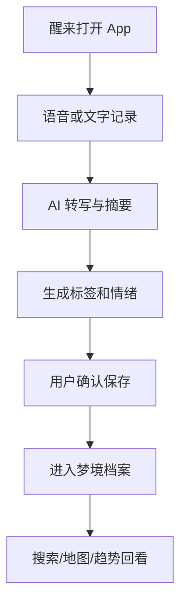

# 梦境记录与 AI 解析器 PRD

---

## 1. 文档概述

| 项目 | 内容 |
|------|------|
| 文档名称 | 梦境记录与AI解析器产品需求文档 |
| 文档版本 | v1.0 |
| 创建日期 | 2026-04-28 |
| 文档状态 | 草稿 |
| 目标受众 | 产品、设计、前端、后端、AI 工程、测试 |

## 2. 项目背景

很多人醒来后会快速遗忘梦境，即使记下来也很难长期整理和回看。传统日记产品更偏文字记录，不适合半梦半醒时的语音输入、碎片补充和主题归档。本产品将梦境记录、情绪标注、AI 解析和长期模式观察结合，帮助用户保存梦境、发现反复出现的人物/场景/情绪，并生成可回看的“梦境地图”。

**项目特点：**
- 支持醒来后 30 秒内快速语音记录。
- 自动抽取梦中的人物、地点、物品、情绪和关键词。
- 生成梦境时间线、主题地图和 recurring pattern。
- 强隐私本地优先，允许用户关闭云端分析。

## 3. 产品概述

### 3.1 产品定位

一款面向个人的梦境记录与 AI 解析工具，把零散梦境沉淀为可搜索、可回顾、可洞察的私人梦境档案。

### 3.2 目标用户

| 用户角色 | 特征描述 | 核心需求 |
|----------|----------|----------|
| 梦境爱好者 | 经常记梦、喜欢探索潜意识 | 快速记录和系统整理 |
| 创作者 | 需要灵感素材 | 从梦境提取故事、画面和角色 |
| 压力人群 | 睡眠浅、梦多 | 观察情绪和压力变化 |
| 心理咨询用户 | 希望辅助自我观察 | 输出可分享的梦境摘要 |

### 3.3 核心价值

1. **降低记录门槛**：醒来后用语音、短句、关键词即可保存梦境。
2. **形成长期洞察**：自动发现反复出现的意象、人物和情绪。
3. **激发创意产出**：把梦境转成故事梗概、画面提示词或诗歌片段。
4. **保护隐私**：梦境属于高敏感内容，默认私密存储。

## 4. 功能需求

### 4.1 P0：核心功能（MVP）

| 功能编号 | 功能名称 | 功能描述 | 验收标准 |
|----------|----------|----------|----------|
| F001 | 快速记录 | 支持语音、文本和关键词记录梦境 | 3 秒内进入记录界面 |
| F002 | 语音转写 | 将晨间语音转成可编辑文本 | 转写结果可手动修正 |
| F003 | 梦境标签 | 自动生成情绪、人物、地点、物品标签 | 标签可删除和新增 |
| F004 | AI 摘要 | 生成 100 字以内梦境摘要 | 摘要保留关键事件 |
| F005 | 梦境搜索 | 按关键词、标签、日期搜索 | 搜索结果高亮命中内容 |
| F006 | 私密锁 | 支持密码、Face ID 或系统锁 | 未解锁无法查看内容 |

### 4.2 P1：重要功能

| 功能编号 | 功能名称 | 功能描述 |
|----------|----------|----------|
| F101 | 梦境地图 | 可视化展示反复出现的主题和人物关系 |
| F102 | 情绪趋势 | 统计最近 7/30/90 天梦境情绪变化 |
| F103 | 创作模式 | 将梦境生成短篇故事、分镜或绘图提示词 |
| F104 | 睡眠关联 | 记录入睡时间、醒来时间和睡眠质量 |
| F105 | 咨询分享 | 导出脱敏版梦境报告 |

### 4.3 P2：增强功能

| 功能编号 | 功能名称 | 功能描述 |
|----------|----------|----------|
| F201 | 本地小模型 | 在设备端完成标签和摘要 |
| F202 | 梦境相册 | 根据梦境内容生成私密视觉卡片 |
| F203 | 清醒梦训练 | 提供 reality check 训练和提醒 |
| F204 | 多语言记录 | 支持中英混合梦境转写和分析 |

## 5. 技术方案

| 层级 | 技术选择 |
|------|----------|
| 客户端 | iOS / Android / Flutter |
| 后端 | FastAPI / NestJS |
| 数据库 | SQLite 本地库、PostgreSQL 云同步 |
| AI 能力 | 语音转写、实体抽取、摘要生成、情绪分类 |
| 安全 | 端侧加密、密钥托管、私密锁 |

## 6. 数据模型

### 6.1 DreamEntry

| 字段名 | 类型 | 必填 | 说明 |
|--------|------|:----:|------|
| id | string | ✓ | 梦境 ID |
| userId | string | ✓ | 用户 ID |
| rawText | text | ✓ | 原始记录 |
| summary | text | ✗ | AI 摘要 |
| tags | array | ✗ | 标签列表 |
| emotion | enum | ✗ | calm/fear/sad/joy/confused |
| sleepDate | date | ✓ | 梦境日期 |
| isEncrypted | boolean | ✓ | 是否加密 |

## 7. 核心流程

## 8. 验收指标

| 指标 | 目标 |
|------|------|
| 首次记录完成率 | ≥ 70% |
| 记录入口打开时间 | ≤ 3 秒 |
| AI 标签可接受率 | ≥ 80% |
| 私密内容未解锁可见率 | 0 |

