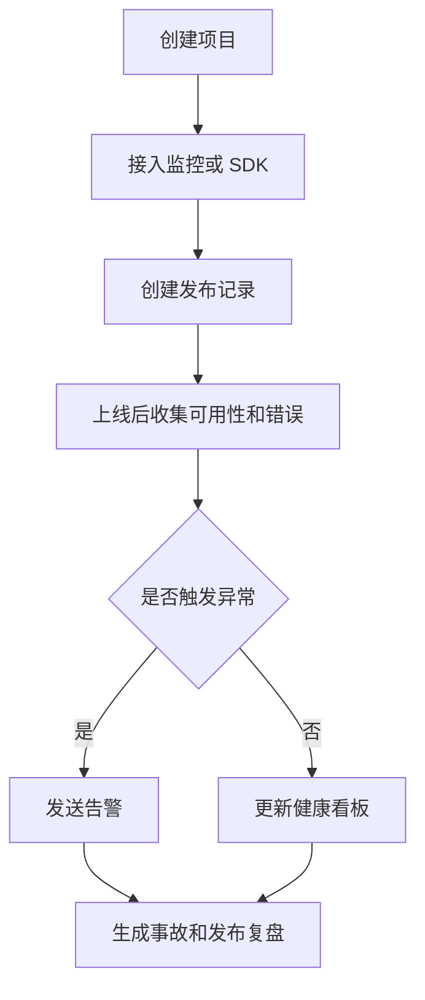

# 独立开发者发布监控平台 PRD

---

## 1. 文档概述

### 1.1 文档信息

| 项目 | 内容 |
|------|------|
| 文档名称 | 独立开发者发布监控平台产品需求文档 |
| 文档版本 | v1.0 |
| 创建日期 | 2026-04-28 |
| 文档状态 | 草稿 |
| 目标受众 | 产品、设计、前端、后端、DevOps、测试 |

### 1.2 项目背景

独立开发者通常同时管理网站、App、插件、API 和多个发布渠道。上线后需要关注构建状态、错误日志、可用性、用户反馈、收入和社媒提及，但单独接入完整企业级监控成本过高。本项目为独立开发者提供一个轻量发布监控平台，把“发布后是否正常”集中呈现。

**项目特点：**
- 聚合部署、可用性、错误、反馈和收入数据。
- 以发布版本为中心展示影响。
- 提供上线检查清单和事故提醒。
- 支持低成本接入和个人项目管理。

---

## 2. 产品概述

### 2.1 产品定位

一款面向独立开发者和小团队的发布监控平台，帮助用户跟踪产品上线后的健康状态和关键反馈。

### 2.2 目标用户

| 用户角色 | 特征描述 | 核心需求 |
|----------|----------|----------|
| 独立开发者 | 一人负责开发和运维 | 发布后快速知道是否出问题 |
| 小型 SaaS 团队 | 资源有限 | 低成本监控核心指标 |
| 插件开发者 | 多渠道发布 | 跟踪版本、评论和错误 |
| 技术产品经理 | 关注上线质量 | 发布检查和影响复盘 |

### 2.3 核心价值

1. **发布风险可见**：把版本、错误和可用性关联起来。
2. **减少工具切换**：聚合日志、监控、反馈和收入。
3. **事故更快响应**：异常时通过多渠道提醒。
4. **适合小团队**：接入轻量、价格低、配置简单。

---

## 3. 功能需求

### 3.1 P0：核心功能（MVP）

#### 3.1.1 项目与发布

| 功能编号 | 功能名称 | 功能描述 | 验收标准 |
|----------|----------|----------|----------|
| F001 | 项目创建 | 添加网站、API、App、插件等项目 | 项目进入工作台 |
| F002 | 发布记录 | 手动或 Webhook 创建版本发布记录 | 记录包含版本号和时间 |
| F003 | 发布检查清单 | 配置上线前检查项 | 可勾选完成 |
| F004 | 版本关联 | 将错误、可用性和反馈关联到版本 | 版本页展示关联数据 |

#### 3.1.2 可用性监控

| 功能编号 | 功能名称 | 功能描述 | 验收标准 |
|----------|----------|----------|----------|
| F011 | HTTP 监控 | 定时请求 URL 检查状态码和响应时间 | 异常时记录事件 |
| F012 | API 断言 | 支持检查响应内容或 JSON 字段 | 断言失败触发告警 |
| F013 | 区域检测 | 从不同区域发起检测 | 展示区域结果 |
| F014 | 状态页 | 生成公开或私有状态页 | 用户可分享链接 |

#### 3.1.3 错误与日志

| 功能编号 | 功能名称 | 功能描述 | 验收标准 |
|----------|----------|----------|----------|
| F021 | 前端错误收集 | 提供 JS SDK 收集异常 | 错误出现在项目页 |
| F022 | 后端事件上报 | 通过 API 上报错误和自定义事件 | 支持按版本过滤 |
| F023 | 错误聚合 | 相似错误自动合并 | 展示出现次数和影响用户 |
| F024 | 错误详情 | 展示堆栈、环境、浏览器、发生时间 | 信息可复制 |

#### 3.1.4 告警与复盘

| 功能编号 | 功能名称 | 功能描述 | 验收标准 |
|----------|----------|----------|----------|
| F031 | 告警规则 | 配置错误率、不可用、响应慢等规则 | 规则触发时通知 |
| F032 | 通知渠道 | 支持邮件、飞书、Slack、Webhook | 至少一种渠道可用 |
| F033 | 发布复盘 | 生成发布后 24 小时健康摘要 | 摘要包含异常和指标变化 |

### 3.2 P1：重要功能

| 功能编号 | 功能名称 | 功能描述 |
|----------|----------|----------|
| F101 | GitHub 集成 | 自动读取 release、commit 和部署状态 |
| F102 | 用户反馈聚合 | 收集应用内反馈、表单和评论 |
| F103 | 收入指标 | 接入 Stripe、Paddle 或手动收入记录 |
| F104 | 竞品和社媒提及 | 监控关键词和社交平台提及 |
| F105 | 事故时间线 | 自动整理故障开始、处理和恢复记录 |

### 3.3 P2：增强功能

| 功能编号 | 功能名称 | 功能描述 |
|----------|----------|----------|
| F201 | AI 根因摘要 | 根据错误、部署和日志总结可能原因 |
| F202 | 自动回滚建议 | 结合版本健康度提示是否回滚 |
| F203 | 多产品组合看板 | 管理多个独立产品的健康状态 |
| F204 | 用户影响分析 | 估算异常影响的用户、收入和地域 |

---

## 4. 技术方案

### 4.1 技术栈

| 层级 | 技术选择 |
|------|----------|
| 前端 | Next.js / React、图表组件 |
| 后端 | Go / Node.js / FastAPI |
| 数据库 | PostgreSQL、ClickHouse、Redis |
| 监控 | 定时任务、探针节点、事件聚合 |
| 通知 | 邮件、Slack、飞书、Webhook |
| SDK | JavaScript SDK、REST API |

### 4.2 系统架构

```text
项目接入 SDK / Webhook / 探针
  ↓
事件接收网关
  ↓
错误聚合 / 可用性检测 / 发布关联
  ↓
指标看板 / 告警服务 / 复盘生成
```

---

## 5. 数据模型

### 5.1 Project

| 字段名 | 类型 | 必填 | 说明 |
|--------|------|:----:|------|
| id | string | ✓ | 项目 ID |
| name | string | ✓ | 项目名称 |
| type | enum | ✓ | web/api/app/plugin |
| ownerId | string | ✓ | 所有者 |
| alertChannels | array | ✗ | 告警渠道 |
| createdAt | datetime | ✓ | 创建时间 |

### 5.2 Release

| 字段名 | 类型 | 必填 | 说明 |
|--------|------|:----:|------|
| id | string | ✓ | 发布 ID |
| projectId | string | ✓ | 所属项目 |
| version | string | ✓ | 版本号 |
| releasedAt | datetime | ✓ | 发布时间 |
| commitSha | string | ✗ | 关联提交 |
| notes | text | ✗ | 发布说明 |

---

## 6. 核心流程



---

## 7. 非功能需求

| 类别 | 要求 |
|------|------|
| 可靠性 | 事件接收服务可用性不低于 99.9% |
| 性能 | SDK 对页面性能影响低于 20ms |
| 数据保留 | 免费版保留 7-30 天事件数据 |
| 安全 | 项目 API Key 支持轮换和禁用 |
| 可用性 | 新项目接入基础监控不超过 10 分钟 |

---

## 8. 开发计划

| 阶段 | 周期 | 交付内容 |
|------|------|----------|
| 第一阶段 | 2 周 | 项目、发布、HTTP 监控 |
| 第二阶段 | 3 周 | JS SDK、错误聚合、告警 |
| 第三阶段 | 2 周 | 状态页、发布复盘、通知渠道 |
| 第四阶段 | 1 周 | GitHub 集成、测试、上线 |

