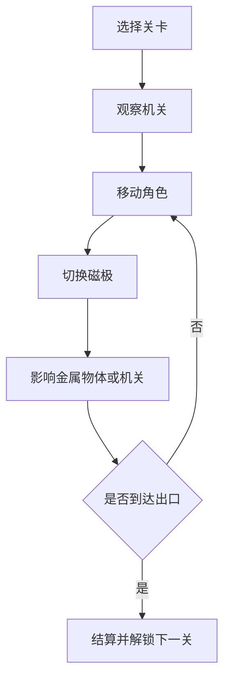

# 磁力迷宫网页游戏 PRD

---

## 1. 文档概述

### 1.1 文档信息

| 项目 | 内容 |
|------|------|
| 文档名称 | 磁力迷宫网页游戏产品需求文档 |
| 文档版本 | v1.0 |
| 创建日期 | 2026-04-28 |
| 文档状态 | 草稿 |
| 目标受众 | 产品、设计、前端、关卡设计、测试 |

### 1.2 项目背景

磁力迷宫是一款轻量级网页解谜动作游戏。玩家控制一个小角色在迷宫关卡中移动，通过切换红色/蓝色磁极来吸引或排斥金属方块、机关平台和移动门，最终到达出口。项目目标是做出一个机制清晰、关卡可扩展、低美术成本但有完整体验的 Web 游戏原型。

**项目特点：**
- 单一核心机制：磁极切换。
- 关卡逐步教学：每 1-2 关引入一个新机关。
- 适合键盘和触屏操作。
- 不依赖 IP 或复杂素材，重点放在规则、反馈和关卡设计。

---

## 2. 产品概述

### 2.1 产品定位

一款面向休闲玩家和解谜游戏爱好者的网页端物理解谜游戏，让用户在 3-5 分钟内理解规则并完成多个短关卡。

### 2.2 目标用户

| 用户角色 | 特征描述 | 核心需求 |
|----------|----------|----------|
| 休闲玩家 | 喜欢短时间轻游戏 | 规则简单、反馈清晰、失败成本低 |
| 解谜玩家 | 喜欢机关和关卡推理 | 关卡有递进、有思考空间 |
| 开发验证者 | 需要网页游戏案例 | 机制明确、代码结构可扩展 |
| 关卡设计者 | 需要快速制作关卡 | 关卡数据结构简单、可迭代 |

### 2.3 核心价值

1. **机制聚焦**：只围绕磁力吸引、排斥和机关联动展开。
2. **易于完成**：MVP 可用少量图形和音效实现完整游戏体验。
3. **可持续扩展**：后续可增加新机关、新世界和关卡编辑器。

---

## 3. 游戏设计

### 3.1 核心循环

玩家进入关卡后观察地图，移动角色，切换磁极，利用磁力移动金属物体或改变机关状态，拿到可选收集物并到达出口。失败后可快速重试，通关后进入下一关。

### 3.2 操作方式

| 输入 | 桌面端 | 移动端 | 说明 |
|------|--------|--------|------|
| 移动 | WASD / 方向键 | 虚拟方向键 | 控制角色上下左右移动 |
| 切换磁极 | Space / J | 磁极按钮 | 红极、蓝极、无极三态循环或双态切换 |
| 重开关卡 | R | 重开按钮 | 回到当前关初始状态 |
| 暂停 | Esc | 暂停按钮 | 打开菜单 |

### 3.3 主要规则

| 规则 | 描述 |
|------|------|
| 红蓝磁极 | 玩家当前磁极决定与金属物体的交互方向 |
| 同极排斥 | 玩家与同色磁物体接近时产生推力 |
| 异极吸引 | 玩家与异色磁物体接近时产生拉力 |
| 无极安全 | 无极状态不影响物体，但也无法触发部分机关 |
| 金属方块 | 可被磁力推动或拉动，可压住按钮 |
| 门与按钮 | 按钮被角色或方块压住时打开对应门 |
| 危险区域 | 电流、深坑、激光触碰后重置当前关卡 |
| 出口 | 玩家到达出口且必要机关满足时通关 |

---

## 4. 功能需求

### 4.1 P0：核心功能（MVP）

#### 4.1.1 游戏框架

| 功能编号 | 功能名称 | 功能描述 | 验收标准 |
|----------|----------|----------|----------|
| F001 | 开始界面 | 展示游戏标题、开始、关卡选择、设置入口 | 用户可在 2 次点击内开始第一关 |
| F002 | 关卡加载 | 根据关卡 JSON/对象数据生成地图、角色、机关 | 每关初始化状态正确 |
| F003 | 游戏循环 | 提供固定帧率更新、碰撞检测、渲染和输入处理 | 操作响应无明显卡顿 |
| F004 | 暂停菜单 | 支持继续、重开、返回关卡选择 | 暂停后游戏状态冻结 |

#### 4.1.2 角色与磁力

| 功能编号 | 功能名称 | 功能描述 | 验收标准 |
|----------|----------|----------|----------|
| F011 | 角色移动 | 支持四方向移动和基础碰撞 | 角色不能穿墙或穿过关闭的门 |
| F012 | 磁极切换 | 支持红、蓝、无极状态切换 | UI 和角色颜色同步变化 |
| F013 | 吸引/排斥 | 根据极性和距离对金属物体施加方向力 | 物体移动方向符合规则 |
| F014 | 磁力范围提示 | 显示当前磁力影响范围 | 玩家能判断哪些物体会受影响 |
| F015 | 失败重置 | 掉落或触碰危险物后重置当前关 | 重置后所有实体回到初始状态 |

#### 4.1.3 机关与关卡

| 功能编号 | 功能名称 | 功能描述 | 验收标准 |
|----------|----------|----------|----------|
| F021 | 墙体与地板 | 支持不可通行墙体和普通地板 | 碰撞边界准确 |
| F022 | 金属方块 | 可被磁力移动，可压按钮 | 方块不会穿墙或卡进障碍 |
| F023 | 按钮机关 | 被压住时触发对应门或平台 | 松开后按配置保持或恢复 |
| F024 | 磁力门 | 根据机关状态打开或关闭 | 门状态切换有视觉反馈 |
| F025 | 出口判定 | 玩家进入出口区域后完成关卡 | 完成后展示结算面板 |
| F026 | 关卡进度 | 通关后解锁下一关 | 刷新后进度保留在本地 |

### 4.2 P1：重要功能

| 功能编号 | 功能名称 | 功能描述 | 验收标准 |
|----------|----------|----------|----------|
| F101 | 星级评分 | 根据步数、用时、收集物给出 1-3 星 | 结算结果稳定可复现 |
| F102 | 收集物 | 每关设置 0-3 个可选能量晶体 | 收集状态计入结算 |
| F103 | 提示系统 | 玩家卡关后可查看一条提示 | 提示不直接自动解关 |
| F104 | 音效反馈 | 切换磁极、按钮、开门、失败、通关有音效 | 可在设置中关闭 |
| F105 | 触屏适配 | 移动端显示虚拟摇杆/方向键和磁极按钮 | 390px 宽度下可正常操作 |

### 4.3 P2：增强功能

| 功能编号 | 功能名称 | 功能描述 |
|----------|----------|----------|
| F201 | 关卡编辑器 | 支持拖拽地图格子、机关和出口并导出 JSON |
| F202 | 新机关包 | 增加传送门、单向门、定时电流、磁轨平台 |
| F203 | 每日挑战 | 每天生成或发布一个限时挑战关 |
| F204 | 分享关卡 | 用户可分享自制关卡链接 |
| F205 | 皮肤系统 | 解锁角色颜色、磁力特效和关卡主题 |

---

## 5. 关卡规划

### 5.1 MVP 关卡结构

| 关卡 | 目标 | 引入内容 | 设计要点 |
|------|------|----------|----------|
| 1 | 走到出口 | 移动、出口 | 无危险，完成基础教学 |
| 2 | 推开方块 | 红蓝磁极、金属方块 | 让玩家理解排斥 |
| 3 | 拉动方块压按钮 | 吸引、按钮、门 | 引导异极吸引 |
| 4 | 避开电流 | 危险区域 | 失败后快速重试 |
| 5 | 多方块联动 | 两个按钮、一扇门 | 形成第一道小谜题 |
| 6 | 收集物挑战 | 可选晶体 | 路线优化和探索 |
| 7 | 移动平台 | 磁力平台 | 时机与空间判断 |
| 8 | 综合关 | 全部 MVP 机关 | 作为 Demo 终局 |

### 5.2 难度原则

- 第一关必须在 30 秒内完成。
- 每关只引入一个新概念。
- 失败点离重试点不要超过 10 秒。
- 关卡画面要让目标、危险和机关关系一眼可见。

---

## 6. 技术方案

### 6.1 推荐技术栈

| 层级 | 技术选择 |
|------|----------|
| 游戏渲染 | HTML Canvas + Phaser 3 |
| 物理/碰撞 | Phaser Arcade Physics，必要时自定义磁力计算 |
| UI | 原生 DOM 或 Phaser UI 场景 |
| 数据存储 | localStorage |
| 部署 | 静态站点，支持 GitHub Pages / Vercel |

### 6.2 数据模型

#### Level

| 字段名 | 类型 | 必填 | 说明 |
|--------|------|:----:|------|
| id | string | ✓ | 关卡 ID |
| name | string | ✓ | 关卡名称 |
| width | number | ✓ | 地图宽度 |
| height | number | ✓ | 地图高度 |
| tiles | array | ✓ | 地形网格 |
| entities | array | ✓ | 角色、方块、按钮、门、出口等实体 |
| parTime | number | ✗ | 三星参考时间 |
| parMoves | number | ✗ | 三星参考步数 |

#### Entity

| 字段名 | 类型 | 必填 | 说明 |
|--------|------|:----:|------|
| id | string | ✓ | 实体 ID |
| type | enum | ✓ | player/block/button/door/exit/hazard |
| x | number | ✓ | 网格或像素坐标 x |
| y | number | ✓ | 网格或像素坐标 y |
| polarity | enum | ✗ | red/blue/neutral |
| targetId | string | ✗ | 机关联动目标 |
| initialState | object | ✗ | 初始状态 |

---

## 7. 界面与视觉

### 7.1 页面结构

| 区域 | 内容 |
|------|------|
| 顶部状态栏 | 关卡名、用时、步数、收集物、暂停 |
| 游戏区域 | 地图、角色、机关、磁力范围 |
| 底部控制区 | 移动端方向键、磁极切换、重开 |
| 结算弹窗 | 星级、用时、收集物、下一关、重玩 |

### 7.2 视觉方向

采用明亮、几何、玩具感的视觉语言。红蓝磁极必须有强区分，机关联动使用同色线条或图标标识。避免写实金属和复杂背景，保证玩家能快速读懂地图。

---

## 8. 非功能需求

| 类别 | 要求 |
|------|------|
| 性能 | 桌面端稳定 60 FPS，移动端目标 30 FPS 以上 |
| 加载 | 首屏资源小于 5MB，首次可玩时间小于 3 秒 |
| 兼容 | Chrome、Edge、Safari、Firefox 近两年版本 |
| 响应式 | 支持 390px 移动端到 1440px 桌面端 |
| 可访问性 | 关键状态不能只依赖颜色，需配合图标或形状 |
| 存档 | 本地保存关卡解锁、星级、音效设置 |

---

## 9. 验收标准

1. 用户可以从首页进入第 1 关，并连续完成至少 8 个 MVP 关卡。
2. 磁极切换、吸引、排斥、按钮、门、危险和出口规则稳定可用。
3. 任何关卡失败后 1 秒内可重开。
4. 刷新页面后已解锁关卡和星级不丢失。
5. 桌面和移动端均能完成完整流程。

---

## 10. 里程碑

| 阶段 | 周期 | 交付物 |
|------|------|--------|
| M1 原型 | 2-3 天 | 角色移动、磁极切换、基础碰撞 |
| M2 MVP | 5-7 天 | 8 个关卡、机关、结算、存档 |
| M3 打磨 | 3-5 天 | 音效、动画、移动端适配、星级评分 |
| M4 发布 | 1-2 天 | 部署、测试清单、演示链接 |

