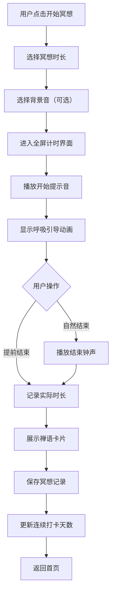
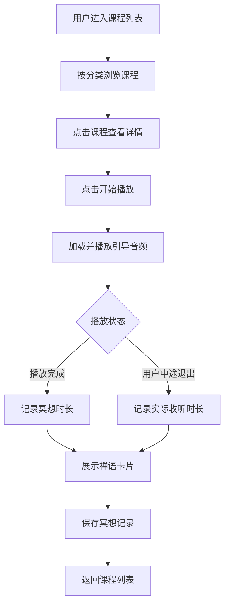
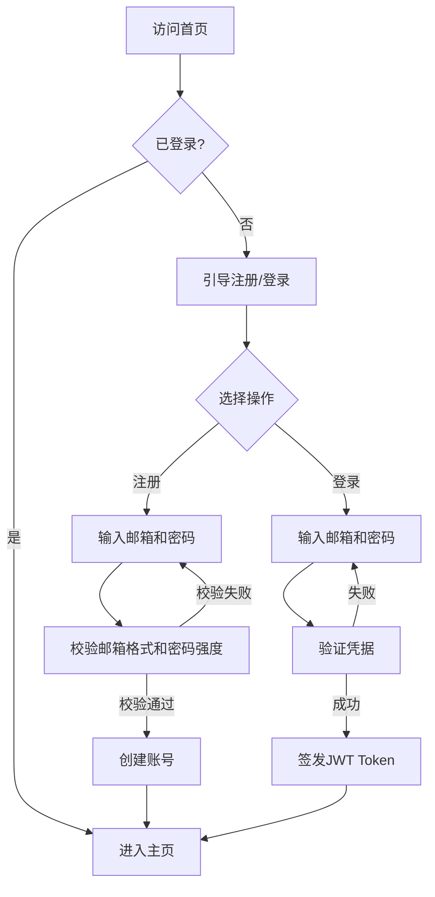

# 禅定（ZenMind）产品需求文档（PRD）

---

## 1. 文档概述

### 1.1 文档信息

| 项目 | 内容 |
|------|------|
| 文档名称 | 禅定（ZenMind）产品需求文档 |
| 文档版本 | v1.0 |
| 创建日期 | 2026-04-28 |
| 文档状态 | 草稿 |
| 目标受众 | 开发团队（小团队/个人） |

### 1.2 修订历史

| 版本 | 日期 | 修订人 | 修订内容 |
|------|------|--------|----------|
| v1.0 | 2026-04-28 | - | 初始版本创建 |

### 1.3 项目背景

现代生活节奏快、压力大，越来越多的人开始关注冥想和正念练习以缓解焦虑、提升专注力。然而，禅修初学者面临以下痛点：

- **不知从何入手**：缺乏系统性的引导，不知道如何开始冥想
- **难以坚持**：没有工具辅助记录和激励，容易半途而废
- **碎片化资源**：禅修内容散落各处，缺少一个集中的练习平台

**项目特点：**
- 面向初学者，降低禅修入门门槛
- 以冥想计时与引导为核心，简洁实用
- MVP周期1个月，快速验证

---

## 2. 产品概述

### 2.1 产品定位

一款面向禅修初学者的在线冥想平台，提供引导式冥想、打坐计时和修行记录功能，帮助用户建立并坚持每日冥想习惯。

### 2.2 目标用户

| 用户角色 | 规模 | 特征 |
|----------|------|------|
| 禅修初学者 | 主要用户 | 对冥想感兴趣，零基础或少量经验，需要引导 |
| 偶尔冥想者 | 次要用户 | 有过冥想经历但不规律，希望养成习惯 |
| 禅修爱好者 | 潜在用户 | 有一定基础，需要一个便捷的计时和记录工具 |

### 2.3 核心价值

1. **零门槛入门**：通过引导音频和预设课程，初学者无需任何背景知识即可开始冥想
2. **习惯养成**：每日提醒、连续打卡、可视化统计，激励用户坚持练习
3. **简洁专注**：摒弃社交等干扰功能，让用户专注于冥想本身

---

## 3. 角色与权限体系

### 3.1 角色定义

#### 3.1.1 普通用户

注册并使用冥想功能的用户。可以浏览引导课程、使用计时器、记录修行数据。

#### 3.1.2 管理员

管理平台内容（上传引导音频、管理课程）和查看平台数据（用户数、冥想统计数据）。

### 3.2 权限矩阵

| 功能模块 | 普通用户 | 管理员 |
|----------|:------:|:----:|
| 使用冥想计时器 | ✓ | ✓ |
| 播放引导音频 | ✓ | ✓ |
| 查看个人修行记录 | ✓ | ✓ |
| 每日打卡 | ✓ | ✓ |
| 管理引导课程 | ✗ | ✓ |
| 查看平台统计 | ✗ | ✓ |

> ✓：有权限 | ✗：无权限

---

## 4. 功能需求

### 4.1 P0：核心功能（MVP）

#### 4.1.1 用户系统

| 功能编号 | 功能名称 | 功能描述 |
|----------|----------|----------|
| F001 | 邮箱注册 | 用户通过邮箱+密码注册账号 |
| F002 | 邮箱登录 | 邮箱+密码登录，JWT鉴权 |
| F003 | 个人信息 | 查看和编辑昵称、头像 |

#### 4.1.2 冥想计时器

| 功能编号 | 功能名称 | 功能描述 |
|----------|----------|----------|
| F011 | 自由计时 | 用户自定义时长（5/10/15/20/30/45/60分钟），开始/暂停/结束冥想 |
| F012 | 计时界面 | 全屏沉浸式计时界面，显示剩余时间、呼吸引导动画（圆环缩放） |
| F013 | 音效提示 | 冥想开始时播放轻柔提示音，结束时播放结束钟声 |
| F014 | 背景音选择 | 可选择白噪音/自然音/静音作为冥想背景 |
| F015 | 提前结束 | 支持中途结束冥想，记录实际时长 |

#### 4.1.3 引导冥想

| 功能编号 | 功能名称 | 功能描述 |
|----------|----------|----------|
| F021 | 课程列表 | 展示引导冥想课程列表（名称、时长、难度、简介） |
| F022 | 课程播放 | 播放引导音频，音频结束后自动记录为一次冥想 |
| F023 | 课程分类 | 按主题分类：入门引导、呼吸练习、身体扫描、睡眠放松 |
| F024 | 预设课程 | 预置3-5个入门级引导冥想课程 |

#### 4.1.4 修行记录

| 功能编号 | 功能名称 | 功能描述 |
|----------|----------|----------|
| F031 | 自动记录 | 每次冥想结束自动记录：日期、时长、类型（自由/引导） |
| F032 | 日历视图 | 日历形式展示每日冥想记录，标记有练习的日期 |
| F033 | 连续打卡 | 显示连续冥想天数 |
| F034 | 累计统计 | 显示累计冥想次数、总时长、本月冥想天数 |

### 4.2 P1：重要功能

| 功能编号 | 功能名称 | 功能描述 |
|----------|----------|----------|
| F101 | 每日提醒 | 用户设置每日冥想提醒时间，浏览器通知提醒 |
| F102 | 统计仪表盘 | 周/月维度的冥想时长趋势图（折线图/柱状图） |
| F103 | 个人目标 | 用户设置每日/每周冥想目标（如每天10分钟），进度可视化 |
| F104 | 禅语卡片 | 每次冥想结束后展示一条禅语/格言 |
| F105 | 深色模式 | 支持深色/浅色主题切换 |

### 4.3 P2：增强功能（后续迭代）

| 功能编号 | 功能名称 | 功能描述 |
|----------|----------|----------|
| F201 | 成就徽章 | 达成里程碑（如首次冥想、连续7天、累计100小时）解锁徽章 |
| F202 | 禅学内容 | 禅宗经典、公案、开示等图文内容 |
| F203 | 社区分享 | 用户分享冥想心得，评论互动 |
| F204 | 自定义引导 | 管理员可上传自定义引导音频，动态添加课程 |
| F205 | 数据导出 | 导出个人冥想记录（CSV格式） |

---

## 5. 非功能需求

### 5.1 性能要求

| 指标 | 要求 | 说明 |
|------|------|------|
| 页面加载时间 | < 2秒 | 首屏加载时间（含资源） |
| API响应时间 | < 500ms | 常规接口响应时间 |
| 音频加载延迟 | < 1秒 | 引导音频开始播放的等待时间 |
| 并发用户 | ≥ 100 | 同时在线冥想用户数 |

### 5.2 安全要求

| 要求 | 说明 |
|------|------|
| 密码加密 | 使用bcrypt加密存储，cost factor ≥ 10 |
| JWT鉴权 | Access Token有效期2小时，Refresh Token有效期7天 |
| HTTPS | 生产环境强制HTTPS |
| 输入校验 | 前后端均做参数校验，防止XSS和SQL注入 |

### 5.3 兼容性要求

| 类别 | 要求 |
|------|------|
| 浏览器 | Chrome 90+、Firefox 88+、Safari 14+、Edge 90+ |
| 分辨率 | 最低1280×720，推荐1920×1080 |
| 移动端 | 响应式适配，支持主流手机浏览器（iOS Safari、Android Chrome） |
| 服务器 | Linux (Ubuntu 20.04+)，2核4G起步 |

### 5.4 可用性要求

| 指标 | 要求 |
|------|------|
| 系统可用性 | ≥ 99% |
| 数据持久性 | ≥ 99.9%（数据库每日备份） |

---

## 6. 数据模型

### 6.1 核心实体

#### 6.1.1 User（用户）

| 字段名 | 类型 | 必填 | 说明 |
|--------|------|:----:|------|
| id | UUID | ✓ | 主键 |
| email | string(255) | ✓ | 邮箱，唯一索引 |
| password_hash | string(255) | ✓ | bcrypt加密密码 |
| nickname | string(50) | ✗ | 昵称，默认"禅修者" |
| avatar | string(500) | ✗ | 头像URL |
| role | enum | ✓ | 角色：user / admin，默认user |
| daily_goal_minutes | integer | ✗ | 每日目标冥想时长（分钟），默认10 |
| reminder_time | time | ✗ | 每日提醒时间，如"07:00" |
| theme | enum | ✗ | 主题偏好：light / dark，默认light |
| created_at | datetime | ✓ | 注册时间 |
| updated_at | datetime | ✓ | 更新时间 |

#### 6.1.2 MeditationSession（冥想记录）

| 字段名 | 类型 | 必填 | 说明 |
|--------|------|:----:|------|
| id | UUID | ✓ | 主键 |
| user_id | UUID | ✓ | 外键 → User.id |
| type | enum | ✓ | 类型：free / guided |
| duration_seconds | integer | ✓ | 实际冥想时长（秒） |
| target_minutes | integer | ✗ | 目标时长（分钟），仅自由冥想 |
| guided_course_id | UUID | ✗ | 外键 → GuidedCourse.id，仅引导冥想 |
| background_sound | string(50) | ✗ | 背景音选择：none/rain/forest/ocean/white_noise |
| completed | boolean | ✓ | 是否完成（未提前结束） |
| zen_quote_id | UUID | ✗ | 外键 → ZenQuote.id，结束后展示的禅语 |
| created_at | datetime | ✓ | 冥想时间 |

#### 6.1.3 GuidedCourse（引导课程）

| 字段名 | 类型 | 必填 | 说明 |
|--------|------|:----:|------|
| id | UUID | ✓ | 主键 |
| title | string(100) | ✓ | 课程名称，如"5分钟入门呼吸" |
| description | string(500) | ✗ | 课程简介 |
| category | enum | ✓ | 分类：beginner / breathing / body_scan / sleep |
| duration_seconds | integer | ✓ | 音频时长（秒） |
| difficulty | enum | ✓ | 难度：beginner / intermediate |
| audio_url | string(500) | ✓ | 音频文件URL |
| cover_image | string(500) | ✗ | 封面图URL |
| sort_order | integer | ✓ | 排序权重，越小越靠前 |
| is_active | boolean | ✓ | 是否上架 |
| created_at | datetime | ✓ | 创建时间 |

#### 6.1.4 ZenQuote（禅语）

| 字段名 | 类型 | 必填 | 说明 |
|--------|------|:----:|------|
| id | UUID | ✓ | 主键 |
| content | string(500) | ✓ | 禅语内容 |
| author | string(100) | ✗ | 出处/作者 |
| translation | string(500) | ✗ | 白话译文（如为古文） |
| is_active | boolean | ✓ | 是否启用 |

### 6.2 实体关系图（ERD）

```
┌──────────┐     1:n     ┌─────────────────────┐
│   User   │────────────>│ MeditationSession   │
└──────────┘             └─────────┬───────────┘
                                   │ n:1
                                   ▼
                         ┌─────────────────────┐
                         │   GuidedCourse      │
                         └─────────────────────┘

┌──────────┐     n:1     ┌─────────────────────┐
│ ZenQuote │<────────────│ MeditationSession   │
└──────────┘             └─────────────────────┘
```

---

## 7. 业务流程

### 7.1 核心业务流程

#### 7.1.1 自由冥想流程



#### 7.1.2 引导冥想流程



#### 7.1.3 用户注册登录流程



### 7.2 状态流转说明

#### 7.2.1 冥想会话状态

| 状态 | 说明 | 可转换状态 |
|------|------|------------|
| idle | 未开始 | preparing |
| preparing | 选择参数中 | active |
| active | 冥想进行中 | paused / completed / cancelled |
| paused | 暂停中 | active / cancelled |
| completed | 正常完成 | - |
| cancelled | 提前结束 | - |

---

## 8. 界面设计规范

### 8.1 整体布局

网站采用简洁的禅意风格，以大面积留白和柔和色调为主。

**设计原则：**
- 极简主义，减少视觉干扰
- 自然色调：米白、浅灰、竹绿为主色
- 字体：使用衬线体体现禅意，正文用无衬线体保证可读性
- 大量留白，营造宁静氛围

```
┌──────────────────────────────────────────────────────┐
│  Logo: 禅定          [日历] [统计] [设置]  [头像 ▼] │
├──────────────────────────────────────────────────────┤
│                                                      │
│              ┌──────────────────┐                     │
│              │                  │                     │
│              │   呼吸引导圆环    │                     │
│              │   （中心计时器）  │                     │
│              │                  │                     │
│              └──────────────────┘                     │
│                                                      │
│         [5分] [10分] [15分] [20分] [30分]             │
│                                                      │
│         背景音：[雨声 ▼]                              │
│                                                      │
│              [ 开始冥想 ]                             │
│                                                      │
│  ──── 今日已冥想 15分钟 · 连续打卡 7天 ────          │
│                                                      │
└──────────────────────────────────────────────────────┘
```

### 8.2 关键页面说明

#### 8.2.1 首页（冥想主页）

| 元素 | 说明 |
|------|------|
| 顶部导航 | Logo、日历入口、统计入口、设置、用户头像 |
| 呼吸圆环 | 页面中央，圆环随呼吸节奏缩放，点击进入冥想 |
| 时长选择 | 圆形按钮组，选择冥想时长 |
| 背景音选择 | 下拉选择白噪音类型 |
| 开始按钮 | 醒目的"开始冥想"按钮 |
| 今日摘要 | 底部展示今日冥想时长和连续打卡天数 |

#### 8.2.2 冥想计时界面（全屏）

| 元素 | 说明 |
|------|------|
| 计时器 | 大号数字显示剩余时间（MM:SS） |
| 呼吸动画 | 圆环随呼吸节奏（吸气4秒→屏息4秒→呼气6秒）缩放 |
| 结束按钮 | 底部"结束冥想"按钮，需二次确认 |
| 背景色 | 渐变背景，随冥想时长缓慢变化（营造沉浸感） |

#### 8.2.3 引导课程列表

| 元素 | 说明 |
|------|------|
| 分类标签 | 顶部横向滚动分类标签 |
| 课程卡片 | 封面图 + 标题 + 时长 + 难度标签 |
| 课程详情 | 点击展开：简介 + 播放按钮 |

#### 8.2.4 修行日历

| 元素 | 说明 |
|------|------|
| 月历视图 | 日历网格，有冥想的日期显示绿色圆点 |
| 日期详情 | 点击某天显示当天冥想记录列表 |
| 连续打卡 | 顶部突出显示连续打卡天数 |
| 累计统计 | 底部显示累计次数和总时长 |

#### 8.2.5 禅语卡片（冥想结束弹窗）

| 元素 | 说明 |
|------|------|
| 卡片背景 | 半透明毛玻璃效果 |
| 禅语内容 | 居中展示禅语原文 |
| 译文 | 禅语下方小字展示白话译文 |
| 操作 | [再冥想一次] [返回首页] |

### 8.3 交互规范

| 场景 | 交互说明 |
|------|----------|
| 冥想计时 | 圆环顺时针填充表示进度，颜色从浅绿渐变到深绿 |
| 提前结束 | 弹出确认弹窗"确定要结束本次冥想吗？"，避免误触 |
| 页面切换 | 使用淡入淡出过渡，避免突兀跳转 |
| 加载状态 | 音频加载时显示呼吸圆环脉冲动画 |
| 错误提示 | 使用非侵入式Toast提示，3秒自动消失 |

---

## 9. 技术建议

### 9.1 技术栈推荐

#### 9.1.1 后端技术

| 组件 | 推荐方案 | 说明 |
|------|----------|------|
| 开发语言 | Node.js (v20+) | 与前端技术栈统一，降低维护成本 |
| Web框架 | Express.js | 轻量成熟，社区生态丰富 |
| 数据库 | PostgreSQL 15 | 可靠稳定，适合结构化数据 |
| ORM | Prisma | 类型安全，开发效率高 |
| 认证 | jsonwebtoken + bcrypt | JWT无状态鉴权 |
| 文件存储 | 本地存储 / MinIO | 存储音频和图片文件 |
| 定时任务 | node-cron | 每日提醒等定时任务 |

#### 9.1.2 前端技术

| 组件 | 推荐方案 | 说明 |
|------|----------|------|
| 框架 | React 18 + TypeScript | 类型安全，组件化开发 |
| 构建工具 | Vite | 快速热更新和构建 |
| UI组件库 | Tailwind CSS | 原子化CSS，快速实现禅意设计 |
| 路由 | React Router v6 | SPA路由管理 |
| 状态管理 | Zustand | 轻量状态管理，适合小项目 |
| 音频播放 | Howler.js | 跨浏览器音频播放，支持淡入淡出 |
| 图表 | Recharts | 冥想统计图表展示 |
| 动画 | Framer Motion | 呼吸圆环、页面过渡动画 |

### 9.2 架构设计

```
┌─────────────────────────────────────────────────┐
│                    前端 (React)                   │
│  ┌─────────┬──────────┬──────────┬────────────┐ │
│  │ 冥想计时 │ 引导课程  │ 修行记录  │  个人设置  │ │
│  └─────────┴──────────┴──────────┴────────────┘ │
└────────────────────┬────────────────────────────┘
                     │ REST API (JSON)
                     ▼
┌─────────────────────────────────────────────────┐
│                  后端 (Express.js)                │
│  ┌─────────┬──────────┬──────────┬────────────┐ │
│  │ 认证中间 │ 用户模块  │ 冥想模块  │  课程模块  │ │
│  └─────────┴──────────┴──────────┴────────────┘ │
│  ┌─────────────────────────────────────────────┐ │
│  │              Prisma ORM                      │ │
│  └────────────────────┬────────────────────────┘ │
└───────────────────────┼─────────────────────────┘
                        │
          ┌─────────────┼─────────────┐
          ▼             ▼             ▼
   ┌────────────┐ ┌──────────┐ ┌──────────┐
   │ PostgreSQL │ │  MinIO/  │ │  Redis   │
   │  (主数据库) │ │ 本地存储  │ │ (可选缓存) │
   └────────────┘ └──────────┘ └──────────┘
```

### 9.3 部署建议

| 环境 | 部署方式 |
|------|----------|
| 开发环境 | 本地开发，Docker Compose启动PostgreSQL |
| 生产环境 | Nginx反向代理，PM2管理Node.js进程，自有服务器部署 |

**Nginx配置要点：**
- 静态资源（前端）由Nginx直接提供
- `/api` 路径反向代理到Node.js后端
- 音频文件配置缓存策略（Cache-Control: max-age=86400）
- 启用Gzip压缩

### 9.4 开发优先级建议

**Phase 1（第1-2周）：基础框架 + 核心冥想**
- 项目脚手架搭建（前后端）
- 用户注册/登录
- 自由冥想计时器（含呼吸动画）
- 冥想记录自动保存

**Phase 2（第3周）：引导冥想 + 记录展示**
- 引导课程管理（后端）
- 课程列表与播放
- 修行日历视图
- 连续打卡与累计统计

**Phase 3（第4周）：完善 + 上线**
- 禅语卡片功能
- 个人设置（提醒时间、主题切换）
- UI细节打磨
- 部署上线

---

## 10. 附录

### 10.1 术语表

| 术语 | 说明 |
|------|------|
| PRD | Product Requirements Document，产品需求文档 |
| MVP | Minimum Viable Product，最小可行产品 |
| JWT | JSON Web Token，用于用户身份认证 |
| 禅语 | 禅宗经典语录或格言 |
| 公案 | 禅宗用于修行的经典案例或问答 |
| 引导冥想 | 由导师语音引导的冥想练习 |
| 自由冥想 | 无语音引导，用户自行控制时长的冥想 |

### 10.2 参考文档

- 竞品参考：Headspace、Calm、小睡眠
- 冥想音频资源： freesound.org（免费音效）、Pixabay（免费音乐）
- 禅语素材来源：《禅宗语录》《六祖坛经》《碧岩录》

---

**文档结束**
