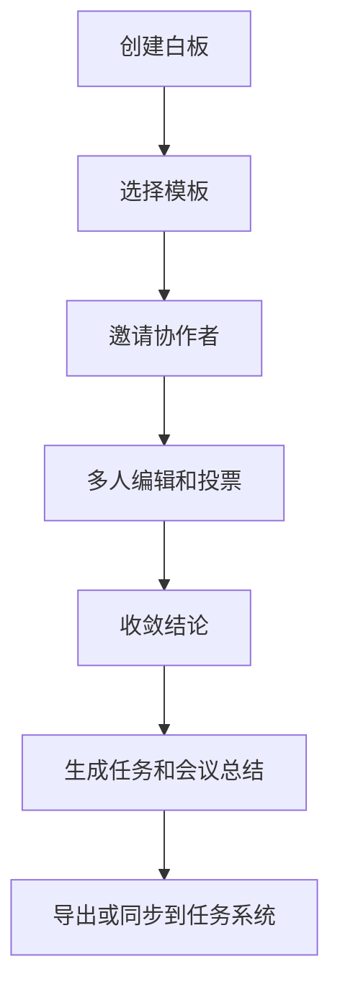

# 远程协作白板 PRD

---

## 1. 文档概述

### 1.1 文档信息

| 项目 | 内容 |
|------|------|
| 文档名称 | 远程协作白板产品需求文档 |
| 文档版本 | v1.0 |
| 创建日期 | 2026-04-28 |
| 文档状态 | 草稿 |
| 目标受众 | 产品、设计、前端、后端、测试 |

### 1.2 项目背景

远程团队在需求评审、头脑风暴、架构讨论和复盘时需要共享空间。通用文档和会议工具难以表达空间关系，而专业白板工具功能复杂、权限和落地追踪较弱。本项目希望提供轻量、实时、结构化的协作白板，兼顾自由绘制和可执行事项。

**项目特点：**
- 支持多人实时编辑。
- 提供便签、流程图、脑图、投票和任务卡。
- 白板内容可转为行动项和文档。
- 支持会议模式和异步评论。

---

## 2. 产品概述

### 2.1 产品定位

一款面向远程团队的实时协作白板工具，用于讨论、梳理、决策和行动项沉淀。

### 2.2 目标用户

| 用户角色 | 特征描述 | 核心需求 |
|----------|----------|----------|
| 产品经理 | 经常组织需求讨论 | 快速收集想法和形成结论 |
| 设计师 | 需要展示流程和草图 | 自由绘制和评论 |
| 工程团队 | 讨论架构和排期 | 图形表达和任务拆解 |
| 远程团队负责人 | 管理会议效率 | 投票、计时和行动项 |

### 2.3 核心价值

1. **减少远程沟通摩擦**：所有人同时看见和编辑同一空间。
2. **让讨论结构化**：模板、投票和任务卡帮助收敛。
3. **保留上下文**：白板、评论和决策记录可复盘。
4. **推动执行**：白板元素可转换为任务。

---

## 3. 功能需求

### 3.1 P0：核心功能（MVP）

#### 3.1.1 白板编辑

| 功能编号 | 功能名称 | 功能描述 | 验收标准 |
|----------|----------|----------|----------|
| F001 | 无限画布 | 支持缩放、拖拽和平移 | 大画布操作流畅 |
| F002 | 基础元素 | 支持便签、文本、矩形、箭头、线条 | 元素可移动和编辑 |
| F003 | 框选操作 | 支持多选、复制、删除、对齐 | 操作结果准确 |
| F004 | 撤销重做 | 支持用户本地操作撤销和重做 | 不影响他人操作 |

#### 3.1.2 多人协作

| 功能编号 | 功能名称 | 功能描述 | 验收标准 |
|----------|----------|----------|----------|
| F011 | 实时同步 | 多人编辑内容实时同步 | 延迟不超过 500ms |
| F012 | 光标显示 | 展示协作者光标和昵称 | 用户可识别他人位置 |
| F013 | 权限控制 | 支持查看、评论、编辑权限 | 无权限用户不能编辑 |
| F014 | 协作状态 | 显示在线成员和连接状态 | 断线后自动重连 |

#### 3.1.3 模板与会议工具

| 功能编号 | 功能名称 | 功能描述 | 验收标准 |
|----------|----------|----------|----------|
| F021 | 模板库 | 提供头脑风暴、复盘、流程图模板 | 创建白板时可选择 |
| F022 | 投票 | 对便签或方案进行投票 | 结果实时统计 |
| F023 | 计时器 | 会议中设置倒计时 | 所有人可见 |
| F024 | 评论 | 对元素添加评论和回复 | 评论可解决 |

#### 3.1.4 导出与任务

| 功能编号 | 功能名称 | 功能描述 | 验收标准 |
|----------|----------|----------|----------|
| F031 | 图片导出 | 导出 PNG 图片 | 内容完整 |
| F032 | PDF 导出 | 按画布区域导出 PDF | 文本清晰 |
| F033 | 任务卡 | 将便签转为任务卡，设置负责人和截止时间 | 任务进入任务列表 |
| F034 | 会议总结 | 汇总投票结果、任务和评论 | 可复制为 Markdown |

### 3.2 P1：重要功能

| 功能编号 | 功能名称 | 功能描述 |
|----------|----------|----------|
| F101 | 版本历史 | 查看和恢复历史版本 |
| F102 | 语音会议集成 | 白板内发起语音或嵌入会议链接 |
| F103 | 文件嵌入 | 插入图片、PDF、代码片段和网页卡片 |
| F104 | 自动排版 | 一键整理便签和流程图 |
| F105 | 第三方任务同步 | 同步到 Jira、Linear、飞书任务 |

### 3.3 P2：增强功能

| 功能编号 | 功能名称 | 功能描述 |
|----------|----------|----------|
| F201 | AI 整理白板 | 将散乱便签聚类并生成总结 |
| F202 | 架构图识别 | 手绘图自动转为规范流程图 |
| F203 | 白板演示模式 | 按区域生成演示路径 |
| F204 | 企业管理后台 | 空间、成员、审计日志和数据保留策略 |

---

## 4. 技术方案

### 4.1 技术栈

| 层级 | 技术选择 |
|------|----------|
| 前端 | React、Canvas/SVG、Yjs |
| 后端 | Node.js / Go |
| 实时协作 | WebSocket、CRDT |
| 数据库 | PostgreSQL、Redis |
| 存储 | 对象存储保存导出文件 |
| AI 能力 | 白板聚类、摘要、自动排版 |

### 4.2 系统架构

```text
前端白板编辑器
  ↓
WebSocket 协作服务
  ↓
CRDT 文档状态
  ↓
持久化服务 / 导出服务 / 任务服务
```

---

## 5. 数据模型

### 5.1 Board

| 字段名 | 类型 | 必填 | 说明 |
|--------|------|:----:|------|
| id | string | ✓ | 白板 ID |
| title | string | ✓ | 白板标题 |
| ownerId | string | ✓ | 创建者 |
| workspaceId | string | ✓ | 所属空间 |
| permission | enum | ✓ | private/team/public |
| updatedAt | datetime | ✓ | 更新时间 |

### 5.2 BoardElement

| 字段名 | 类型 | 必填 | 说明 |
|--------|------|:----:|------|
| id | string | ✓ | 元素 ID |
| boardId | string | ✓ | 所属白板 |
| type | enum | ✓ | sticky/text/shape/line/task |
| x | number | ✓ | 横坐标 |
| y | number | ✓ | 纵坐标 |
| props | object | ✓ | 元素属性 |

---

## 6. 核心流程



---

## 7. 非功能需求

| 类别 | 要求 |
|------|------|
| 实时性 | 常规编辑同步延迟不超过 500ms |
| 稳定性 | 断线重连后不丢失本地操作 |
| 性能 | 1000 个元素以内画布操作流畅 |
| 安全 | 支持链接权限和团队权限隔离 |
| 兼容性 | 支持 Chrome、Edge、Safari 最新版本 |

---

## 8. 开发计划

| 阶段 | 周期 | 交付内容 |
|------|------|----------|
| 第一阶段 | 3 周 | 画布、基础元素、保存 |
| 第二阶段 | 3 周 | 多人协作、权限、评论 |
| 第三阶段 | 2 周 | 模板、投票、任务卡 |
| 第四阶段 | 1 周 | 导出、性能优化、测试上线 |

