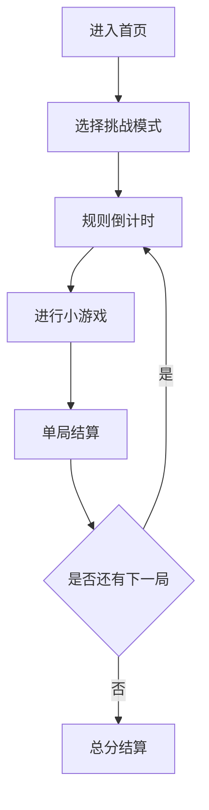

# 迷你派对合集网页游戏 PRD

---

## 1. 文档概述

### 1.1 文档信息

| 项目 | 内容 |
|------|------|
| 文档名称 | 迷你派对合集网页游戏产品需求文档 |
| 文档版本 | v1.0 |
| 创建日期 | 2026-04-28 |
| 文档状态 | 草稿 |
| 目标受众 | 产品、设计、前端、小游戏设计、测试 |

### 1.2 项目背景

迷你派对合集是一款由多个 10-30 秒短小游戏组成的网页游戏合集。玩家可以单人挑战，也可以在同一设备上轮流游玩。项目目标是快速产出多个可玩的网页游戏 demo，形成作品集式案例，并为后续扩展多人派对玩法打基础。

**项目特点：**
- 单局时间短，反馈强。
- 每个小游戏规则极简，3 秒内能理解。
- 可持续新增小游戏，适合模块化开发。
- 适合桌面端和移动端分享游玩。

---

## 2. 产品概述

### 2.1 产品定位

一款轻量级网页 party game 合集，通过多个短局小游戏提供快速、轻松、可反复挑战的娱乐体验。

### 2.2 目标用户

| 用户角色 | 特征描述 | 核心需求 |
|----------|----------|----------|
| 休闲玩家 | 想随手玩 1-3 分钟 | 快速开始、规则简单、反馈有趣 |
| 朋友聚会用户 | 需要轮流或同屏小游戏 | 分数对比、节奏快、易围观 |
| 开发学习者 | 想做多个小游戏案例 | 模块化结构、便于新增玩法 |
| 作品集观看者 | 想快速看到多样性 | 打开即玩、每个玩法有差异 |

### 2.3 核心价值

1. **快速产出**：MVP 可先做 5 个小游戏，每个独立实现。
2. **玩法丰富**：反应、记忆、节奏、躲避、收集等类型都能覆盖。
3. **扩展友好**：统一游戏壳、结算和分数系统，小游戏可插拔。

---

## 3. 游戏设计

### 3.1 核心循环

玩家进入首页后选择“开始挑战”或单独小游戏。系统随机或按顺序启动多个小游戏，每局开始前显示 2 秒规则提示，结束后记录分数。完成一轮后展示总分、评级和最佳记录。



### 3.2 MVP 小游戏列表

| 小游戏 | 类型 | 单局时长 | 核心操作 | 得分方式 |
|--------|------|----------|----------|----------|
| 反应拍灯 | 反应 | 10 秒 | 看到亮灯后点击 | 越快分越高，误点扣分 |
| 星星接接乐 | 收集 | 20 秒 | 左右移动篮子 | 接到星星加分，接到炸弹扣分 |
| 记忆翻牌 | 记忆 | 30 秒 | 点击翻牌配对 | 配对越多分越高 |
| 躲避落石 | 躲避 | 20 秒 | 左右移动角色 | 存活越久分越高 |
| 节奏敲敲 | 节奏 | 20 秒 | 按节拍点击目标 | 命中时机越准分越高 |

### 3.3 模式设计

| 模式 | 描述 | MVP 是否包含 |
|------|------|:-----------:|
| 快速挑战 | 随机 3 个小游戏，统计总分 | ✓ |
| 全部挑战 | 顺序游玩全部小游戏 | ✓ |
| 单项练习 | 单独选择某一个小游戏 | ✓ |
| 本地多人 | 同一设备多名玩家轮流游玩 | P1 |
| 每日挑战 | 每日固定小游戏组合 | P2 |

---

## 4. 功能需求

### 4.1 P0：核心功能（MVP）

#### 4.1.1 游戏壳

| 功能编号 | 功能名称 | 功能描述 | 验收标准 |
|----------|----------|----------|----------|
| F001 | 首页 | 展示开始挑战、全部挑战、单项练习、设置 | 用户可在 2 次点击内开始游戏 |
| F002 | 小游戏管理器 | 统一注册、启动、暂停、结束小游戏 | 每个小游戏可独立接入 |
| F003 | 规则倒计时 | 每局前显示简短规则和 3、2、1 倒计时 | 玩家能理解当前操作 |
| F004 | 单局结算 | 每个小游戏结束后展示得分和评价 | 分数准确累计到总分 |
| F005 | 总分结算 | 完成挑战后展示总分、评级、最佳记录 | 本地最佳分保存 |

#### 4.1.2 反应拍灯

| 功能编号 | 功能名称 | 功能描述 | 验收标准 |
|----------|----------|----------|----------|
| F011 | 随机亮灯 | 灯在随机延迟后变亮 | 延迟不可预测且有最小间隔 |
| F012 | 点击判定 | 亮灯后点击计入反应时间 | 反应时间越短分越高 |
| F013 | 误点扣分 | 灯未亮时点击扣分或标记失误 | 失误有明确反馈 |

#### 4.1.3 星星接接乐

| 功能编号 | 功能名称 | 功能描述 | 验收标准 |
|----------|----------|----------|----------|
| F021 | 篮子移动 | 玩家控制底部篮子左右移动 | 操作响应流畅 |
| F022 | 掉落物生成 | 星星和炸弹从顶部随机掉落 | 掉落节奏随时间略增强 |
| F023 | 接取判定 | 篮子接到星星加分，接到炸弹扣分 | 碰撞判定稳定 |

#### 4.1.4 记忆翻牌

| 功能编号 | 功能名称 | 功能描述 | 验收标准 |
|----------|----------|----------|----------|
| F031 | 卡牌布局 | 生成偶数张成对卡牌 | 每局牌面随机打乱 |
| F032 | 翻牌逻辑 | 一次最多翻开两张牌 | 不允许连续快速破坏状态 |
| F033 | 配对判定 | 两张相同则保持翻开，否则盖回 | 配对数量计入得分 |

#### 4.1.5 躲避落石

| 功能编号 | 功能名称 | 功能描述 | 验收标准 |
|----------|----------|----------|----------|
| F041 | 角色移动 | 玩家左右移动躲避落石 | 角色不能移出边界 |
| F042 | 落石生成 | 落石从随机位置下落 | 难度随时间增加 |
| F043 | 碰撞失败 | 被落石击中后结束或扣生命 | 结算原因清晰 |

#### 4.1.6 节奏敲敲

| 功能编号 | 功能名称 | 功能描述 | 验收标准 |
|----------|----------|----------|----------|
| F051 | 节拍目标 | 目标按固定节拍出现或缩放 | 节奏可预测 |
| F052 | 命中窗口 | 按时间偏差判定 Perfect/Good/Miss | 判定稳定 |
| F053 | 连击计数 | 连续命中提升分数倍率 | Miss 后连击中断 |

### 4.2 P1：重要功能

| 功能编号 | 功能名称 | 功能描述 | 验收标准 |
|----------|----------|----------|----------|
| F101 | 本地多人 | 支持 2-4 名玩家输入名字并轮流挑战 | 总结算展示排行榜 |
| F102 | 角色头像 | 玩家选择颜色或头像 | 结算和状态栏展示 |
| F103 | 难度选择 | 支持轻松、普通、困难 | 掉落速度、时间窗口等随难度变化 |
| F104 | 音效反馈 | 点击、得分、失误、倒计时、结算有音效 | 可静音 |
| F105 | 分享成绩 | 生成成绩截图或分享文案 | 内容包含总分和评级 |

### 4.3 P2：增强功能

| 功能编号 | 功能名称 | 功能描述 |
|----------|----------|----------|
| F201 | 在线排行榜 | 记录全球或好友分数 |
| F202 | 每日挑战 | 每日固定组合和统一种子 |
| F203 | 新小游戏包 | 增加钓鱼、切水果、找不同、打地鼠等 |
| F204 | 远程多人 | 支持房间邀请和实时同步 |
| F205 | 自定义合集 | 玩家选择小游戏组成挑战列表 |

---

## 5. 技术方案

### 5.1 推荐技术栈

| 层级 | 技术选择 |
|------|----------|
| 游戏渲染 | HTML Canvas + Phaser 3，或 React + Canvas 混合 |
| UI | 原生 DOM / React |
| 状态管理 | 轻量状态机或自定义 GameManager |
| 音效 | Web Audio API |
| 存档 | localStorage |
| 部署 | 静态站点，支持 GitHub Pages / Vercel |

### 5.2 模块架构

```text
App Shell
  ├─ Home / Mode Select
  ├─ GameManager
  │   ├─ MiniGame: ReactionLight
  │   ├─ MiniGame: StarCatch
  │   ├─ MiniGame: MemoryCards
  │   ├─ MiniGame: DodgeRocks
  │   └─ MiniGame: RhythmTap
  ├─ ScoreService
  ├─ StorageService
  └─ AudioService
```

### 5.3 数据模型

#### MiniGameConfig

| 字段名 | 类型 | 必填 | 说明 |
|--------|------|:----:|------|
| id | string | ✓ | 小游戏 ID |
| name | string | ✓ | 小游戏名称 |
| duration | number | ✓ | 单局时长 |
| instruction | string | ✓ | 规则提示 |
| difficultyParams | object | ✗ | 难度参数 |

#### ChallengeRun

| 字段名 | 类型 | 必填 | 说明 |
|--------|------|:----:|------|
| id | string | ✓ | 挑战记录 ID |
| mode | enum | ✓ | quick/all/practice/multiplayer |
| games | array | ✓ | 本轮小游戏列表 |
| totalScore | number | ✓ | 总分 |
| gameResults | array | ✓ | 单局结果 |
| createdAt | datetime | ✓ | 创建时间 |

#### GameResult

| 字段名 | 类型 | 必填 | 说明 |
|--------|------|:----:|------|
| gameId | string | ✓ | 小游戏 ID |
| score | number | ✓ | 单局得分 |
| accuracy | number | ✗ | 准确率 |
| combo | number | ✗ | 最大连击 |
| mistakes | number | ✗ | 失误次数 |

---

## 6. 界面与视觉

### 6.1 页面结构

| 页面 | 内容 |
|------|------|
| 首页 | 游戏标题、挑战入口、单项练习、最佳分 |
| 规则倒计时页 | 小游戏名称、规则一句话、倒计时 |
| 小游戏页 | 游戏画布、时间、分数、当前目标 |
| 单局结算页 | 单局分数、评价、下一局 |
| 总结算页 | 总分、评级、最佳记录、重玩、返回首页 |

### 6.2 视觉方向

采用明快、街机感、色块清晰的视觉风格。每个小游戏可以有不同主色，但整体 UI 框架统一。避免复杂背景，优先保证目标、危险、计时和分数可读。

---

## 7. 非功能需求

| 类别 | 要求 |
|------|------|
| 性能 | 桌面端 60 FPS，移动端 30 FPS 以上 |
| 加载 | 首屏小于 5MB，首次可玩时间小于 3 秒 |
| 兼容 | Chrome、Edge、Safari、Firefox 近两年版本 |
| 响应式 | 支持 390px 移动端到 1440px 桌面端 |
| 输入 | 鼠标、触屏、键盘均可使用 |
| 存档 | 保存最佳分、设置、本地多人玩家名 |

---

## 8. 验收标准

1. 首页可进入快速挑战、全部挑战和单项练习。
2. MVP 至少包含 5 个小游戏，且每个小游戏能独立开始、结束和结算。
3. 快速挑战能随机启动 3 个小游戏并计算总分。
4. 总分和最佳记录刷新后仍保留。
5. 桌面端和移动端均能完成完整挑战流程。

---

## 9. 里程碑

| 阶段 | 周期 | 交付物 |
|------|------|--------|
| M1 游戏壳 | 2-3 天 | 首页、GameManager、结算、存档 |
| M2 小游戏 MVP | 5-7 天 | 5 个小游戏完整可玩 |
| M3 模式完善 | 2-3 天 | 快速挑战、全部挑战、单项练习 |
| M4 打磨发布 | 2-3 天 | 音效、动画、移动端适配、部署 |

